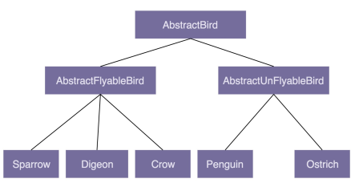

# 10理论七：为何说要多用组合少用继承？如何决定该用组合还是继承？

在面向对象编程中，有一条非常经典的设计原则，那就是：组合优于继承，多用组合少用继承。为什么不推荐使用继承？组合相比继承有哪些优势？如何判断该用组合还是继承？今天，我们就围绕着这三个问题，来详细讲解一下这条设计原则。

话不多说，让我们正式开始今天的学习吧！

## 一、为什么不推荐使用继承？

继承是面向对象的四大特性之一，用来表示类之间的 is-a 关系，可以解决代码复用的问题。虽然继承有诸多作用，但继承层次过深、过复杂，也会影响到代码的可维护性。所以，对于是否应该在项目中使用继承，网上有很多争议。很多人觉得继承是一种反模式，应该尽量少用，甚至不用。为什么会有这样的争议？我们通过一个例子来解释一下。

假设我们要设计一个关于鸟的类。我们将"鸟类"这样一个抽象的事物概念，定义为一个抽象类 AbstractBird。所有更细分的鸟，比如麻雀、鸽子、乌鸦等，都继承这个抽象类。

我们知道，大部分鸟都会飞，那我们可不可以在 AbstractBird 抽象类中，定义一个 fly() 方法呢？答案是否定的。尽管大部分鸟都会飞，但也有特例，比如鸵鸟就不会飞。鸵鸟继承具有 fly() 方法的父类，那鸵鸟就具有"飞"这样的行为，这显然不符合我们对现实世界中事物的认识。当然，你可能会说，我在鸵鸟这个子类中重写（override）fly() 方法，让它抛出 UnSupportedMethodException 异常不就可以了吗？具体的代码实现如下所示：

```java
public class AbstractBird {
    //... 省略其他属性和方法...
    public void fly() { 
        //... 
    }
} 
public class Ostrich extends AbstractBird { // 鸵鸟
    //... 省略其他属性和方法...
    public void fly() {
        throw new UnSupportedMethodException("I can't fly.'");
    }
}
```

这种设计思路虽然可以解决问题，但不够优美。因为除了鸵鸟之外，不会飞的鸟还有很多，比如企鹅。对于这些不会飞的鸟来说，我们都需要重写 fly() 方法，抛出异常。这样的设计，一方面，徒增了编码的工作量；另一方面，也违背了我们之后要讲的最小知识原则（Least Knowledge Principle，也叫最少知识原则或者迪米特法则），暴露不该暴露的接口给外部，增加了类使用过程中被误用的概率。

你可能又会说，那我们再通过 AbstractBird 类派生出两个更加细分的抽象类：会飞的鸟类 AbstractFlyableBird 和不会飞的鸟类 AbstractUnFlyableBird，让麻雀、乌鸦这些会飞的鸟都继承 AbstractFlyableBird，让鸵鸟、企鹅这些不会飞的鸟，都继承 AbstractUnFlyableBird 类，不就可以了吗？具体的继承关系如下图所示：



从图中我们可以看出，继承关系变成了三层。不过，整体上来讲，目前的继承关系还比较简单，层次比较浅，也算是一种可以接受的设计思路。我们再继续加点难度。在刚刚这个场景中，我们只关注"鸟会不会飞"，但如果我们还关注"鸟会不会叫"，那这个时候，我们又该如何设计类之间的继承关系呢？

是否会飞？是否会叫？两个行为搭配起来会产生四种情况：会飞会叫、不会飞会叫、会飞不会叫、不会飞不会叫。如果我们继续沿用刚才的设计思路，那就需要再定义四个抽象类（AbstractFlyableTweetableBird、AbstractFlyableUnTweetableBird、 AbstractUnFlyableTweetableBird、AbstractUnFlyableUnTweetableBird）。


如果我们还需要考虑"是否会下蛋"这样一个行为，那估计就要组合爆炸了。类的继承层次会越来越深、继承关系会越来越复杂。而这种层次很深、很复杂的继承关系，一方面，会导致代码的可读性变差。因为我们要搞清楚某个类具有哪些方法、属性，必须阅读父类的代码、父类的父类的代码......一直追溯到最顶层父类的代码。另一方面，这也破坏了类的封装特性，将父类的实现细节暴露给了子类。子类的实现依赖父类的实现，两者高度耦合，一旦父类代码修改，就会影响所有子类的逻辑。

总之，继承最大的问题就在于：继承层次过深、继承关系过于复杂会影响到代码的可读性和可维护性。这也是为什么我们不推荐使用继承。那刚刚例子中继承存在的问题，我们又该如何来解决呢？你可以先自己思考一下，再听我下面的讲解。

## 二、组合相比继承有哪些优势？

实际上，我们可以利用组合（composition）、接口、委托（delegation）三个技术手段，一块儿来解决刚刚继承存在的问题。

我们前面讲到接口的时候说过，接口表示具有某种行为特性。针对"会飞"这样一个行为特性，我们可以定义一个 Flyable 接口，只让会飞的鸟去实现这个接口。对于会叫、会下蛋这些行为特性，我们可以类似地定义 Tweetable 接口、EggLayable 接口。我们将这个设计思路翻译成 Java 代码的话，就是下面这个样子：

```java
public interface Flyable {
    void fly();
}
public interface Tweetable {
    void tweet();
}
public interface EggLayable {
    void layEgg();
}
public class Ostrich implements Tweetable, EggLayable {// 鸵鸟
    //... 省略其他属性和方法...
    @Override
    public void tweet() { 
        //... 
    }
    @Override
    public void layEgg() { 
        //... 
    }
}
public class Sparrow impelents Flayable, Tweetable, EggLayable {// 麻雀
    //... 省略其他属性和方法...
    @Override
    public void fly() {
        //... 
    }
    @Override
    public void tweet() { 
        //... 
    }
    @Override
    public void layEgg() { 
        //... 
    }
}
```

不过，我们知道，接口只声明方法，不定义实现。也就是说，每个会下蛋的鸟都要实现一遍 layEgg() 方法，并且实现逻辑是一样的，这就会导致代码重复的问题。那这个问题又该如何解决呢？

我们可以针对三个接口再定义三个实现类，它们分别是：实现了 fly() 方法的 FlyAbility 类、实现了 tweet() 方法的 TweetAbility 类、实现了 layEgg() 方法的 EggLayAbility 类。然后，通过组合和委托技术来消除代码重复。具体的代码实现如下所示：

我们知道继承主要有三个作用：表示 is-a 关系，支持多态特性，代码复用。而这三个作用都可以通过其他技术手段来达成。比如 is-a 关系，我们可以通过组合和接口的 has-a 关系来替代；多态特性我们可以利用接口来实现；代码复用我们可以通过组合和委托来实现。所以，从理论上讲，通过组合、接口、委托三个技术手段，我们完全可以替换掉继承，在项目中不用或者少用继承关系，特别是一些复杂的继承关系。

## 三、如何判断该用组合还是继承？

尽管我们鼓励多用组合少用继承，但组合也并不是完美的，继承也并非一无是处。从上面的例子来看，继承改写成组合意味着要做更细粒度的类的拆分。这也就意味着，我们要定义更多的类和接口。类和接口的增多也就或多或少地增加代码的复杂程度和维护成本。所以，在实际的项目开发中，我们还是要根据具体的情况，来具体选择该用继承还是组合。

如果类之间的继承结构稳定（不会轻易改变），继承层次比较浅（比如，最多有两层继承关系），继承关系不复杂，我们就可以大胆地使用继承。反之，系统越不稳定，继承层次很 深，继承关系复杂，我们就尽量使用组合来替代继承。

除此之外，还有一些设计模式会固定使用继承或者组合。比如，装饰者模式（decorator pattern）、策略模式（strategy pattern）、组合模式（composite pattern）等都使用了组合关系，而模板模式（template pattern）使用了继承关系。

前面我们讲到继承可以实现代码复用。利用继承特性，我们把相同的属性和方法，抽取出 来，定义到父类中。子类复用父类中的属性和方法，达到代码复用的目的。但是，有的时 候，从业务含义上，A 类和 B 类并不一定具有继承关系。比如，Crawler 类和 PageAnalyzer 类，它们都用到了 URL 拼接和分割的功能，但并不具有继承关系（既不是父子关系，也不是兄弟关系）。仅仅为了代码复用，生硬地抽象出一个父类出来，会影响到代码的可读性。如果不熟悉背后设计思路的同事，发现 Crawler 类和 PageAnalyzer 类继承同一个父类，而父类中定义的却只是 URL 相关的操作，会觉得这个代码写得莫名其妙，理解不了。这个时候，使用组合就更加合理、更加灵活。具体的代码实现如下所示：

```java
public class Url {
    //... 省略属性和方法
}
public class Crawler {
    private Url url; // 组合
    public Crawler() {
        this.url = new Url();
    }
    //...
} 
public class PageAnalyzer {
    private Url url; // 组合
    public PageAnalyzer() {
        this.url = new Url();
    }
    //..
}
```

还有一些特殊的场景要求我们必须使用继承。如果你不能改变一个函数的入参类型，而入参又非接口，为了支持多态，只能采用继承来实现。比如下面这样一段代码，其中 FeignClient 是一个外部类，我们没有权限去修改这部分代码，但是我们希望能重写这个类在运行时执行的 encode() 函数。这个时候，我们只能采用继承来实现了。

```java
public class FeignClient { // feighn client 框架代码
//... 省略其他代码...
public void encode(String url) { //... }
} p
ublic void demofunction(FeignClient feignClient) {
//...
feignClient.encode(url);
//...
} p
ublic class CustomizedFeignClient extends FeignClient {
@Override
public void encode(String url) { //... 重写 encode 的实现...}
} /
/ 调用
FeignClient client = new CustomizedFeignClient();
demofunction(client);
```

尽管有些人说，要杜绝继承，100% 用组合代替继承，但是我的观点没那么极端！之所以"多用组合少用继承"这个口号喊得这么响，只是因为，长期以来，我们过度使用继承。还是那句话，组合并不完美，继承也不是一无是处。只要我们控制好它们的副作用、发挥它们各自的优势，在不同的场合下，恰当地选择使用继承还是组合，这才是我们所追求的境 界。

## 重点回顾

到此，今天的内容就讲完了。我们一块儿来回顾一下，你需要重点掌握的知识点。

#### 为什么不推荐使用继承？

继承是面向对象的四大特性之一，用来表示类之间的 is-a 关系，可以解决代码复用的问题。虽然继承有诸多作用，但继承层次过深、过复杂，也会影响到代码的可维护性。在这种情况下，我们应该尽量少用，甚至不用继承。

#### 组合相比继承有哪些优势？

继承主要有三个作用：表示 is-a 关系，支持多态特性，代码复用。而这三个作用都可以通过组合、接口、委托三个技术手段来达成。除此之外，利用组合还能解决层次过深、过复杂的继承关系影响代码可维护性的问题。

#### 如何判断该用组合还是继承？

尽管我们鼓励多用组合少用继承，但组合也并不是完美的，继承也并非一无是处。在实际的项目开发中，我们还是要根据具体的情况，来选择该用继承还是组合。如果类之间的继承结构稳定，层次比较浅，关系不复杂，我们就可以大胆地使用继承。反之，我们就尽量使用组合来替代继承。除此之外，还有一些设计模式、特殊的应用场景，会固定使用继承或者组 合。

## 课堂讨论

我们在基于 MVC 架构开发 Web 应用的时候，经常会在数据库层定义 Entity，在 Service业务层定义 BO（Business Object），在 Controller 接口层定义 VO（View Object）。大部分情况下，Entity、BO、VO 三者之间的代码有很大重复，但又不完全相同。我们该如何处理 Entity、BO、VO 代码重复的问题呢？

欢迎在留言区写下你的答案，和同学一起交流和分享。如果有收获，也欢迎你把这篇文章分享给你的朋友。

## 精选留言

- 我个人感觉VO和BO都会采用组合entity的方式，老师是否可以在下一节课课聊聊上节课留
  下的思考题，您的处理方式？
- 我的观点比较极端，用接口，组合和委托代替继承。原因如下：
  \1. 人无法预知未来，现在比较稳定的类继承关系将来未必稳定。
  2.两种设计之间的选择耗费资源，每次都要为这个问题拿捏一下，甚至争论一下，不如把
  争论放在业务逻辑的实现上。
  3.相对于接口+组合+委托增加的复杂度，代码统一成接口+组合+委托带来的好处更多，…
- 看完之后有种感觉，我们平常写的spring的依赖注入这种形式，是不是就是跟组合，委托
  这种模式啊
- public class FeignClient { // feighn client框架代码
  feighn -> feign 勘误~
- 我只有在该类需要更细化详情信息的时候会组合详情类的list 看了这节课后 受益匪浅
- 现代军事武器中的开发都在追求模块化开发，这样装备之间通用性更强，战损时随时可以
  替换掉损坏的模块，这样又可以重新作战，当要增强坦克某一部分的性能时，仅改进对应
  的模块就行，感觉很像组合的思想。就像文中说的，对于结构稳定，层次浅的地方完全可
  以用继承，或者说可以局部用继承，比如VO层，对于用户检验，分页等都可以抽象出来
- Entity，也称为DO （Data Object），与数据库表结构一一对应，到过DAO层向上传输对
  象，应独立为一个类。
  BO，VO 可以采用继承或者组合的方式，复用DO的代码。
  …
- 老师好，今天刚用继承优化了代码臃肿的问题，但是感觉好奇怪，请老师指导:
  所有的消息都会先到一个A类中，在A类中，根据消息类型，比如类型1 2 3 4去处理不同的
  业务，每一类的业务都需要处理对应数据，原本随着消息类型的增加不断往这个A类中扩展
  代码，导致不好维护，所以我对每个业务模型建对应的类继承这个A类，在A类中将消息…
- 1.bo vo和entity三个命名在现在面向服务而非页面的后端编程，并不合适。
  2.这里最好用组合。entity是最小的实体单元，bo可能面对多个entity聚合，vo可能面对多
  个bo聚合，这种场景下，显然组合更适合。虽然也存在entity和bo一对一的场景，或者bo
  中只有一个主entity的场景，这种场景用继承倒也不为过。但是，为了套路单一，减少阅读
  思考，统一组合便是，没必要再引入继承。…
- GO完全摒弃了继承，在语法上只有组合，接口之间也可以组合(这也是官方鼓励的做法)。
- 谈谈对下面一段话的理解：
  “我们知道继承主要有三个作用：表示 is-a 关系，支持多态特性，代码复用。而这三个作
  用都可以通过其他技术手段来达成。比如 is-a 关系，我们可以通过组合和接口的 has-a …
- 很多同学提出复用Entity（DO），我有不同意见：若修改DO，可能会影响到BO和VO。
  我们都知道DO对应数据表，如PersonDO类有id，age，name。
  若现在需求改变，age要从政府系统获取，原有的Person表要删除age字段，相应的DO类
  就要修改，UI仍然显示person.age。BO、VO有如果使用了DO就会受到影响。
  为了降低影响，BO,VO考虑使用PersonDTO。…
- 因为Entity， BO， VO都是描述对象的，只不过是用于不同目的的对象，这些对象之间会
  有很多重复的元素定义，针对这样的重复定义，我倒是感觉可以使用继承，将重复的那些
  元素都提取出来作为父类，然后entity，VO，BO去继承这个父类，在实现自己独有的元
  素。而接口主要是针对不同能能的复用，用在E，B，V身上并不合适。
- 这次的思考题正好也是困惑我很久的问题，看看大家有什么好的方式。
  之前我的做法是用组合+委托的方式，但发现这种方式其实还是无法实现分层，即间接的将
  两个硬关联起来，增减属性的时候需要同时修改两个对象的代码；
  如果是继承关系，那么相当于多出一个类，让三个对象同时继承该类，但这个新衍生出的
  对象又怎么理解它呢？它与其他三个对象是否有is-a的关系？不能单纯的为了复用而继承…
- 这个问题困扰我很久了。现在写代码的时候有时候会直接把Entity返回。除非有组合数据采
  用vo。🤣
- 课堂讨论answer:
  Entity， Bo， Vo三者之间，显然并不存在 is-a关系，首先排除使用继承。
  其次三者间也并非是严格的has-a关系，half measure之一是考虑使用组合（compositio
  n） + 委托（delegation）的方式解决代码重复的问题，但并不是我心中的最佳答案.…
- 之前写Android的时候，对这些似懂非懂；现在接触到了Java Service，感觉对设计模式的
  要求越来越高了，就比如老师提出的这个思考题，尴尬，我现在的做法还是做封装，提取
  公共类更多一点。
- VO——》BO——》Entity
- 目前项目中确实存在很多实体类都有同样的属性，至于怎么合理的应用还没有思考过。看
  了老师的文章之后，是不是要考虑用组合模式来优化。  