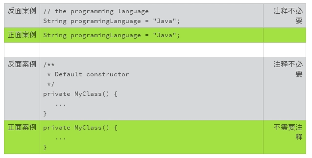
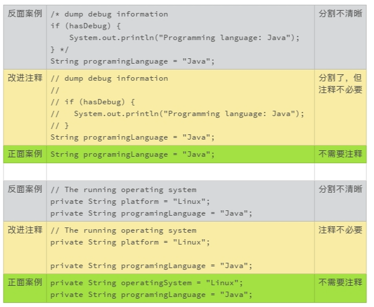
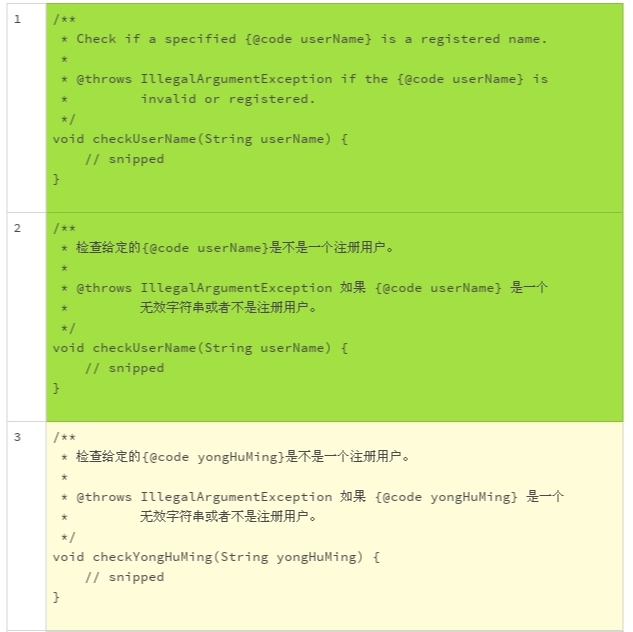

# 07写好注释，真的是小菜一碟吗？

上一讲中我们讲了如何整理代码，但有些时候，即便我们取好了名字，编排好格式，但代码还是让我们抓狂，不明出处，不好理解。这时候，就需要注释登场了。


顾名思义，注释就是对代码的解释。注释不需要运行，它是用来提高代码的可读性和可维护性的。不好的注释会使代码变得更糟糕，使人更抓狂。


理想虽丰满，现实很骨感。注释虽小，写好不易。那写注释有哪些注意事项？有没有什么技巧呢？今天我们就来聊聊写注释这个话题。


当然了，不同的语言，注释的语法差别很大。为方便起见，我们统一使用 Java 语言的注释语法，来解释说明写好注释的基础原则。

## 注释是无奈的妥协

那你是不是有这样一个问题，源代码一定需要解释吗？


其实在理想状况下，代码不需要注释。理想的代码，命名恰当，结构清晰，逻辑顺畅，含义显而易见。但正如一个作家无法预料他的读者能否清晰地理解他的文字一样，一个程序员也不能判断他的读者能否清晰地理解他写的代码。所以，写注释其实是下巧功夫。


可是，注释也是一个麻烦鬼，可能会给我们带来三个麻烦。


首先，**因为注释不需要运行，所以没有常规的办法来测试它**。 注释对不对？有没有随着代码变更？这些问题都是写注释需要注意的地方。**注释难以维护，这是使用注释带来的最大的麻烦**。


另一个麻烦是，**注释为我们提供了一个借口**。使用注释来解释代码，是注释的本意。但是，我们有时候会过度依赖解释，从而放弃了潜在的替代方案，比如更准确的命名，更清晰的结构，更顺畅的逻辑等等。 **注释，被我们用成万能的狗皮膏药，有时会让代码更糟糕**。


比如，下面的代码和注释，看起来没毛病，但读起来很吃力。

```java
String name1;  // first name
String name2;  // last name
```

如果使用准确、有意义的命名，我们就可以去掉没有意义的注释了。

```java
String firstName;
String lastName;
```

还有一个麻烦，就是**注释的滥用**。 由于注释部分不被执行，那么就可以被用来注释掉一些不需要的东西。比如，在正式的产品代码中，注释掉调试信息、代码块、俏皮话等等。

比如说，看到下面的注释，你是不是立即就转移注意力了？ 我理解这个注释的初衷是幽默一下，但是众口难调，这样的注释有些人感觉到的不是幽默，而是散漫和业余。

```java
// 哈哈，有没有人姓好，叫“好名字”？
String firstName;
String lastName;
```

讲了这么多，总结一下，注释是代码的一部分，是需要阅读的内容，目的是让其他人能更好地理解我们的代码，写注释需要我们有“用户思维”。虽然也有过度依赖注释的情况，但是，对于大部分程序员来说，问题还是注释太少，而不是太多。

## 几种常见注释类型

接下来，我们就聊聊几种常见的注释类型。一个典型的源代码文件，一般包含不同类型的注释。不同类型的注释，有着不相同的要求，适用于不同的注释风格和原则。


**第一种类型，是记录源代码版权和授权的**，一般放在每一个源文件的开头，说明源代码的版权所有者，以及授权使用的许可方式，或者其他的公共信息。比如，如果是个人的代码，版权信息可以写成：

```java
/*
 * Copyright (c) 2018, FirstName LastName. All rights reserved.
 */
```

一般来说，版权和授权信息是固定的。版权和授权信息是法律条款，除了年份，一个字都不能更改。对于每个源代码文件，我们记得复制粘贴在文件开头就行。**需要注意的是，如果文件有变更，记得更改版权信息的年份（比如上例中的 2018）**。


**第二种类型，是用来生成用户文档的**，比如 Java Doc。 这部分的作用，是用来生成独立的、不包含源代码的文档。 这些文档帮助使用者了解软件的功能和细节，主要面向的是该软件的**使用者**，而不是该软件的开发者。 比如 Java 的 API 规范的文档。


**第三种类型，是用来解释源代码的**。换句话说，就是帮助代码的阅读者理解代码。这是大家默认的注释类型，也是我们今天讨论的重点。

## 简化注释的风格

上面我们介绍了三种常见的注释类型，下面就针对这三种注释类型，再给你介绍**三种风格**的注释。


**针对第一种注释类型，也就是固定的版权和授权信息，使用一般的星号注释符（/\*-\*/）**。注释块的首行和尾行只使用星号注释符，中间行以缩进一个空格的星号开始，文字和星号之间使用一个空格。注释的每行长度限制，和代码块的每行长度限制保持一致。


比如：

```java
/*
 * Copyright (c) 2018, FirstName LastName. All rights reserved.
 */
```

**针对第二种注释类型，即生成用户文档的注释，使用 Javadoc 要求的格式，文档注释符（`/**-*/`）**。 除了首行使用特殊的文档注释符（`/**`），其他的格式和第一种风格保持一致。


比如：

```java
/**
 * A {@code Readable} is a source of characters. Characters from
 * a {@code Readable} are made available to callers of the read
 * method via a {@link java.nio.CharBuffer CharBuffer}.
 *
 * @since 1.5
 */
public interface Readable {
   ...
}
```

**针对第三种注释类型，也就是代码解释注释，只使用行注释符（//）**。 每行长度限制，和代码块的每行长度限制保持一致。

比如：

```java
// Verify that the buffer has sufficient remaining
private static void verifyLength(
        ByteBuffer buffer, int requiredLength) {
    ...
}
 
String myString;  // using end-to-line comment
 
// This is a multiple line comment.  This is a multiple
// line comment. 
if (!myString.isEmpty()) {
   ...
}
```

写代码注释时，我一般只用这三种风格。它们各自有固定的使用范围，简单直观，规避不必要的代码错误。也不会让别人混淆注释的类型。


我不会使用如下的注释，因为这种注释风格可能和有效的代码混淆在一起。 注释越长，错误越容易隐藏起来。

```java
/*
 * This is a multiple line comment.  This is a multiple
 * line comment.
 
 if (programingLanguage.equals("Java")) {
    ...   
 } */
```

当然了，肯定有人会喜欢上述的风格，因为这种风格可以注释掉不用的代码。这一点，方便我们调试分段代码。我自己在调试的时候也喜欢使用这种注释方式，但是一旦调试结束，我就会清理掉这些注释。


从我自己的经验来看，养成这样的习惯很有帮助：**如果一段代码不再需要，我会清理掉代码，而不会保留这个注释掉的代码块。**不要在源代码里记录代码历史，那是代码版本管理系统该干的事情。

## 注释的三项原则

那么，用来解释源代码的注释有什么需要注意的地方吗？为了规避注释的种种麻烦，有没有什么原则我们必需要遵守呢？我总结了以下三点。

1. **准确**，错误的注释比没有注释更糟糕。
2. **必要**，多余的注释浪费阅读者的时间。
3. **清晰**，混乱的注释会把代码搞得更乱。

比如，当我们说编程语言时，一定不要省略“编程”这两个字。否则，就可能会被误解为大家日常说话用的语言。这就是准确性的要求。


如果代码已经能够清晰、简单地表达自己的语义和逻辑，这时候重复代码语义的注释就是多余的注释。注释的维护是耗费时间和精力的，所以，不要保留多余的、不必要的注释。



如果注释和代码不能从视觉上清晰地分割，注释就会破坏代码的可读性。


另外，不要在代码里标注你想要做的工作和已经做过的工作。比如使用 TODO，记录代码更改记录等等。这些信息会干扰代码的阅读者。


特别需要注意的是，我们可以使用临时的调试语句，但是，不要把代码的调试语句保留在提交的代码里。这些调试语句，既不容易维护，也不容易阅读。


## 注释用英文还是汉字呢？

你会注意到，上面的代码案例中，我基本使用的是英文注释，在这里我也建议你使用英文注释。


为什么呢？


因为使用中文注释，不是一个所有人都能接受的风格。一部分人，一部分公司，并不接受中文注释。特别是国际化的项目，比如说贡献给 Apache 的项目，就没有办法使用中文注释了。而且，如果是去面试，我也会尽最大的努力不使用中文注释，以免踩到坑。


除了接受度之外，汉字带来的真正困扰是，它会影响到编码风格的偏好。比如命名的问题，到底是应该使用拼音还是英文？ 由于代码命名只能使用 ASCII 字符，注释里的拼音、英文、汉字混杂的问题该怎么处理？代码编辑时，字符的切换也是一个麻烦事。比如，空格使用汉字全角，编译器会报错，但是肉眼看不到，问题排查起来也很心累。


那么什么情况下使用汉字呢？


面对国内的需求文档的时候。因为很多项目的需求文档一般是汉字书写的。程序的编码，当然需要按照需求来。如果需求的引用还要翻译成英文，那就太麻烦了。


还有一种状况，就是团队的英文水平不太好。与其使用难以读懂的蹩脚英文，不如使用大家更熟悉的中文注释来的便捷。不过，我对这种状况的担心越来越少，现在大部分年轻软件工程师的英语水平是可以让人放心的。


试着对比下面的几种注释，你喜欢哪一种呢？




上面的五种不同的风格，我个人比较喜欢第一种和第二种，第三种也可以接受。 但是我会尽量避免第四种和第五种风格。


总结一下，今天我们讨论了怎么写好注释这个话题，希望你能理解一个基本的原则：注释是用来提高代码的可读性和可维护性的。 不要让注释偏离了这个原则，破坏了代码的逻辑和可读性。你也可以实践一下我们讨论的“三项原则”和“三种风格”，看看能不能让你的代码变得更友好？

## 一起来动手

还记得我们上一节的练习题吗？前面，我们改了名字，改了编排。这一次，我们来修改注释。认真读一下这段代码，看看有需要增加或者修改注释的地方吗？欢迎你把优化的代码公布在讨论区，我们一起来感受修改后的代码是不是更好阅读，更好维护。

```java
import java.util.HashMap;
import java.util.Map;
 
class Solution {
    /**
     * Given an array of integers, return indices of the two numbers
     * such that they add up to a specific target.
     */
    public int[] twoSum(int[] nums, int target) {
        Map<Integer, Integer> map = new HashMap<>();
        for (int i = 0; i < nums.length; i++) {
            int complement = target - nums[i];
            if (map.containsKey(complement)) {
                return new int[] { map.get(complement), i };
            }
            map.put(nums[i], i);
        }
        throw new IllegalArgumentException("No two sum solution");
    }
}
```

## 精选留言(18)

- 

  秦凯

  2019-01-18

  **24

  Code Tells You How, Comments Tell You Why.

  展开**

- 

  L

  2019-01-18

  **7

  要写好注释首先要思考怎么不写注释

  展开**

- 

  彩色的沙漠

  2019-01-18

  **4

  通过本篇学习，自己写的注释犯了两个错误一是提交了注释掉的测试代码和需求变更后不需要的代码，二是使用了TODO提醒自己，写完之后没有删除。
  老师最后讲的五种风格，第三种风格和第四种风格有什么区别，只发现了颜色区别，其他的一样

  作者回复: 第三种风格和第四种风格区别在方法的命名上。嗯，不太容易看出来。

- 

  有渔@蔡

  2019-03-01

  **2

  尽量不写注释，尽量用代码告诉别人我的思想。注释用来写代码无法表达的东西，比如我当时为什么这么写，其他想法等。

- 

  Being

  2019-01-18

  **2

  建议注释用英文，确实，中文注释还不好排版。关键是团队建议用中文，好无奈，而且写着写着还要切换输入法

- 

  小新是也

  2019-01-27

  **1

  在代码写TODO已成为团队的习惯

  展开**

  作者回复: 嗯，曾经常用的标记。有些人还保留了这个习惯，并且传承了下来。

- 

  如摄

  2019-01-24

  **1

  作为前端人员买了这个专栏，收获也不少……
  能不能针对js讲一个课程。

  作者回复: 这是个好主意！

- 

  Sisyphus2...

  2019-05-22

  **

  留言区没有人讨论课后题，我抛砖引玉下。注释就像文中所说，准确、必要和清晰最重要，也就是说在不同的团队同一段代码的注释会不同，因为团队能力不同。这里我试着用比较完整的方式做一段注释，如果团队能力好，一些部分是可以省略的

  import java.util.HashMap;
  import java.util.Map;

  class TwoSumSolution {
    /**
     \* Given an array of integers, return indices of the two numbers
     \* such that they add up to a specific target.
     */

    public int[] twoSum(int[] nums, int target) {
      // init a map storing number and its index relation
      Map<Integer, Integer> map = new HashMap<>();

  ​    for (int i = 0; i < nums.length; i++) {
  ​      // calculate the complement of current number
  ​      int complement = target - nums[i];
  ​      // if map contains the complement, return complement directly, else update map with current number
  ​      if (map.containsKey(complement)) {
  ​        return new int[] { map.get(complement), i };
  ​      }
  ​      map.put(nums[i], i);
  ​    }
  ​    
  ​    // if the sum of any two numbers is not equal to the specific target, throw illegal argument exception
  ​    throw new IllegalArgumentException("No two sum solution");
    }
  }

  展开**

  作者回复: 👍

- 

  卞雪达

  2019-05-14

  **

  如果一段代码不再需要，我会清理掉代码，而不会保留这个注释掉的代码块。
  --我简直不能再同意了，我曾因为错误的注释代码而导致十几万的损失，我那时候测试分支特别喜欢用注释代码的方式，因为在一个文件甚至方法里复制并注释两下，是很快能达成一个分支的。这种错误的习惯一旦养成，隐患大大滴。正如您说的，这种情况应该使用版本控制。切换的时候，应该切换不同版本的文件。确定的分支如判断开发环境或生产环境，我喜欢用配置文件…应该，是受到前端套路的影响，你知道各种前端框架都喜欢isDev，我慢慢的…觉得好像还不错…

  展开**

  作者回复: 我可能要极端一点，配置文件可以，但是判断是开发环境还是生产环境的，然后使用不同分支的代码不应该出现，也是一大堆的问题。

- 

  10rina－f

  2019-04-10

  **

  刚开始工作的时候，自己写了一段代码（没有什么注释），过来一段时间，自己维护的时候花了很多时间来读自己的代码。。。深刻明白了注释的重要性（虽然当时代码写的不好也有一部分原因）

  展开**

  作者回复: 是的，自己也是未来的阅读者之一。

- 

  老吴

  2019-02-21

  **

  建议英文 ，但是我们团队都是第二种，我们英语水平一般

  展开**

  作者回复: 第二种也是很好的。

- 

  北风一叶

  2019-02-20

  **

  我从来没在注释里用过｛code userName｝这样的用法，以后需要改进

  展开**

  作者回复: 嗯，防止指代不明。

- 

  小文

  2019-02-15

  **

  还是喜欢中文，文中的indices就不知道啥意思，翻译后才知道是指数，有时候看英文注释个别单词不认识很郁闷😒

  作者回复: 随着视野的不断扩张，早晚会习惯英文的。

- 

  峰人院

  2019-01-24

  **

  第三四五种不用是因为用了拼音吧🤣，第五种注释有问题，注释没有完结的 /，后面的代码都不能用啦，谢谢老师指点

  作者回复: 嗯，我漏掉了尾部注释符号这一行。 谢谢！

- 

  王小勃

  2019-01-20

  **

  打卡

  展开**

- 

  草原上的奔...

  2019-01-18

  **

  老师最后留的题看半天才发现是返回两个数的索引，这两个数的和为target，若不存在，则抛出异常，方法的注释应该把异常抛出的情况也讲出来，同时，注释中的indicate感觉改为index更好理解。

  展开**

  作者回复: 练手题的注释缺了很多注释，难以理解。已经有的注释，使用的也不规范。你找到的两个都是很好的改进。

- 

  DemonLee

  2019-01-18

  **

  老师，如果我有一个函数，只是先写了一个空函数（类似于定了一个接口），这个时候我会写个注释说待完善，感觉是不是也不能写了？我感觉这有点类似于警告的性质，就是说提醒开发者，后续要注意

  展开**

  作者回复: 空函数有人使用吗？ 没人用要删掉，有人用函数的功能要清楚。

  有的时候，的确需要一些提醒类的东西，但是要标记清楚问题，不要含混。 要不然，一旦忙起来，忘记了修改，以后自己看到都记不起来了。OpenJDK的代码里就有不少这样的失误，改起来很费精神，要校对注释和代码，比重写一遍都麻烦。

  当然，代码没提交之前，特别是编码和调试的时候，可以多用些注释提醒下。我一般会把这样的注释和代码，顶格些，提交之前浏览下，这样就不容易忘记删除了。

- 

  王智

  2019-01-18

  **

  心酸,被打击到了,表示毕业半年,在校英语就不好,现在依旧,看到要用英文写注释表示头疼,一直想学好英语但不知道从哪里下手,看来下去得多尝试尝试英语了,增强一下英语水平,不然就只能使用idea的插件进行翻译了,(╥╯^╰╥)!!!

  展开**

  作者回复: 写代码的，那么多的英文文献要看，英文想不好都不太容易。时间长点，就适应了。