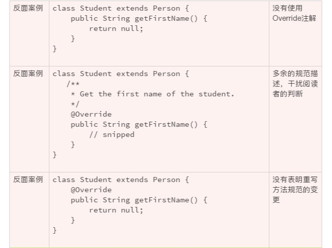
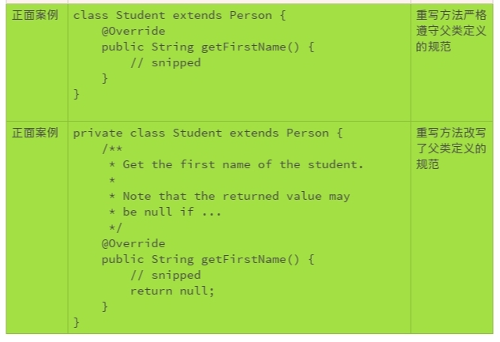

# 09  怎么用好Java注解？

如果你使用面向对象的概念和技术有一段时间了，不知道你会不会有这样的困惑： 面向对象技术带来的麻烦，一点都不比它带来的好处少！

比如说，我们辛辛苦苦继承了一个类，重写了它的方法。过几天，这个类居然修改了它的接口，而且没人通知我们。然后，我们写的子类还可以美滋滋地编译，运行，就是总出错误，怎么调试都没发现这个子类的实现有什么不妥。直到有人说，父类变了！这时候，我们就想找杯咖啡暖暖手，一个人静静。

面向对象技术确实有它值得傲娇的地方。但是，只有把类似上面的小麻烦解决掉，它的使用才更合理。 比如说，父类做了修改，能不能立即就通知我？ 别等到问题出现了，我们还被蒙在鼓里。

Java 注解就可以帮助我们。

## 什么是 Java 注解

Java 注解是 Java 1.5 引入的一个工具，类似于给代码贴个标签，通过注解可以为代码添加标签信息。这些标签信息可以添加在字段、方法和类上。开发工具、部署工具或者运行类库，可以对这些标签信息进行特殊的处理，从而获得更丰富的功能。

经过十多年的发展，注解已经成了 Java 生态系统一个非常重要的技术。使用注解可以大幅度降低我们的开发强度，提高工作效率，减少潜在的错误。像 Java 类库一样，注解也有了越来越丰富的定义和规范，成了我们需要掌握的重要技术之一。

**我们这里只讨论编写规范的代码时，该怎么合理地使用注解，具体就是 Override、Deprecated、SuppressWarnings 这三个注解**。更详细的 Java 注解技术和规范，以及如何自定义注解，需要你参考相关的文档。

## 在声明继承关系中，Java 注解该如何使用？

在代码编写中，继承和重写是面向对象编程的两个重要的机制。这两个机制，在给我们带来便利的同时，也顺便带来了一些麻烦，这就需要我们用到注解了。

**第一个麻烦是，识别子类的方法是不是重写方法**。比如下面的例子，在一般情况下，对代码阅读者来说，最直觉的感受就是，getFirstName() 这个方法不是重写方法，父类 Person 没有定义这个方法。

```java
class Student extends Person {
    // snipped
    public String getFirstName() {
        // snipped
    }
    // snipped
}
```

通常如果一个方法是重写方法，一定要使用 Override 注解，清楚地标明这个方法是重写的方法。 使用 Override 注解的另一个好处是，如果父类更改了方法，子类的编译就会出错。这样我们就能在第一时间获得通知，既可以及时地变更子类，也可以使父类的变更更加合理。

```java
class Student extends Person {
    // snipped
    @Override
    public String getFirstName() {
        // snipped
    }
    // snipped
}
```

为什么要识别重写方法呢？这是因为继承的第二个麻烦。

**第二个麻烦是，重写方法可以不遵守父类方法的规范**。面向对象编程的机制，理想的状况是，父类定义了方法和规范，子类严格地遵守父类的定义。 比如 Person.getFirstName() 要求返回值是一个人的名，不包括姓氏部分，而且不可以是空值。但是子类 Student.getFirstName() 的实现完全有可能没有严格遵守这样的规范，不管是有意的，或者是无意的。 比如，返回了姓氏，或者返回了包括姓氏的姓名，或者可以返回了空值。

```java
class Student extends Person {
    // snipped
    @Override
    public String getFirstName() {
        return null;
    }
    // snipped
}
```

编译器无法检查重写到底该怎么实现，保持重写方法的行为一致需要我们凭借经验、肉眼识别。一般来说，一个重写方法不应该改变父类定义的规范。如果的确需要改变，就要有充足的理由，以及面对潜在兼容问题的具体的解决办法。

比如上面的例子中，如果 Person.getFirstName() 不允许返回空值，应用程序可以很安心地使用返回值，而不需要检查空值。

```java
boolean isAlice(Person person) {
  return person.getFirstName().equals("Alice");
}
```

但是，有了可以返回空值的 Studen.getFirstName() 的重写，上面的代码就可能抛出 NullPointerException。一段简单的、严格遵守规范的代码，就变得危机四伏。

既然需要肉眼的判断，第一步就是要识别出重写方法。 识别方法越简单越好。

所以，重写的方法，一定要加上 Override 注解。这个注解，既可以提醒代码的阅读者，也提醒代码的书写者，要谨慎对待该方法在父类定义的规范。

识别出重写方法后，第二步就要判断重写的方法和父类规范的定义有没有冲突和抵触。

虽然一般情况下，子类的重写方法不应该改变父类的规范。但是，编写代码处处充满了无奈和妥协。极少数情况下，除了变更方法的规范，我们可能别无选择。 一旦这种情况发生，一定要明确标明，并注明潜在的后果。

如果重写方法既没有改变父类规范，也没有其他情况需要重点说明，重写方法就不应该有规范描述部分的存在。这样，可以减少规范描述对于阅读者的误导。我们当然需要了解具体的规范，但是应该查找、阅读父类的规范描述。






继承和重写还有一些其他的麻烦，我们后面的章节接着再聊。

## 在废弃退役接口的情况下，如何使用注解？

一个软件，部署得越广泛，生命力越悠久，就越需要不断地改进、升级。而废弃不合理的设计，拥抱更新的思想，也是软件改进的一部分。

然而，软件接口的废弃，不是一件简单的事情。越是广泛使用的接口，它的废弃、退役越困难。

比如，下面的 String 构造方法，是 1994 年 Java 1.0 设计实现的方法。很快，人们发现了这个方法的局限性。在 1997 年发布的 Java 1.1 中，废弃了该构造方法以及其他相关的方法。到现在，已经废弃 20 多年了，但 Java 依然没有删除这些方法，因为 String 的使用太广泛了！

```java
@Deprecated(since="1.1")
public String(byte ascii[], int hibyte) {
    this(ascii, hibyte, 0, ascii.length);
}
```

无论对于软件的维护者，还是软件的使用者，废弃的接口都是不值得让我们继续耗费精力的。

如果软件的维护者继续在废弃的接口上投入精力，意味着这个接口随着时间的推移，它的实现可能会存在各种各样的问题，包括严重的安全问题，就连使用者也要承担这些风险。而且还会有用户持续把它们运用到新的应用中去，这就违背了废弃接口的初衷。更多的使用者加入危险的游戏，也增加了删除废弃接口的难度。

这就要求我们做好两件事情

**第一件事情是，如果接口的设计存在不合理性，或者新方法取代了旧方法，我们应该尽早地废弃该接口**。

及时止损！

做好这件事情，需要我们使用 Deprecated 注解，并且用一切可以使用的办法，广而告之。对于代码而言，要在声明中使用 Deprecated 注解；在规范描述中，说明废弃的原因以及替代的办法；对于有计划要删除的接口，要注明计划删除的版本号。

下面是两个可以参照的 Java 代码废弃接口的例子：

```java
java/lang/String.java:
 
/**
 * Counts the number of stack frames in this thread. The thread must
 * be suspended.
 *
 * @return     the number of stack frames in this thread.
 * @throws     IllegalThreadStateException  if this thread is not
 *             suspended.
 * @deprecated The definition of this call depends on
 *             {@link #suspend}, which is deprecated.  Further,
 *             the results of this call were never well-defined.
 *             This method is subject to removal in a future
 *             version of Java SE.
 * @see        StackWalker
 */
@Deprecated(since="1.2", forRemoval=true)
public native int countStackFrames();
```

```java
java.security.Certificate.java:
 
/**
 * <p>This is an interface of abstract methods for managing a
 * variety of identity certificates.
 *
 * ... snipped ...
 *
 * @deprecated This class is deprecated and subject to removal
 *     in a future version of Java SE. It has been replaced by
 *     {@code java.security.cert.Certificate} and related classes.
 * @see java.security.cert.Certificate
 */
@Deprecated(since="1.2", forRemoval=true)
public interface Certificate {
    // snipped
}
```

**第二件事情是，如果我们在现有的代码中使用了废弃的接口，要尽快转换、使用替换的方法**。等到废弃方法删除的时候，再去更改，就太晚了，**不要等到压力山大的时候才救火**。

如果一个接口被废弃，编译器会警告继续使用的代码。Java 提供了一个不推荐使用的注解，SuppressWarnings。这个注解告诉编译器，忽略特定的警告。警告是非常有价值的信息，忽略警告永远不是一个最好的选项。

再次强调，除非万不得已，不要使用 SuppressWarnings。如果万不得已来临，请参考下面的例子。

```java
@SuppressWarnings("deprecation")
private boolean myMethodUseDeprecatedMethod() {
  // snipped
}
```

当然，这样的使用带来了一系列的后遗症。 由于，废弃的编译警告被无视，我们使用了废弃接口的事实就被淹没在代码的海洋里，再也进入不了我们的视野。不到废弃接口被删除的那一天，我们都意识不到我们的代码里使用了废弃的接口，我们的应用程序都要承担着废弃接口维护不足的种种风险，包括严重的安全风险。

后面我们还会谈到，不要轻易地更改现有的代码，即使这些代码很丑陋，散发着浓浓的腐臭味。但是，有一个例外，如果看到了使用 SuppressWarnings 的代码，我们要尽可能地想办法把相关的警告消除掉、把这个注解去掉，越快越好。

## 小结

Java 注解的功能很丰富，了解注解可以使得我们编码的工作更轻松。 这一次，希望我们记住三个基本的实践：

1. 重写的方法，总是使用；
2. 过时的接口，尽早废弃；
3. 废弃的接口，不要使用。

## 一起来动手

Java 的注解非常丰富，功能也很强大。借这个机会，我想让大家互相分享一下，你最经常使用的注解是什么？什么情况下使用这个注解？这个注解给你带来哪些便利？欢迎你把你的经验发布在评论区，我们一起来学习更多的注解，一起来进步。

也欢迎你把这篇文章分享给你的朋友或者同事，一起来探讨吧！

## 精选留言(20)

- 

  hua168

  2019-01-23

  **16

  老师，问3个很重要的题外问题：
  \1. 大专学历，想直接自学考本科或研究生，自考学历中大型公司承认的吗？
  \2. 大公司对年龄有限制的吗？
  \3. 30多岁，运维（编程自学java一年，没项目经验），只有小公司工作经验，技术一般，发展方向是什么？很多IT公司好像都不要年龄大点的~~人生80，那不是40岁就没得工作了？

  展开**

  作者回复: 人生三十，学历的分量应该比重不大了。国内的部分大公司，年龄是个考量的因素，但是也就是众多因素中的一个因素。如果把劳动力看成一个理性的市场，重要的是我们有什么可以拿来交换的。

  我有一个朋友，认识他的人都特别佩服，他曾经兼顾过一段时间的非常枯燥无聊、看起来也没什么技术含量的工作。 过了几年，当他把工作转交给下一个人时，他已经把这项工作做的像一个艺术了。他做了大量的自动化，看起来非常枯燥无聊的事情，被他搞的很有趣，自动化后，根本就占用不了他多长时间。

  软件是一个复杂的系统，需要各种各样的人才，有能研发的，有能测试的，有能运维的，有能运营的。每种都需要不同的技能。再厉害的研发也不一定做得了测试，也不一定做得了运维。

  把你手头的工作做出花来，这就是我们值钱的地方。 怎么才能做出花来呢？ 这个你的领导不知道，你的公司可能也不知道，所以大概率没有人能够教你怎么做。你得自己去从工作中发现现实的问题，找到具体的解决办法。多看看新的技术，想一想能不能用到你的工作环境中去。 你可能看到100个技术，只有一个能用。 一个能用，这就行了。你要是不看100个，可能没有办法找到这一个。

  运维就是一个涉及到很多复杂知识的岗位，它的复杂度一点都不必软件开发简单。 但是，的确也有的运维就是看几台机器。但是，既然是你做运维，你可以自己定义运维该怎么做最好。

  不管时哪一个岗位，如果做到一定程度，年龄从来都不是真正的问题。很多岗位，年龄都是优势，而不是问题，因为没有积年累月的积累，我们成不了一个领域最专业的人。成为问题的，是我们40岁了，水平还停留在20到30岁的阶段。

  Stay Hungry, Stay Foolish!

- 

  岁月安然

  2019-01-24

  **9

  lombok插件的很多实用的注解
  @Data 使用在类上，该注解会提供getter、setter、equals、canEqual、hashCode、toString方法。
  @NonNull 该注解使用在属性上，该注解用于属的非空检查，当放在setter方法的字段上，将生成一个空检查，如果为空，则抛出NullPointerException。
  @AllArgsConstructor 该注解使用在类上，该注解提供一个全参数的构造方法，默认不提供无参构造。
  @NoArgsConstructor 该注解使用在类上，该注解提供一个无参构造。
  等等

  展开**

  作者回复: 学习了，我还不知道这个插件。注解真的非常强大！

- 

  王智

  2019-01-23

  **2

  阿里巴巴的扫描插件或许会有帮助的,在使用idea的过程中,安装了Alibaba Java Coding Guidelines之后,代码的规范等等插件就会检测出来报红,虽然可以运行,但是对于有强迫症和代码洁癖的人来说就很难受.
  包括了if不写括号,继承的方法没有使用@Override注解.

  对于刚刚工作的我,java中的注解用的最多的就是@Override了. 废弃方法在idea中会有横线作为标记,有这种标记的方法一律不使用.

  继续加油去了.

  展开**

  作者回复: 加油！

- 

  web

  2019-01-28

  **1

  题目有点大, 以为是讲怎么写注解; 内容有点水, 半个版面怎么写override

  展开**

  作者回复: 😄和规范有关的注解。

- 

  Being

  2019-01-23

  **1

  Override对应C++就是virtual了，经常用，以前还真不太清楚为什么重写的方法要加，就觉得好区别，就保留这个习惯了，今天才意识到要避免父类删除继承方法后，能快速通过编译器定位问题。
  貌似C++没有JAVA的Depraceted和SuppressWarnings类似的，我再查查确认下，Deprecated的用处挺大的，及时止损呀

  展开**

  作者回复: 谢谢分享C++对应的关键字。

- 

  啦啦啦

  2019-01-23

  **1

  课程都是以java讲解的吗，没有其他编程语言吗

  展开**

  作者回复: 除了个别的例子，几乎都是用Java讲解的。

- 

  苦行僧

  2019-01-23

  **1

  现在基本上是用静态代码检查工具扫描业务代码，jdk中的废弃方法基本替换掉

  展开**

  作者回复: 赞，这是一个好习惯！

- 

  Sisyphus2...

  2019-05-22

  **

  注解如果没有校检功能就是注释，如果需要校检功能，各个语言都有自己的特色，比如 python 的装饰器，能够极大的提高代码可读性，模块封装的更好。
  是否使用注解应该是个开放话题，注释倒是必须写清楚的。

  展开**

  作者回复: “是否使用注解应该是个开放话题”，是的，注解很复杂，不同的注解，要分开考量。

- 

  卞雪达

  2019-05-15

  **

  哈哈哈，最常用的注解，现在都成Spring的@Autowired啦，还有Spring的各种注解，给我的感觉，Spring使用多了，都是注解编程啦，我参数检验都用注解完成。我也会写自己的注解，我刚刚还完成了一个@Excel，我这是个Web的项目，有的接口产生的数据，可能会被导出成Excel，我捣鼓了几波，终于弄了一个注解，放在controller层的方法上，让那种简单的回List的接口，可以直接导出成Excel（配合下http参数），我遇到比较大的麻烦，是我之前设计了一个@Page的注解，注在Service层方法上，帮助开启数据库分页（也要配合http参数，且是一个方法查一次数据的那种），而@Excel跟它有个比较大的冲突：@Page是要分页，@Excel是不要分页。用户肯定是查询的时候看到分页接口，导出的时候拿到全部结果，我得想办法通知一下@Page，我最开始尝试给@Page里面的default方法弄个参数，然后改这个值，后来发现这个值竟然不是每个线程独有的，而是唯一的，也就是改了大家全都改，后来想了想，大概是因为注解本质上是个接口或类似接口？最终选择了ThreadLocal来通知@Page，我已经使用了很多ThreadLoacal了，我之前用它不是很多，现在有些上瘾，又隐隐担心别有坑，比如我知道有个不remove可能有内存溢出的坑。回到注解的话题，注解编程我觉得挺帅的，@Override我也爱加，能给方法加多少注解我就加多少，感觉是一种加持，哈哈哈，不过创造、使用注解就像是创造、使用规则，得对这个规则熟悉，好多注解编译器也不能判断你是不是符合了规则，用的时候还是有些学习成本。

  展开**

  作者回复: 👍 很多Java的特性，被大家用的出神入化，甚至远远超出了设计者的构想！这真的很帅啊！

- 

  程龙

  2019-04-10

  **

  老师 我想问下，接口和实现类，注解应该写在接口 上面还是实现类?

  展开**

  作者回复: 要区分一下。 一般的，我们说接口是公开的interface或者class。接口的规范（注释的一种形式）要写在接口里，这样自动生成的文档，便于查阅。一般的实现类，是在内部包或者代码里。实现类的注释，是帮助理解实现类的，要贴着代码写。

- 

  苦行僧

  2019-03-11

  **

  spring注解才是坑超级多

  展开**

- 

  悲劇の輪廻

  2019-02-25

  **

  虽然只是为了举例而写的代码段，但一般情况下需要被equals的对象为字符串时我们会声明一个字符串常量，而当一个从方法获得的值需要与字符串常量作比较的时候，通常把方法返回值放在被equals的位置，这样也能避免方法返回null时抛出空指针异常，而且不会引起逻辑上的错误。:-)

  作者回复: 只有多次使用时，一般才会考虑定义常量。euqals的使用是一个很好的实践。代码质量就是这些一点一点的小事累积而成的。

- 

  醉侠

  2019-02-13

  **

  老师，想知道文章里String的构造函数为什么被移除，是因为字符编码的问题吗？

  作者回复: 是字符编码的问题，这个构造函数（String(byte[] ascii, int hibyte)）没有充分的信息可以把字节（byte）转换成合适的字符（character）。

- 

  小新是也

  2019-02-03

  **

  用的最多的应该是Lombox的@Data了

  展开**

- 

  小成

  2019-01-30

  **

  C++11引入了override关键字，对应Java的override.
  C++14引入了deprecated关键字，对应Java的deprecated.

  作者回复: 谢谢分享，这个留言对使用C++的有帮助！

- 

  hua168

  2019-01-24

  **

  看你介绍，您是DBA大神，有哥们小公司搞DBA几年，会mysql、MSSQL、mongoDB，群集、分库，分表、分区简单优化等，不懂开发，我想问一下：
  1.DBA一般发展方向是怎样的呀？运维和开发我了解，DBA没接触过，无法给建议，一般的升级过程是怎样的？
  2.DBA开发语言选择是C++还是java，还是其它？
  3.以后发展方向是怎样？现在都是开源、大数据时代时代，阿里又搞“去IOE”，一般oracle DBA发展前景不好吧？

  DBA工资普遍比开发、运维高，但感觉很难~~能帮菜鸟指一个大概的方向吗？谢谢~~

  展开**

  作者回复: 可能是你搞错了，我不懂Oracle的数据库。我的数据库知识也比较陈旧了，还是十多年前的见识，没什么长进。

  小伙伴们帮着回答一下吧！

- 

  hua168

  2019-01-24

  **

  非常感谢您的认真回答！谢谢……

  展开**

  作者回复: 不客气

- 

  多拉格·fi...

  2019-01-24

  **

  在项目中使用Lombok可以减少很多重复代码的书写。使用注解在class文件中生成getter/setter/toString等方法。

  作者回复: 了解了。谢谢！

- 

  wwww

  2019-01-23

  **

  lombak

  展开**

  作者回复: lombak是什么？怎么用？能分享多一点内容吗?

- 

  allean

  2019-01-23

  **

  Findbugs？

  展开**

  作者回复: FindBugs/SpotBugds，或者规范的插件，都能检查出来这些问题。