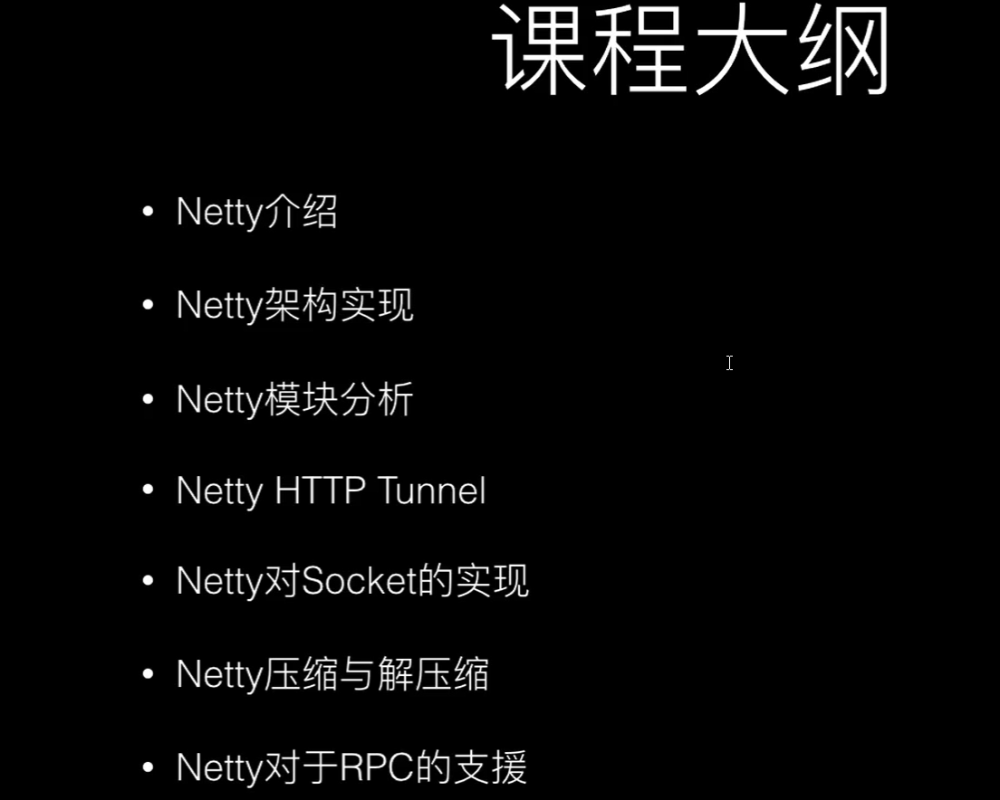
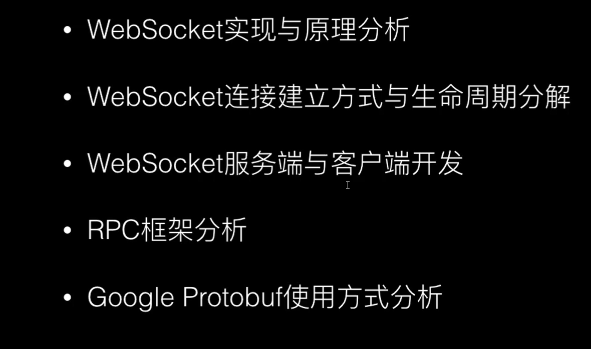

# Netty

# Netty介绍及NIO详解


### Netty简介

------

Netty是一个**异步**、基于**事件驱动**的网络应用框架

Netty is *an asynchronous event-driven network application framework*
for rapid development of maintainable high performance protocol servers & clients.

[BIO、NIO、AIO的简介](https://blog.csdn.net/qq_33423418/article/details/103093348)

### 应用场景

------

- 分布式系统中各节点远程过程调用（RPC：Dubbo）
- 游戏服务器
- Hadoop通信


### 课程大纲






### NIO

------

##### 三大组件

NIO三大组件：**Selector、Channel、Buffer**


- 一个Channel对应一个Buffer，一个Selector管理多个Channel，一个线程对应一个Selector
- 程序切换到哪个Channel由事件决定，Event
- Buffer就是一个内存块，底层是数组。Client通过Buffer进行数据的读写，NIO中的Buffer是双向的，BIO中的输入流、输出流不是双向的。
- Channel也是双向的

#### Buffer

抽象类Buffer中的属性：

- mark ： 标记
- position ： 位置，下一次要读写的元素的位置。
- limit ： 缓冲区的终点，不能超过缓冲区的最大位置，可以修改
- capacity ：容量，缓冲区创建时指定

```java
		IntBuffer intBuffer = IntBuffer.allocate(5);
        for (int i = 0; i < intBuffer.capacity(); i++) {
            // 将元素插入position位置
            intBuffer.put(i << 10);
        }
        // 读写翻转
        intBuffer.flip();
        // 将limit指定为3，只能获取索引小于3的元素
        intBuffer.limit(3);
        System.out.println(intBuffer.capacity());
        while (intBuffer.hasRemaining()){
            // 获取position位置的元素
            System.out.println(intBuffer.get());
        }
1234567891011121314
```

基本类型中除了bool，其他类型都有对应的Buffer类。

IntegerBuffer类中的重要属性：

```java
	// 存储数据的数组
	final int[] hb;                  // Non-null only for heap buffers
    final int offset;
    // 是否只读
    boolean isReadOnly;

123456
```

#### Channel

Channel可以同时读写，可以异步读写数据。

- **FileChannel**：文件读写
    FileOutPutStream和FileInputStream中包含了FileChannel属性，可以通过这两个类的实例获得Channel。
    实例：

```java
		FileOutputStream outputStream = new FileOutputStream("D://hello.txt");
        // 从FileOutPutStream获取FileChannelImpl
        FileChannel channel = outputStream.getChannel();
        ByteBuffer buffer = ByteBuffer.allocate(1024);
        String s = "hello,World";
        // 将byte数组放入缓冲区，buffer的position等于数组长度
        buffer.put(s.getBytes());
        // 读写翻转，limit=position，而position置0
        buffer.flip();
        // 写入
        channel.write(buffer);
        outputStream.close();
        channel.close();
12345678910111213
		FileInputStream inputStream = new FileInputStream("D://hello.txt");
        // FileInputStream获取FileChannel，实际类型是FileChannelImpl
        FileChannel channel = inputStream.getChannel();
        ByteBuffer buffer = ByteBuffer.allocate(1024);
        int read = channel.read(buffer);
        System.out.println(read);
        String s = new String(buffer.array(), 0, read,"utf-8");
        System.out.println(s);
        inputStream.close();
        channel.close();
12345678910
		FileInputStream inputStream = new FileInputStream("D://hello.txt");
        FileOutputStream outputStream = new FileOutputStream("D://hello2.txt");
        FileChannel inChannel = inputStream.getChannel();
        FileChannel outputChannel = outputStream.getChannel();
        ByteBuffer buffer = ByteBuffer.allocate(2);
        while (true){
            // clear不重置的话，position=limit，则read一直等于0
            // 标志位重置，position重置为0，limit设为capacity
            buffer.clear();
            int read = inChannel.read(buffer);
            if (read == -1){
                break;
            }
            buffer.flip();
            outputChannel.write(buffer);
        }
        inputStream.close();
        outputStream.close();
123456789101112131415161718
		// 使用transfrom拷贝文件
		FileInputStream inputStream = new FileInputStream("D://a.jpg");
        FileOutputStream outputStream = new FileOutputStream("D://a2.jpg");
        FileChannel inChannel = inputStream.getChannel();
        FileChannel outputChannel = outputStream.getChannel();
        // transferFrom拷贝
        outputChannel.transferFrom(inChannel,0,inChannel.size());
        inputStream.close();
        outputStream.close();
123456789
```

- 

#### Buffer和Channel注意事项

- ByteBuffer，put什么类型，取得时候就要相应的类型去get。

- Buffer可以设置为只读

    ```java
    // 只读Buffer，不可写，否则会报ReadOnlyBufferException
    ByteBuffer readOnlyBuffer = buffer.asReadOnlyBuffer();
    12
    ```

- MappedByteBuffer可以直接在内存（堆外内存）中修改，操作系统不需要拷贝一次

    ```java
    		// 直接在内存中修改，不用操作系统再拷贝一次
            RandomAccessFile accessFile = new RandomAccessFile("D://a.txt", "rw");
            FileChannel channel = accessFile.getChannel();
            /**
             * 参数说明；
             * 1.FileChannel.MapMode.READ_WRITE 使用读写模式
             * 2.直接修改的起始位置
             * 3.从起始位置映射到内存的大小（不是索引），超过字节大小将不能修改
             */
            MappedByteBuffer mappedByteBuffer = channel.map(FileChannel.MapMode.READ_WRITE, 0, 5);
            mappedByteBuffer.put(0,(byte) 'a');
            mappedByteBuffer.put(3,(byte) '9');
            accessFile.close();
    12345678910111213
    ```

- NIO支持多个Buffer的Scatting和Gathering

    ```java
    /**
             * Scatting：将数据写入到buffer时，可以使用buffer数组，依次写入
             * Gathering：从buffer读取数据时，可以采用buffer数组，依次读取
             */
            ServerSocketChannel serverSocketChannel = ServerSocketChannel.open();
            InetSocketAddress socketAddress = new InetSocketAddress(7000);
            serverSocketChannel.socket().bind(socketAddress);
    
            // 创建buffer数组
            ByteBuffer[] buffers = new ByteBuffer[2];
            buffers[0] = ByteBuffer.allocate(5);
            buffers[1] = ByteBuffer.allocate(8);
            int messageLength = 10;
            // 等待连接
            SocketChannel socketChannel = serverSocketChannel.accept();
            // 循环读取
            while (true) {
                int byteRead = 0;
                while (byteRead < messageLength){
                    long l = socketChannel.read(buffers);
                    byteRead += l;
                    System.out.println("byteRead = "+byteRead);
                    Arrays.asList(buffers).stream().map(buffer -> "position = "+buffer.position() +",limit = "+buffer.limit()).forEach(System.out::println);
                }
    
                Arrays.asList(buffers).forEach(byteBuffer -> byteBuffer.flip());
                int byteWrite = 0;
                while (byteWrite < messageLength){
                    long l = socketChannel.write(buffers);
                    byteWrite += l;
                }
                Arrays.asList(buffers).forEach(byteBuffer -> byteBuffer.clear());
                System.out.println("byteRead = "+byteRead + ",byteWrite = "+byteWrite +",messageLength = "+messageLength);
    123456789101112131415161718192021222324252627282930313233
    ```

#### Selector

- Channel注册到Selector，Selector能够检测到Channel是否有事件发生。如果有事件发生，则进行相应的处理。这样可以实现一个线程管理多个Channel（即多个连接和请求）
- 只有通道真正有读写事件发生时，才会进行读写。减少了创建的线程数，降低了系统开销
- 减少了上下文的切换，用户态和系统态的切换

以ServerSocketChannel为例说明：

1. 当有客户端连接时，ServerSocketChannel会返回一个SocketChannel
2. SocketChannel注册到Selector。（register方法）
3. register方法会返回一个SelectionKey，SelectionKey与Channel关联
4. Selector监听select方法，返回有事件的个数
5. 进一步得到SelectionKey
6. 通过SelectionKey获取SocketChannel（SelectionKey中的channel方法）
7. 通过获取的channel，执行业务处理

**代码说明：**

SeverSocketChannel端：

```java
 		// 创建ServerSocketChannel
        ServerSocketChannel serverSocketChannel = ServerSocketChannel.open();
        // 创建Selector
        Selector selector = Selector.open();
        // 绑定ip
        serverSocketChannel.socket().bind(new InetSocketAddress(9000));
        // 设置为不阻塞
        serverSocketChannel.configureBlocking(false);
        // 将ServerSocketChannel注册到selector。指定关心的事件为OP_ACCEPT，
        // 当有关心的事件发生时，会返回这个SelectionKey，通过SelectionKey可以拿到Channel
        serverSocketChannel.register(selector,SelectionKey.OP_ACCEPT);

        while (true){
            // Selector监听，等于0说明此时没有事件发生。
            if (selector.select(1000) == 0) {
                System.out.println("Selector监听了一秒");
                continue;
            }
            Set<SelectionKey> keys = selector.selectedKeys();
            Iterator<SelectionKey> keyIterator = keys.iterator();
            while (keyIterator.hasNext()){
                SelectionKey key = keyIterator.next();
                if (key.isAcceptable()){
                    // 获得SocketChannel，此处的accept不会阻塞
                    SocketChannel socketChannel = serverSocketChannel.accept();
                    // 此处socketChannel也要设置为非阻塞模式
                    socketChannel.configureBlocking(false);
                    // 注册Selector。第三个参数是连接的对象，通过SelectionKey可以连接到这个对象
                    socketChannel.register(selector,SelectionKey.OP_READ,ByteBuffer.allocate(1024));
                }
                if (key.isReadable()){
                    SocketChannel channel = (SocketChannel)key.channel();
                    ByteBuffer buffer = (ByteBuffer) key.attachment();
                    int read = channel.read(buffer);
                    System.out.println("客户端 : "+new String(buffer.array(),0,read));
                }
                // 手动删除避免重复
                keyIterator.remove();
            }
        }
12345678910111213141516171819202122232425262728293031323334353637383940
```

SocketClient端;

```java
		SocketChannel socketChannel = SocketChannel.open();
        // 设置非阻塞模式
        socketChannel.configureBlocking(false);
        boolean connect = socketChannel.connect(new InetSocketAddress("127.0.0.1",9000));
        if (!connect){
            while (!socketChannel.finishConnect()){
                System.out.println("因为连接需要时间，客户端不会阻塞，可以做一些其他工作");
            }
        }
        ByteBuffer buffer = ByteBuffer.wrap("This is a message!".getBytes());
        socketChannel.write(buffer);
        System.in.read();
123456789101112
```

 