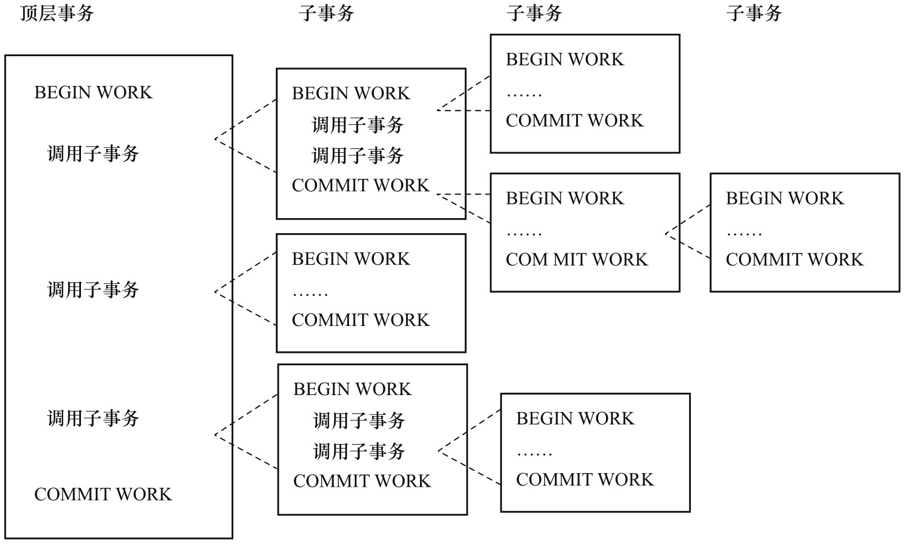

# 事务

[TOC]


## 一、认识事务

### （一）概述

事务（Transaction）目的是把数据库从一种一致状态转换为另一种一致状态。在数据库提交工作时，可以确保要么所有修改都已经保存或都不保存。

事务由一条或多条 SQL 语句组成，事务是访问并更新数据库中各种数据项的一个数据执行单元。

InnoDB 中的默认事务隔离级别为 READ REPEATABLE，完全符合 ACID 的特性，其中隔离性通过锁来完成，原子性、一致性、持久性通过 redo 和 undo 来完成。

- 原子性（atomicity）

    指整个数据库事务是不可分割的工作单位。只有使事务中所有的数据库操作都执行成功，才算整个事务成功。事务中任何一个 SQL 语句执行失败，已经执行成功的 SQL 语句也必须撤销，数据库状态应该退回到执行事务前的状态。

- 一致性（consistency）

    一致性指事务将数据库从一种状态转变为下一种一致的状态。在事务开始之前和事务结束以后，都没有破坏数据库的**完整性约束**。

    > 如事务开始前表中姓名不能重复，如果事务提交或者回滚之后，姓名不唯一了，就是破坏一致性了。

- 隔离性（isolation）

    事务的隔离性要求每个读写事务的对象对其他事务的操作对象能相互分离，即该事务提交前对其他事务都不可见，通常这使用锁来实现。

- 持久性（durability）

    事务一旦提交，其结果就是永久性的。即使发生宕机等故障，数据库也能将数据恢复即只能从事务本身的角度来保证结果的永久性。

    如果非数据库本身故障则可能导致提交数据丢失，因为持久性保证事务系统的高可靠性而不是高可用性。

### （二）事务分类

从事务理论的角度来说，可以把事务分为以下几种类型：

- 扁平事务（Flat Transactions）
- 带有保存点的扁平事务（Flat Transactions with Savepoints）
- 链事务（Chained Transactions）
- 嵌套事务（Nested Transactions）
- 分布式事务（Distributed Transactions）

**扁平事务（Flat Transaction）** 是事务类型中最简单也是在生产中使用最频繁的一种事务。在扁平事务中，所有操作都处于同一层次，其由 BEGIN WORK 开始，由 COMMIT WORK 或 ROLLBACK WORK 结束，其间的操作是原子的，要么都执行，要么都回滚。因此其限制在于不能提交或者回滚事务的某一部分，或分几个步骤提交。

**带有保存点的扁平事务（Flat Transactions with Savepoint）**，除了支持扁平事务支持的操作外，允许在事务执行过程中回滚到同一事务中较早的一个状态。这是因为某些事务可能在执行过程中出现的错误并不会导致所有的操作都无效，放弃整个事务不合乎要求，开销也太大。保存点（Savepoint）用来通知系统应该记住事务当前的状态，以便当之后发生错误时，事务能回到保存点当时的状态。

> 扁平事务中隐式设置了唯一一个保存点，因此回滚只能回滚到事务开始时的状态。

使用 SAVE WORK 函数建立保存点，通知系统记录当前的处理状态。


**链事务（Chained Transaction）**可视为保存点模式的一种变种。带有保存点的扁平事务，当发生系统崩溃时，所有的保存点都将消失，因为其保存点是易失而非持久的。则当进行恢复时，事务需要从开始处重新执行，而不能从最近的一个保存点继续执行。

链事务的思想是：在提交一个事务时，释放不需要的数据对象，将必要的处理上下文隐式地传给下一个要开始的事务。注意，提交事务操作和开始下一个事务操作将合并为一个原子操作。这意味着下一个事务将看到上一个事务的结果，就好像在一个事务中进行的一样。下图为链事务的工作方式：


两者区别在于：带有保存点的扁平事务能回滚到任意正确的保存点，而链事务中的回滚仅限于当前事务，即只能恢复到最近一个的保存点。对于锁的处理，两者也不相同。链事务在执行 COMMIT 后即释放了当前事务所持有的锁，而带有保存点的扁平事务不影响迄今为止所持有的锁。

**嵌套事务（Nested Transaction）**是一个层次结构框架。由一个顶层事务（top-level transaction）控制着各个层次的事务。顶层事务之下嵌套的事务被称为子事务（subTransaction），其控制每一个局部的变换。嵌套事务的层次结构如图所示。



- 嵌套事务是由若干事务组成的一棵树，子树可以是嵌套事务或者是扁平事务；
- 叶子节点事务为扁平事务，根节点为顶层事务，事务前后驱分别为：父事务/子事务；
- 任何子事务都在顶层事务提交之后才真正的提交（子事务可以提交或回滚，但是只有其父事务提交之后才生效）。
- 任何一个事务的回滚都会引起其所有子事务的一同回滚；

叶子节点事务完成访问数据库、发送消息等实际工作，高层的事务仅负责逻辑控制（即何时调用相关子事务），即使一个系统不支持嵌套事务，**可以通过保存点技术来模拟嵌套事务**。如图


 

**用保存点技术来模拟嵌套事务在锁的持有方面还是嵌套事务有区别的**：当通过保存点技术时，用户无法选择哪些锁需要被子事务继承，哪些需要被父事务保留。也就是说，无论有多少个保存点，所有被锁住的对象都可以被得到和访问。

嵌套事务例如：一个父事务p1，其持有对象X和Y的排它锁，现在要开始一个调用子事务p11，那么父事务p1可以不传递锁，也可以传递所有的锁，也可以只传递一个排它锁。如果子事务p11中还要持有对象Z的排它锁，那么通过反向继承（counter-inherited），父事务p1将持有3个对象X，Y，Z的排它锁。【书本 P 292-293】。

**分布式事务（Distributed Transactions）**通常是一个在分布式环境下运行的扁平事务，因此需要根据数据所在位置访问网络中的不同节点，不同的结点的数据库执行的事务操作又都是扁平的。

对于InnoDB存储引擎来说，其支持扁平事务，带有保存点的事务，链事务，分布式事务，而不支持嵌套事务，不过可以通过带保存点的事务来模拟串行的嵌套事务。

## 二、事务的实现

原子性、一致性、持久性通过数据库的 `redo log` 和 `undo log` 来完成。`redo log` 称为重做日志，用来保证事务的原子性和持久性。`undo log` 用来保证事务的一致性（用于帮助事务回滚和 MVCC 功能）。

redo 和 undo 的作用都可以视为是一种恢复操作，redo 恢复提交事务修改的页操作，而 undo 回滚行记录到某个特定版本。因此两者记录的内容不同，redo 通常是物理日志，记录的是页的物理修改操作。undo 是逻辑日志，根据每行记录进行记录。

### （一）redo

#### 1.基本概念

重做日志用来实现事务的持久性。其由两部分组成：一是内存中易失的重做日志缓冲（redo log buffer）；二是持久的重做日志文件（redo log file）。

InnoDB 是事务的存储引擎，其通过 Force Log at Commit 机制实现事务的持久性，即当事务提交（COMMIT）时，必须先将该事务的所有日志写入到重做日志文件进行持久化，待事务的 COMMIT 操作完成才算完成。这里的日志包括 redo log（基本为顺序写，在数据库运行时不需要对 redo log 的文件进行读取操作）和 undo log（需要进行随机读写）。

每次将重做日志缓冲写入重做日志文件后，InnoDB 都需要调用一次 fsync 操作来确保每次日志都写入重做日志文件（因为重做日志文件打开并没有使用 O_DIRECT 选项，因此重做日志缓冲先写入文件系统缓存，所以必须进行 fsync 确保重做日志写入磁盘），且 fsync 效率取决于磁盘，所以磁盘的性能决定事务提交的性能。

参数 `innodb_flush_log_at_trx_commit` 用于控制重做日志刷新到磁盘的策略，默认值为 1 表示事务提交时必须调用一次 fsync 操作，值为 0 表示事务提交时不写入重做日志，写入重做日志仅仅是会在 master thread 中以每秒进行一次重做日志文件的 fsync 操作，值为 2 表示事务提交时将重做日志写入重做日志文件，但仅写入文件系统的缓存中，不进行 fsync 操作（MySQL 宕机事务不会丢失，但是操作系统宕机会丢失未从文件系统缓存刷新到重做日志文件的部分事务）。设置为 0 或者 2 虽然会带来性能提升，但是丧失了事务的 ACID 特性，为了提升事务的提交性能，因为多次插入然后进行一次 COMMIT，不是每插入一次就 COMMIT 一次，这样可以使事务方法在回滚时可以直接回滚到事务最开始的状态。

在 MySQL 库中还有一种二进制日志（binlog），其用来进行 POINT-IN-TIME（PIT）的恢复及主从复制（Replication）环境的建立。其和重做日志差异为：

首先，重做日志是在 InnoDB 存储引擎层产生，而二进制日志是在 MySQL 数据库的上层产生的，并且二进制日志不仅仅针对于 InnoDB 存储引擎，MySQL 数据库中的任何存储引擎对于数据库的更改都会产生二进制日志。

其次，两种日志记录的内容形式不同。MySQL 数据库上层的二进制日志是一种逻辑日志，其记录的是对应的 SQL 语句。而 InnoDB 存储引擎层面的重做日志是物理格式日志，其记录的是对于每个页的修改。

此外，两种日志记录写入磁盘的时间点不同。二进制日志只在事务提交完成后进行一次写入（同时对于每个事务仅包含对应事务的一个日志）。而 InnoDB 存储引擎的重做日志在事务进行中不断地被写入，这表现为日志并不是随事务提交的顺序进行写入的（且其记录的是物理操作日志，因此每个事务对应多个日志条目）。

#### 2.log block

InnoDB 中重做日志缓冲、重做日志文件都是以块（block）的方式保存的，称为重做日志块（log block），每块大小 512 字节，其和磁盘扇区大小一致，因此重做日志的写入可以保证原子性，不需要 doublewrite 技术，如果一个页中产生的重做日志大小大于 512 字节，则分为多个重做日志块进行存储。


log buffer 由 log block 组成（类似于数组），因此使用 `LOG_BLOCK_HDR_NO` 标记这个数组中的位置，该值递增循环使用（第一位用于判断是否为 flush bit，所以最大值为 2G）。`LOG_BLOCK_HDR_DATA_LEN` 表示 log block 占用的实际大小，当写满的时候该值为 0x200（512 字节），`LOG_BLOCK_FIRST_REC_GROUP` 表示 log block 中第一个日志所在的偏移量，如果该值和 `LOG_BLOCK_HDR_DATA_LEN` 相等即表示当前 log block 不包含新的日志。==P299 没理解 12 的含义。==`LOG_BLOCK_CHECKPOINT_NO` 为该 log block 最后被写入时的检查点第 4 字节的值。尾部只有 `LOG_BLOCK_TRL_NO`，该值和 `LOG_BLOCK_HDR_NO` 相同，并在函数 `log_block_init` 中被初始化。

#### 2.log group

重做日志组是一个逻辑上的概念，其多个重做日志文件组成（其中每个日志文件大小相同），并没有一个实际存储的物理文件来表示 log group 信息，且 InnoDB 只有一个 log group，重做日志文件总大小最多为 512GB。

重做日志文件中存储的就是 log buffer 中保存的 log block，因此其也是根据 512 字节为一块的方式进行物理存储的管理，且 InnoDB 在运行过程中，log buffer 会根据一定规则将内存中的  log block 刷新到磁盘中，规则包括：

- 事务提交时；
- 当 log buffer 中有一半的内存空间已经被使用时
- log checkpoint 时

对于 log block 的写入是追加在 redo log file 的最后，让一个 redo log file 写满之后写下一个，使用方式为 round-robin（循环写）;


#### undo

重做日志记录了事务的行为，可以很好地通过其对页进行“重做”操作。但是事务有时还需要进行回滚操作，这时就需要 undo。因此在对数据库进行修改时，InnoDB 存储引擎不但会产生 redo，还会产生一定量的 undo。这样如果用户执行的事务或语句由于某种原因失败了，又或者用户用一条 ROLLBACK 语句请求回滚，就可以利用这些undo信息将数据回滚到修改之前的样子。

用户通常对 undo 有这样的误解：undo 用于将数据库物理地恢复到执行语句或事务之前的样子——但事实并非如此。undo 是逻辑日志，因此只是将数据库逻辑地恢复到原来的样子。所有修改都被逻辑地取消了，但是数据结构和页本身在回滚之后可能大不相同。这是因为在多用户并发系统中，可能会有数十、数百甚至数千个并发事务。数据库的主要任务就是协调对数据记录的并发访问。比如，一个事务在修改当前一个页中某几条记录，同时还有别的事务在对同一个页中另几条记录进行修改。因此，不能将一个页回滚到事务开始的样子，因为这样会影响其他事务正在进行的工作。

除了回滚操作，undo 的另一个作用是 MVCC，即在 InnoDB 存储引擎中 MVCC 的实现是通过 undo 来完成。当用户读取一行记录时，若该记录已经被其他事务占用，当前事务可以通过 undo 读取之前的行版本信息，以此实现非锁定读取。

### 事务的隔离级别

SQL 标准定义的四个隔离级别为：

- READ UNCOMMITTED
- READ COMMITTED
- REPEATABLE READ
- SERIALIZABLE

InnoDB 存储引擎默认支持的隔离级别是 `REPEATABLE READ` ，但是与标准 SQL 不同的是，InnoDB 存储引擎在 `REPEATABLE READ` 事务隔离级别下，使用 `Next-Key Lock` 锁的算法，因此避免幻读的产生。

## 备份与恢复

### 复制

#### 复制的原理

复制（replication）是MySQL数据库提供的一种高可用高性能的解决方案，一般用来建立大型的应用。总体来说，replication的工作原理分为以下3个步骤：

1. 主服务器（master）把数据更改记录到二进制日志（binlog）中。
2. 从服务器（slave）把主服务器的二进制日志复制到自己的中继日志（relay log）中。
3. 从服务器重做中继日志中的日志，把更改应用到自己的数据库上，以达到数据的最终一致性。

复制的工作原理并不复杂，其实就是一个完全备份加上二进制日志备份的还原。不同的是这个二进制日志的还原操作基本上实时在进行中。这里特别需要注意的是，复制不是完全实时地进行同步，而是异步实时。这中间存在主从服务器之间的执行延时，如果主服务器的压力很大，则可能导致主从服务器延时较大。复制的工作原理如图8-4所示。

[](https://gitee.com/qchery/graph-bed/raw/master/202002/25/MySQL数据库的复制工作原理.jpg)

从服务器有2个线程，一个是I/O线程，负责读取主服务器的二进制日志，并将其保存为中继日志；另一个是SQL线程，复制执行中继日志。


# 第五章：数据库事务

> 简单的说说：就是数据库区别于文件系统的重要特征之一了。就是事务是访问更新数据库数据的一个单元，在这个事务单元中所有的修改，要么都成功，要么都失败。

------

### 概述与分类

#### 数据库特性

- **原子性(atomicity)：**就是事务操作为最小单位，要么都成功，要么都失败。
- **一致性(consistency)：**
- **隔离性(isolation)：**不同事务之间的数据不会相互影响。
- **持久性(durability)：**事务完成后，数据就为永久性的了（数据不可逆并持久化存储于存储系统当中）

> 就是常说的啥ACID特性。具体干啥用的，不知道。但并不是所有数据库都完全满足这4个特性的。【比如：oracle 数据库，默认事务级别为READ COMMITTED，就不满足隔离性的了。】

#### 事务的分类

- **扁平事务** ：就是简单的单个 begin 、commit、rollback这样子。
- **带有保存点的扁平事务**：在一个事务中有好几个保存点用于部分回滚的东东。
- **链事务**：一个事务结束之后调用另一个事务。（之间有数据结果传递）
- **嵌套事务**：一个事务中 调用另外的子事务。（常见存储过程之间调用，好像相互调用会死锁或死循环的样子）
- **分布式事务**： 是多个节点间的扁平事务集合。（栗子：招行转账到工行，这个操作了两个节点的数据。需要分布式事务，要么都成功，要么都失败。虽然这个事务常见处理时在业务层面完成的。）

> **注意**：**InnoDB是不支持嵌套事务的**，ε=(´ο｀*)))唉 。。。。。

#### 事务特性的实现

数据库的事务是要满足ACID特性的：

- 隔离性：由 锁 来实现
- 原子性、一致性、持久性：由数据库的redo log 和 undo log 来实现；

> redo log为重做日志，用来保证事务的原子性和持久性。（物理页日志）
>
> undo log为回滚日志，用来保证事务的一致性。（逻辑行日志）

### 关于各种日志

#### redo 重做日志

是InnoDB开启事务的时候，就一直在记录重做日志，在commit的时候，会把所有日志写到重做日志文件进行持久化保存。【这个动作为同步fsync操作】

> 默认配置操作为commit的时候同步，但是也可以配置 略

重做日志，分为两个部分：内存中的重做日志缓冲，和 重做日志文件。

然后这里面还有啥log block (重做日志块)、log group(重做日志组)、LSN（日志序列号）等等的东西，都不用管啦，引擎自行处理就好了。

> 查看重做日志情况：`SHOW ENGINE INNODB STATUS;中的Log sequence ...Log flushed up to ...Last checkpoint at .......` 看看就好了。

#### undo 回滚日志

是一种逻辑日志，用于将数据库逻辑地恢复到原来的样子。

`show VARIABLES LIKE 'innodb_undo%'` 可以用这个语句来查询一点简单的信息。

而关于这个回滚日志的其他的东东，我也看不懂了(ノ｀Д)ノ 反正都是InnoDB自己处理的。

### 其他操作

#### purge 清空操作

delete 和update 操作，并不会真正的删除原有的记录，只是标记页记录中的标志位。真正的删除是有purge这里来操作完成的。

是按照一个history list 进行undo log 的查找，并处理清除数据的。对已其他的配置，正常人就不用去调整了。。。

#### group commit

就是一次同步刷新多个事务日志到文件。略

------

> 以上这些乱七八糟的操作，反正都是建议按InnoDB原本的配置就可以了。*(:з」∠)*

------

### 事务控制

> 默认情况下，MySQL是自动提交的。就是在执行完一个sql之后，自动就会commit。

#### 常用的语句命令

- | start transaction | begin ：显示开启事务 |
    | ----------------- | -------------------- |
    |                   |                      |

- commit： 显示事务提交

- rollback：回滚操作，回滚会结束用户事务，并撤销为提交的修改。

- savepoint identifier : 允许始终中添加多个保存点

- release savepoint identifier : 删除事务保存点，如果没有保存点会抛出异常

- rollback to [savepoint] identifier:回滚事务到保存点，但是并没有结束事务

- set transaction：设置事务隔离级别。在前一篇锁的笔记里面有

> 这些的事务控制的命令，在做存储过程的时候是会用上了，普通代码的CURD是不会用到的

#### 分布式事务

InnoDB存储引擎是支持XA事务的，也就是分布式事务。（XA使用的是两次提交的事务解决方案）

通常来说，分布式事务是使用编程语言来完成操作的。比如：**Java的JTA（Java Transaction API）**可以很好的支持Mysql的分布式事务，具体怎么用。。。。。鬼知道啊。。。(ノ｀Д)ノ 用到的时候再说吧，现在接手的业务还没到这个级别。

### 事务的问题

#### 循环提交

> 正常在存储过程中循环更新数据的时候，虽然没有显示的提交【commit】，但是数据库默认会自动提交的。也就是说，每一次的更新都会进行一次的日志同步，这个是很会花时间的。【即使是用了BEGIN，并且在循环中没有显示commit】
>
> 所以，正确的加快速度的做法是，显示的`START TRANSACION`开始事务，在完成后`COMMIT`。这样只会进行一次的重做日志同步。

#### 自动提交

> 这个就是前边说的情况，默认情况下Mysql是自动提交的，在大数据更新的时候可能会影响速度。

#### 自动回滚

> 说的是代码(存储过程)中使用异常捕获，然后自动回滚：像这样
>
> ```SQL
> CREATE PROCEDURE XXXXXXX()
> BEGIN
> DECLARE EXIT HANDLER FOR SQLEXCEPTION ROLLBACK ;
> -- DECLARE EXIT HANDLER FOR SQLEXCEPTION BEGIN ...插入异常日志... END ;
> .........
> END;
> ```
>
> 我觉的挺好啊，不过就是会丢失了，数据库异常返回的信息而已 ╮(╯_╰)╭；
>
> **觉得这个异常捕获可以做一些日志的插入，还是很好的；**

#### 长事务

> 就是执行时间几个小时的事务，需要进行分解为小的事务来处理。（比如处理n亿级别的数据）

