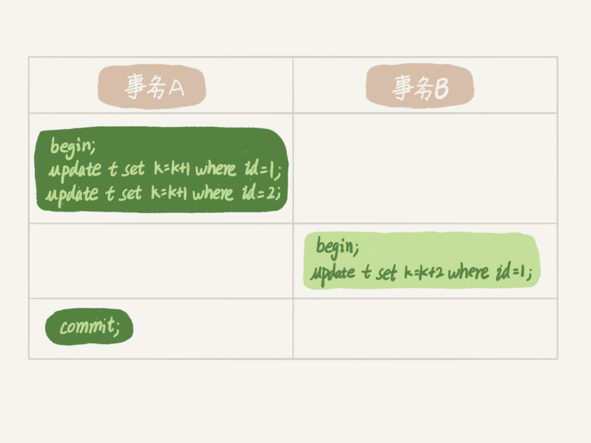
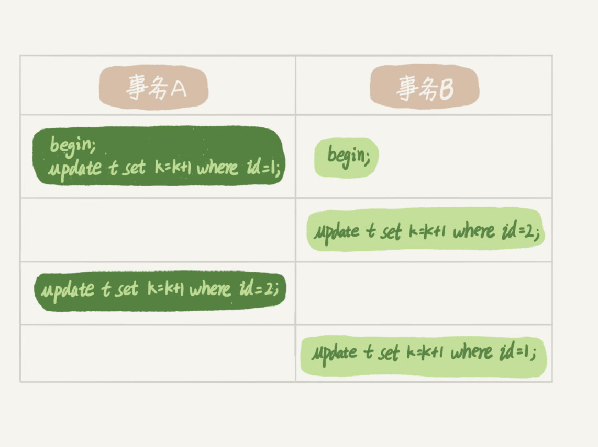

# 07讲行锁功过：怎么减少行锁对性能的影响

M**ySQL 的行锁是在引擎层由各个引擎自己实现的**。但并不是所有的引擎都支持行锁，比如 MyISAM 引擎就不支持行锁。不支持行锁意味着并发控制只能使用表锁，对于这种引擎的表，同一张表上任何时刻只能有一个更新在执行，这就会影响到业务并发度。InnoDB 是支持行锁的，这也是 MyISAM 被 InnoDB 替代的重要原因之一。

我们今天就主要来聊聊 InnoDB 的行锁，以及如何通过减少锁冲突来提升业务并发度。

顾名思义，行锁就是针对数据表中行记录的锁。比如事务 A 更新了一行，而这时候事务 B 也要更新同一行，则必须等事务 A 的操作完成后才能进行更新。

当然，数据库中还有一些没那么一目了然的概念和设计，这些概念如果理解和使用不当，容易导致程序出现非预期行为，比如两阶段锁。

## 一、从两阶段锁说起

在下面的操作序列示例中，假设字段 id 是表 t 的主键。事务 B 的 update 语句执行时会是什么现象呢？

这个问题的结论取决于事务 A 在执行完两条 update 语句后，持有哪些锁，以及在什么时候释放。你可以验证一下：实际上事务 B 的 update语句会被阻塞，直到事务 A 执行 commit 之后，事务 B 才能继续执行。

知道了这个答案，你一定知道了事务 A 持有的两个记录的行锁，都是在 commit 的时候才释放的。

也就是说，**在 InnoDB 事务中，行锁是在需要的时候才加上的，但并不是不需要了就立刻释放，而是要等到事务结束时才释放。这个就是两阶段锁协议。**

知道了这个设定，对我们使用事务有什么帮助呢？那就是，**如果你的事务中需要锁多个行，要把最可能造成锁冲突、最可能影响并发度的锁尽量往后放**。我给你举个例子。

假设你负责实现一个电影票在线交易业务，顾客 A 要在影院 B 购买电影票。我们简化一点，这个业务需要涉及到以下操作：

- 从顾客 A 账户余额中扣除电影票价；

- 给影院 B 的账户余额增加这张电影票价；

- 记录一条交易日志。

要完成这个交易，我们需要 update 两条记录，并 insert 一条记录。当然，为了保证交易的原子性，我们要把这三个操作放在一个事务中。那么，你会怎样安排这三个语句在事务中的顺序呢？

试想如果同时有另外一个顾客 C 要在影院 B 买票，那么这两个事务冲突的部分就是语句 2 了。因为它们要更新同一个影院账户的余额，需要修改同一行数据。

根据两阶段锁协议，不论你怎样安排语句顺序，所有的操作需要的行锁都是在事务提交的时候才释放的。所以，如果你把语句 2 安排在最后，比如按照 3、1、2 这样的顺序，那么影院账户余额这一行的锁时间就最少。这就最大程度地减少了事务之间的锁等待，提升了并发度。

好了，现在由于你的正确设计，影院余额这一行的行锁在一个事务中不会停留很长时间。但是，这并没有完全解决你的困扰。

如果这个影院做活动，可以低价预售一年内所有的电影票，而且这个活动只做一天。于是在活动时间开始的时候，你的 MySQL 就挂了。你登上服务器一看，CPU 消耗接近 100%，但整个数据库每秒就执行不到 100 个事务。这是什么原因呢？

这里，我就要说到死锁和死锁检测了。

## 二、死锁和死锁检测

当并发系统中不同线程出现循环资源依赖，涉及的线程都在等待别的线程释放资源时，就会导致这几个线程都进入无限等待的状态，称为死锁。这里我用数据库中的行锁举个例子。

这时候，事务 A 在等待事务 B 释放 id=2 的行锁，而事务 B 在等待事务 A 释放 id=1 的行锁。 事务 A 和事务 B 在互相等待对方的资源释放，就是进入了死锁状态。当出现死锁以后，有两种策略：

- 策略一：直接进入等待，直到超时。这个超时时间可以通过参数 `innodb_lock_wait_timeout` 来设置。
- 策略二：发起死锁检测，发现死锁后，主动回滚死锁链条中的某一个事务，让其他事务得以继续执行。将参数 `innodb_deadlock_detect` 设置为 on，表示开启这个逻辑。

在 InnoDB 中，`innodb_lock_wait_timeout` 的默认值是 50s（单位为秒），意味着如果采用第一个策略，当出现死锁以后，第一个被锁住的线程要过 50s 才会超时退出，然后其他线程才有可能继续执行。对于在线服务来说，这个等待时间往往是无法接受的。

但是，我们又不可能直接把这个时间设置成一个很小的值，比如 1s。这样当出现死锁的时候，确实很快就可以解开，但如果不是死锁，而是简单的锁等待呢？所以，超时时间设置太短的话，会出现很多误伤。

所以，正常情况下我们还是要采用第二种策略，即：主动死锁检测，而且 `innodb_deadlock_detect` 的默认值本身就是 on。主动死锁检测在发生死锁的时候，是能够快速发现并进行处理的，但是它也是有额外负担的。

你可以想象一下这个过程：每当一个事务被锁的时候，就要看看它所依赖的线程有没有被别人锁住，如此循环，最后判断是否出现了循环等待，也就是死锁。

那如果是我们上面说到的所有事务都要更新同一行的场景呢？

每个新来的被堵住的线程，都要判断会不会由于自己的加入导致了死锁，这是一个时间复杂度是 `O(n)` 的操作。假设有 1000 个并发线程要同时更新同一行，那么死锁检测操作就是 100 万这个量级的。虽然最终检测的结果是没有死锁，但是这期间要消耗大量的 CPU 资源。因此，你就会看到 CPU 利用率很高，但是每秒却执行不了几个事务。

根据上面的分析，我们来讨论一下，怎么解决由这种**热点行更新导致的性能问题呢？问题的症结在于，死锁检测要耗费大量的 CPU 资源。**

方式一：**临时关闭死锁检测**，一种头痛医头的方法，就是如果你能确保这个业务一定不会出现死锁。但是这种操作本身带有一定的风险，因为业务设计的时候一般不会把死锁当做一个严重错误，毕竟出现死锁了，就回滚，然后通过业务重试一般就没问题了，这是业务无损的。而关掉死锁检测意味着可能会出现大量的超时，这是业务有损的。

方式二：**控制并发度。**如果并发能够控制住，比如同一行同时最多只有 10 个线程在更新，那么死锁检测的成本很低，就不会出现这个问题。一个直接的想法就是，在客户端做并发控制。但是，如果有 600 个客户端，即使每个客户端控制到只有 5 个并发线程，汇总到数据库服务端以后，峰值并发数也可能要达到 3000。

因此，这个并发控制要做在数据库服务端。如果你有中间件，可以考虑在中间件实现；如果你的团队有能修改 MySQL 源码的人，也可以做在 MySQL 里面。基本思路就是，对于相同行的更新，在进入引擎之前排队。这样在 InnoDB 内部就不会有大量的死锁检测工作了。

可能你会问，**如果团队里暂时没有数据库方面的专家，不能实现这样的方案，能不能从设计上优化这个问题呢？**

你可以考虑通过将一行改成逻辑上的多行来减少锁冲突。还是以影院账户为例，可以考虑放在多条记录上，比如 10 个记录，影院的账户总额等于这 10 个记录的值的总和。这样每次要给影院账户加金额的时候，随机选其中一条记录来加。这样每次冲突概率变成原来的 1/10，可以减少锁等待个数，也就减少了死锁检测的 CPU 消耗。

这个方案看上去是无损的，但其实这类方案需要根据业务逻辑做详细设计。如果账户余额可能会减少，比如退票逻辑，那么这时候就需要考虑当一部分行记录变成 0 的时候，代码要有特殊处理。

## 三、小结

以两阶段协议为起点，一起讨论了在开发的时候如何安排正确的事务语句。这里的原则是：如果你的事务中需要锁多个行，要把最可能造成锁冲突、最可能影响并发度的锁的申请时机尽量往后放。

但是，调整语句顺序并不能完全避免死锁。所以我们引入了死锁和死锁检测的概念，以及提供了三个方案，来减少死锁对数据库的影响。减少死锁的主要方向，就是控制访问相同资源的并发事务量。

## 四、问题

最后，我给你留下一个问题吧。如果你要删除一个表里面的前10000行数据，有以下三种方法可以做到：

- 第一种，直接执行delete from T limit 10000;
- 第二种，在一个连接中循环执行20次 delete from T limit 500;
- 第三种，在20个连接中同时执行delete from T limit 500。

你会选择哪一种方法呢？为什么呢？

你可以把你的思考和观点写在留言区里，我会在下一篇文章的末尾和你讨论这个问题。感谢你的收听，也欢迎你把这篇文章分享给更多的朋友一起阅读。

## 精选留言

- 

    bluefantasy3

    请教老师一个问题：
    innodb行级锁是通过锁索引记录实现的。如果update的列没建索引，即使只update一条记录也会锁定整张表吗？比如update t set t.name='abc' where t.name='cde'; name字段无索引。为何innodb不优化一下，只锁定name='cde'的列？

    2018-11-28 08:17

    作者回复

    第一个问题是好问题，我加到答疑文章中。简单的回答：是的。但是你可以再往前考虑一下，如果是 你的update 语句后面加个limit 1, 会怎么锁？

    
    Innodb支持行锁，没有支持“列锁” 哈

    

    2018-11-28 10:25

- 

    荒漠甘泉

    老师，本节课讲的不支持行锁的引擎，只能使用表锁，而表锁同一张表在同一时刻只能有一个更新。但是上节课讲的表级锁中的MDL锁，dml语句会产生MDL读锁，而MDL读锁不是互斥的，也就是说一张表可以同时有多个dml语句操作。感觉这两种说法有点矛盾，请老师解惑！

    2018-11-28 19:29

    作者回复

    不矛盾，MDL锁和表锁是两个不同的结构。

    比如：
    你要在myisam 表上更新一行，那么会加MDL读锁和表的写锁；
    然后同时另外一个线程要更新这个表上另外一行，也要加MDL读锁和表写锁。

    第二个线程的*MDL读锁是能成功加上*的，但是被表写锁堵住了。从语句现象上看，就是第二个线程要等第一个线程执行完成。

    2018-11-28 20:54

- 

    木木北月生

    老师，关于死锁检测innodb_deadlock_detect我想请教一下，是每条事务执行前都会进行检测吗？如果是这样，即使简单的更新单个表的语句，当每秒的并发量达到上千的话，岂不是也会消耗大量资源用于死锁检测吗？

    2018-12-03 14:28

    作者回复

    是个好问题
    如果他要加锁访问的行上有锁，他才要检测。

    这里面我担心你有两个误解，说明下：
    \1. 一致性读不会加锁，就不需要做死锁检测；

    \2. 并不是每次死锁检测都都要扫所有事务。比如某个时刻，事务等待状态是这样的：

    B在等A，
    D在等C，
    现在来了一个E，发现E需要等D，那么E就判断跟D、C是否会形成死锁，这个检测不用管B和A

    2018-12-03 14:57

- 

    某、人

    老师，针对我的第一个问题。我就是想问怎么能拿到比较全得死锁信息以及把这些信息保存到文件里。
    第二个问题，如果reset以后，是不是就失去了长连接的意义了呢？相当于再次进行连接。

    2018-11-28 23:15

    作者回复

    \1. 就是持续监控，发现新的就存起来

    \2. 不会，reset_connection只是复位状态，恢复到连接和权限验证之后的状态，没有重连

    2018-11-29 01:59

- 

    三木禾

    老师，如果开启事务，然后进行死锁检测，如果发现有其它线程因为这个线程的加入，导致其它线程的死锁，这个流程能帮着分析一下么

    2018-12-14 07:56

    作者回复

    好问题

    理论上说，之前没死锁，现在A加进来，出现了死锁，那么死锁的环里面肯定包含A，
    因此只要从A出发去扫就好了

    2018-12-14 09:10

- 

    蓝天

    老师：上一节讲的dml时会产生读MDL锁（表锁），也就是update会持有读MDL。读和读不互斥。但是对于行锁来说。两个update同时更新一条数据是互斥的。这个是因为多种锁同时存在时，以粒度最小的锁为准的原因么？

    2019-01-09 17:51

    作者回复

    不是“以粒度最小为准”
    而是如果有多种锁，必须得“全部不互斥”才能并行，只要有一个互斥，就得等。

    好问题

    2019-01-09 22:12

- 

    武者

    老师 你好
    有以下情况 帮忙分析下会锁表不

    update a，b set a.name = b.name where a.uid=b.uid and b.group=1；
    update c，b set c.age=b.age where c.uid=b.uid and b.group = 1；

    如果两个语句同时执行期间 是不是有个执行不了 要等b解锁。还是说没有更新b的字段b不会锁，两个可并行执行
    请老师指导下

    

    2018-11-29 18:14

    作者回复

    这个你得同时贴表结构。

    还有，会不会锁，不是验证一下就可以吗，两个都用begin + 语句，

    两阶段锁协议会帮助你

    2018-11-29 21:22

- 

    泉

    我选第二种。
    第一种，需要锁资源多，事务较大，持有锁时间最长。
    第三种，多个事务会对同一行产生锁竞争，消耗cpu资源。
    请指正。

    2018-11-28 07:25

- 

    Tony Du

    方案一，事务相对较长，则占用锁的时间较长，会导致其他客户端等待资源时间较长。
    方案二，串行化执行，将相对长的事务分成多次相对短的事务，则每次事务占用锁的时间相对较短，其他客户端在等待相应资源的时间也较短。这样的操作，同时也意味着将资源分片使用（每次执行使用不同片段的资源），可以提高并发性。
    方案三，人为自己制造锁竞争，加剧并发量。
    方案二相对比较好，具体还要结合实际业务场景。

    另，对于innodb的行锁，我觉得可以增加一讲，如何加锁（依赖于具体的隔离级别，是否有索引，是否是唯一索引，SQL的执行计划），特别是在RR隔离级别下的GAP锁，对于innodb，RR级别是可以防止幻读的。

    2018-11-28 11:31

    作者回复

    分析得很好。

    嗯嗯索引和锁的内容很多，也是需要慢慢安排
    突然上概念怕大家看得不开心

    2018-11-28 12:36

- 

    WL

    继续把该讲内容总结为几个问题, 大家复习的时候可以先尝试回答这些问题检查自己的掌握程度:
    1.
    两阶段锁的概念是什么? 对事务使用有什么帮助?
    2.
    死锁的概念是什么? 举例说明出现死锁的情况.
    3.
    死锁的处理策略有哪两种?
    4.
    等待超时处理死锁的机制什么?有什么局限?
    5.
    死锁检测处理死锁的机制是什么? 有什么局限?
    6.
    有哪些思路可以解决热点更新导致的并发问题?

    

    2018-12-01 11:36

    作者回复

    继续手动

    2018-12-01 12:29

- 

    某、人

    老师我有几个问题:
    1.如何在死锁发生时,就把发生的sql语句抓出来？
    2.在使用连接池的情况下,连接会复用.比如一个业务使用连接set sql_select_limit=1,释放掉以后.其他业务复用该连接时,这个参数也生效.请问怎么避免这种情况,或者怎么禁止业务set session？
    3.很好奇双11的成交额,是通过redis累加的嘛？
    4.不会改源码能成为专家嘛？

    

    2018-11-28 20:58

    作者回复

    \1. show engine innodb status 里面有信息，不过不是很全…
    \2. 5.7的reset_connection接口可以考虑一下
    \3. 用redis的话，为了避免超卖需要增加了很多机制来保证。修改都在数据库里执行就方便点。前提是要解决热点问题
    \4. 我认识几位处理问题和分析问题经验非常丰富的专家，不用懂源码，但是原理还是要很清楚的

    2018-11-28 23:43

- 

    岁月安然

    总结：
    两阶段锁：在 InnoDB 事务中，行锁是在需要的时候才加上的，但并不是不需要了就立刻释放， 而是要等到事务结束时才释放。
    建议：如果你的事务中需要锁多个行，要把最可能造成锁冲突、最可能影响并发度的锁尽量往后放。
    死锁：当并发系统中不同线程出现循环资源依赖，涉及的线程都在等待别的线程释放资源时，就会导致这几个线程都进入无限等待的状态。
    解决方案：
    1、通过参数 innodb_lock_wait_timeout 根据实际业务场景来设置超时时间，InnoDB引擎默认值是50s。
    2、发起死锁检测，发现死锁后，主动回滚死锁链条中的某一个事务，让其他事务得以继续执行。将参数 innodb_deadlock_detect 设置为 on，表示开启这个逻辑（默认是开启状态）。
    如何解决热点行更新导致的性能问题？
    1、如果你能确保这个业务一定不会出现死锁，可以临时把死锁检测关闭掉。一般不建议采用
    2、控制并发度，对应相同行的更新，在进入引擎之前排队。这样在InnoDB内部就不会有大量的死锁检测工作了。
    3、将热更新的行数据拆分成逻辑上的多行来减少锁冲突，但是业务复杂度可能会大大提高。

    innodb行级锁是通过锁索引记录实现的，如果更新的列没建索引是会锁住整个表的。

    2018-11-29 11:05

    作者回复

    这个总结

    2018-11-29 12:09

- 

    锅子

    老师好，关于上一期的问题我有2疑问：
    1.Q2，WITH CONSISTENT SNAPSHOT语句执行完可以确保得到一个一致性视图，为什么还会备份到Q2时间点之后更改的表结构啊？如果这样那是不是意味着如果有一个数据库一直有数据在写入的话，备份会一直都无法完成。
    2.Q3设置了保存点，之后读到主库的DDL语句，那Q6又回滚到了Q3设置的保存点，那是不是就主从不一致了啊？

    2018-11-28 09:41

- 

    Tan

    不考虑数据表的访问并发量，单纯从这个三个方案来对比的话。
    第一个方案，一次占用的锁时间较长，可能会导致其他客户端一直在等待资源。
    第二个方案，分成多次占用锁，串行执行，不占有锁的间隙其他客户端可以工作，类似于现在多任务操作系统的时间分片调度，大家分片使用资源，不直接影响使用。
    第三个方案，自己制造了锁竞争，加剧并发。
    至于选哪一种方案要结合实际场景，综合考虑各个因素吧，比如表的大小，并发量，业务对此表的依赖程度等。

    2018-11-28 08:41

- 

    shawn

    话说留言系统打不出大于小于号是为了防止xss攻击吧，推荐下，能不能用作转义的方式解决呢，留言里小于now()整个没有之后语句不通了
    技术向的服务自己的技术得过关吧(手动滑稽)

    2018-11-29 08:21

- 

    邓俊

    答题：
    这个要看数据库压力，如果数据库非常空闲，我选方案一，这样操作简单。如果数据库中这张表的压力非常大，我选方案三，极端情况下甚至我会制定方案四，每次只删一条。

    老师，我有一个问题：
    例题中的订票系统，影院的余额表可不可以用流水的方式来记录，每天闲时汇总一次，这样就没有update只有insert和select sum了。

    用手机打字好累，表达的不详细，请谅解。

    2018-11-28 02:33

    作者回复

    嗯，如果是没有边界条件，比如一直加钱，这种可以的。但是如果有“退款”的逻辑，就不行了。只记日志可能会给扣成负数。

    2018-11-28 18:48

- 

    Aurora

    针对第一层楼主提到的问题，我记得是，如果update 没有走索引，innodb内部是全表根据主键索引逐行扫描 逐行加锁，释放锁。

    2018-11-28 20:13

    作者回复

    逐行加锁，

    事务提交的时候统一释放。— 记得两阶段锁哈

    2018-11-28 20:44

- 

    everyok22

    今天重读了一下这个表锁，我有一个问题，希望老师给解答一下：
    我现在有一个用户领取奖口的业务，　业务里有奖品表：构造语句如下
    CREATE TABLE `prize` (
    `id` int(11) NOT NULL AUTO_INCREMENT COMMENT 'id',
    `name` varchar(20) DEFAULT NULL COMMENT '用户名',
    `status` int(11) NOT NULL COMMENT '状态（0表示未发给用户，1表示已发给用户）',
    `passwd` varchar(64) DEFAULT NULL COMMENT '卡密',
    PRIMARY KEY (`id`)
    ) ENGINE=InnoDB DEFAULT CHARSET=utf8;

    这个奖品不同于商品，他有一定的特殊性，就是给每个人发的奖品里的passwd是不一样的。给用户发奖品的时候需要更新这个表的数据状态。语句如下：
    UPDATE
    prize
    SET
    STATUS = 1,
    name = 'aaa'
    WHERE STATUS = 0
    LIMIT 1
    根据文章的内容，如果同时有1000个并发的话， 会超成锁冲突，但在发奖品的时候，这个奖品发给谁是不确定的， 有什么比较好的解决办法么。

    2018-12-27 15:23

    作者回复

    嗯，你这样写冲突太厉害了，

    是不是可以改用id做条件来更新？

    其实发奖品不一定要发第一个对吧

    2018-12-27 17:09

- 

    安小依

    林老师，我是一名研究生，爬虫爬新闻存数据到 MySQL 里，突然 MySQL 崩掉了，重启不行，查看日志 看到
    [ERROR] /usr/sbin/mysqld: The table 'articles' is full
    InnoDB: Failing assertion: offset > 0
    InnoDB: We intentionally generate a memory trap.
    InnoDB: Submit a detailed bug report to http://bugs.mysql.com.
    InnoDB: If you get repeated assertion failures or crashes, even
    InnoDB: immediately after the mysqld startup, there may be
    InnoDB: corruption in the InnoDB tablespace. Please refer to
    InnoDB: http://dev.mysql.com/doc/refman/5.7/en/forcing-innodb-recovery.html
    InnoDB: about forcing recovery.
    09:37:14 UTC - mysqld got signal 6 ;
    This could be because you hit a bug. It is also possible that this binary
    or one of the libraries it was linked against is corrupt, improperly built,
    or misconfigured. This error can also be caused by malfunctioning hardware.
    Attempting to collect some information that could help diagnose the problem.
    As this is a crash and something is definitely wrong, the information
    collection process might fail.

    key_buffer_size=16777216
    read_buffer_size=131072
    max_used_connections=50
    max_threads=151
    thread_count=48
    connection_count=48
    It is possible that mysqld could use up to
    key_buffer_size + (read_buffer_size + sort_buffer_size)*max_threads = 75719 K bytes of memory
    Hope that's ok; if not, decrease some variables in the equation.

    [Warning] InnoDB: Page 9 in the doublewrite buffer is not within space bounds: page [page id: space=36, page number=113547]

    参考网上使用 innodb_force_recovery 试了几个，只有 6 可以重启 mysql 成功，但是重启后，虽然数据库还在，可是从表 articles 查询，却提示表不存在。看日志

    [ERROR] InnoDB: Failed to find tablespace for table `news`.`articles` in the cache. Attempting to load the tablespace with space id 36

    所有数据ibd,frm等还在，就是启动不起来，我想问一下现在如何才能重启成功或者恢复我的数据啊，辛苦爬了2个月爬虫，70万篇文章，结果一下回到解放前了。

    2018-11-29 19:26

    作者回复

    数据字典没了，只从数据恢复做法很复杂。有binlog吗

    2018-11-29 23:18

- 

    bing

    在开发时一般都是按照顺序加锁来避免死锁。比如都是按照先拿t1,再拿t2.

    2018-11-28 22:08

    作者回复

    是个好的实践经验

    2018-11-30 08:20