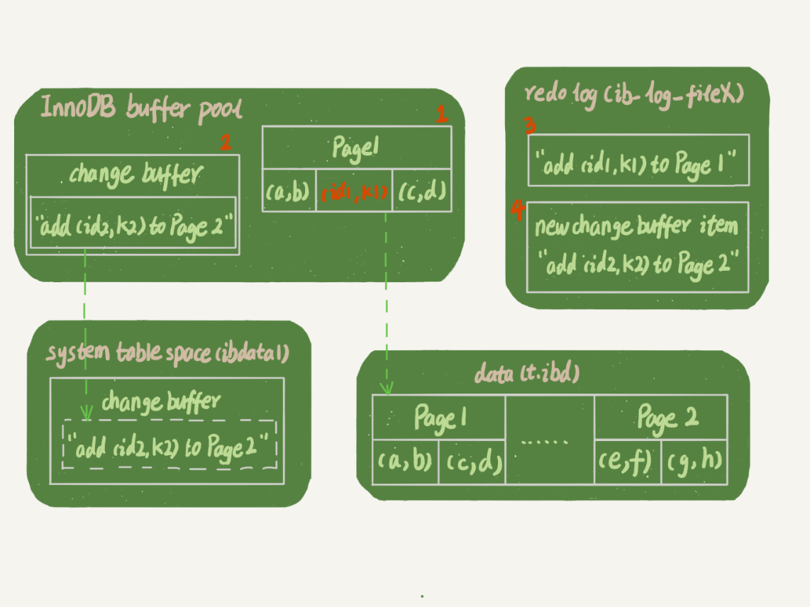
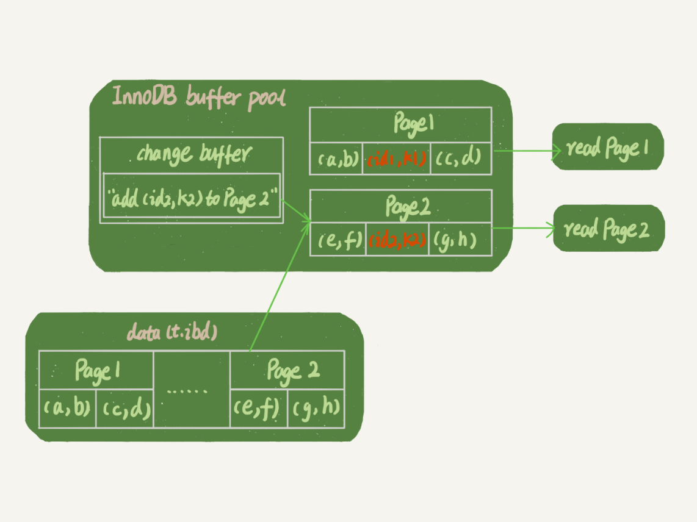

# 09讲普通索引和唯一索引，应该怎么选择

今天的正文开始前，我要特意感谢一下评论区几位留下高质量留言的同学。

用户名是 @某、人 的同学，对文章的知识点做了梳理，然后提了关于事务可见性的问题，就是先启动但是后提交的事务，对数据可见性的影响。@夏日雨同学也提到了这个问题，我在置顶评论中回复了，今天的文章末尾也会再展开说明。@Justin和@倪大人两位同学提了两个好问题。

对于能够引发更深一步思考的问题，我会在回复的内容中写上“好问题”三个字，方便你搜索，你也可以去看看他们的留言。

非常感谢大家很细致地看文章，并且留下了那么多和很高质量的留言。知道文章有给大家带来一些新理解，对我来说是一个很好的鼓励。同时，也让其他认真看评论区的同学，有机会发现一些自己还没有意识到的、但可能还不清晰的知识点，这也在总体上提高了整个专栏的质量。再次谢谢你们。

好了，现在就回到我们今天的正文内容。

在前面的基础篇文章中，我给你介绍过索引的基本概念，相信你已经了解了唯一索引和普通索引的区别。今天我们就继续来谈谈，在不同的业务场景下，应该选择普通索引，还是唯一索引？

假设你在维护一个市民系统，每个人都有一个唯一的身份证号，而且业务代码已经保证了不会写入两个重复的身份证号。如果市民系统需要按照身份证号查姓名，就会执行类似这样的SQL语句：

```
select name from CUser where id_card = 'xxxxxxxyyyyyyzzzzz';
```

所以，你一定会考虑在id_card字段上建索引。

由于身份证号字段比较大，我不建议你把身份证号当做主键，那么现在你有两个选择，要么给id_card字段创建唯一索引，要么创建一个普通索引。如果业务代码已经保证了不会写入重复的身份证号，那么这两个选择逻辑上都是正确的。

现在我要问你的是，从性能的角度考虑，你选择唯一索引还是普通索引呢？选择的依据是什么呢？

简单起见，我们还是用第4篇文章[《深入浅出索引（上）》](https://time.geekbang.org/column/article/69236)中的例子来说明，假设字段 k 上的值都不重复。


图1 InnoDB的索引组织结构

接下来，我们就从这两种索引对查询语句和更新语句的性能影响来进行分析。

# 查询过程

假设，执行查询的语句是 select id from T where k=5。这个查询语句在索引树上查找的过程，先是通过B+树从树根开始，按层搜索到叶子节点，也就是图中右下角的这个数据页，然后可以认为数据页内部通过二分法来定位记录。

- 对于普通索引来说，查找到满足条件的第一个记录(5,500)后，需要查找下一个记录，直到碰到第一个不满足k=5条件的记录。
- 对于唯一索引来说，由于索引定义了唯一性，查找到第一个满足条件的记录后，就会停止继续检索。

那么，这个不同带来的性能差距会有多少呢？答案是，微乎其微。

你知道的，InnoDB的数据是按数据页为单位来读写的。也就是说，当需要读一条记录的时候，并不是将这个记录本身从磁盘读出来，而是以页为单位，将其整体读入内存。在InnoDB中，每个数据页的大小默认是16KB。

因为引擎是按页读写的，所以说，当找到k=5的记录的时候，它所在的数据页就都在内存里了。那么，对于普通索引来说，要多做的那一次“查找和判断下一条记录”的操作，就只需要一次指针寻找和一次计算。

当然，如果k=5这个记录刚好是这个数据页的最后一个记录，那么要取下一个记录，必须读取下一个数据页，这个操作会稍微复杂一些。

但是，我们之前计算过，对于整型字段，一个数据页可以放近千个key，因此出现这种情况的概率会很低。所以，我们计算平均性能差异时，仍可以认为这个操作成本对于现在的CPU来说可以忽略不计。

# 更新过程

为了说明普通索引和唯一索引对更新语句性能的影响这个问题，我需要先跟你介绍一下change buffer。

当需要更新一个数据页时，如果数据页在内存中就直接更新，而如果这个数据页还没有在内存中的话，在不影响数据一致性的前提下，InooDB会将这些更新操作缓存在change buffer中，这样就不需要从磁盘中读入这个数据页了。在下次查询需要访问这个数据页的时候，将数据页读入内存，然后执行change buffer中与这个页有关的操作。通过这种方式就能保证这个数据逻辑的正确性。

需要说明的是，虽然名字叫作change buffer，实际上它是可以持久化的数据。也就是说，change buffer在内存中有拷贝，也会被写入到磁盘上。

将change buffer中的操作应用到原数据页，得到最新结果的过程称为merge。除了访问这个数据页会触发merge外，系统有后台线程会定期merge。在数据库正常关闭（shutdown）的过程中，也会执行merge操作。

显然，如果能够将更新操作先记录在change buffer，减少读磁盘，语句的执行速度会得到明显的提升。而且，数据读入内存是需要占用buffer pool的，所以这种方式还能够避免占用内存，提高内存利用率。

那么，**什么条件下可以使用change buffer呢？**

对于唯一索引来说，所有的更新操作都要先判断这个操作是否违反唯一性约束。比如，要插入(4,400)这个记录，就要先判断现在表中是否已经存在k=4的记录，而这必须要将数据页读入内存才能判断。如果都已经读入到内存了，那直接更新内存会更快，就没必要使用change buffer了。

因此，唯一索引的更新就不能使用change buffer，实际上也只有普通索引可以使用。

change buffer用的是buffer pool里的内存，因此不能无限增大。change buffer的大小，可以通过参数innodb_change_buffer_max_size来动态设置。这个参数设置为50的时候，表示change buffer的大小最多只能占用buffer pool的50%。

现在，你已经理解了change buffer的机制，那么我们再一起来看看**如果要在这张表中插入一个新记录(4,400)的话，InnoDB的处理流程是怎样的。**

第一种情况是，**这个记录要更新的目标页在内存中**。这时，InnoDB的处理流程如下：

- 对于唯一索引来说，找到3和5之间的位置，判断到没有冲突，插入这个值，语句执行结束；
- 对于普通索引来说，找到3和5之间的位置，插入这个值，语句执行结束。

这样看来，普通索引和唯一索引对更新语句性能影响的差别，只是一个判断，只会耗费微小的CPU时间。

但，这不是我们关注的重点。

第二种情况是，**这个记录要更新的目标页不在内存中**。这时，InnoDB的处理流程如下：

- 对于唯一索引来说，需要将数据页读入内存，判断到没有冲突，插入这个值，语句执行结束；
- 对于普通索引来说，则是将更新记录在change buffer，语句执行就结束了。

将数据从磁盘读入内存涉及随机IO的访问，是数据库里面成本最高的操作之一。change buffer因为减少了随机磁盘访问，所以对更新性能的提升是会很明显的。

之前我就碰到过一件事儿，有个DBA的同学跟我反馈说，他负责的某个业务的库内存命中率突然从99%降低到了75%，整个系统处于阻塞状态，更新语句全部堵住。而探究其原因后，我发现这个业务有大量插入数据的操作，而他在前一天把其中的某个普通索引改成了唯一索引。

# change buffer的使用场景

通过上面的分析，你已经清楚了使用change buffer对更新过程的加速作用，也清楚了change buffer只限于用在普通索引的场景下，而不适用于唯一索引。那么，现在有一个问题就是：普通索引的所有场景，使用change buffer都可以起到加速作用吗？

因为merge的时候是真正进行数据更新的时刻，而change buffer的主要目的就是将记录的变更动作缓存下来，所以在一个数据页做merge之前，change buffer记录的变更越多（也就是这个页面上要更新的次数越多），收益就越大。

因此，对于写多读少的业务来说，页面在写完以后马上被访问到的概率比较小，此时change buffer的使用效果最好。这种业务模型常见的就是账单类、日志类的系统。

反过来，假设一个业务的更新模式是写入之后马上会做查询，那么即使满足了条件，将更新先记录在change buffer，但之后由于马上要访问这个数据页，会立即触发merge过程。这样随机访问IO的次数不会减少，反而增加了change buffer的维护代价。所以，对于这种业务模式来说，change buffer反而起到了副作用。

# 索引选择和实践

回到我们文章开头的问题，普通索引和唯一索引应该怎么选择。其实，这两类索引在查询能力上是没差别的，主要考虑的是对更新性能的影响。所以，我建议你尽量选择普通索引。

如果所有的更新后面，都马上伴随着对这个记录的查询，那么你应该关闭change buffer。而在其他情况下，change buffer都能提升更新性能。

在实际使用中，你会发现，普通索引和change buffer的配合使用，对于数据量大的表的更新优化还是很明显的。

特别地，在使用机械硬盘时，change buffer这个机制的收效是非常显著的。所以，当你有一个类似“历史数据”的库，并且出于成本考虑用的是机械硬盘时，那你应该特别关注这些表里的索引，尽量使用普通索引，然后把change buffer 尽量开大，以确保这个“历史数据”表的数据写入速度。

# change buffer 和 redo log

理解了change buffer的原理，你可能会联想到我在前面文章中和你介绍过的redo log和WAL。

在前面文章的评论中，我发现有同学混淆了redo log和change buffer。WAL 提升性能的核心机制，也的确是尽量减少随机读写，这两个概念确实容易混淆。所以，这里我把它们放到了同一个流程里来说明，便于你区分这两个概念。

> 备注：这里，你可以再回顾下第2篇文章[《日志系统：一条SQL更新语句是如何执行的？》](https://time.geekbang.org/column/article/68633)中的相关内容。

现在，我们要在表上执行这个插入语句：

```
mysql> insert into t(id,k) values(id1,k1),(id2,k2);
```

这里，我们假设当前k索引树的状态，查找到位置后，k1所在的数据页在内存(InnoDB buffer pool)中，k2所在的数据页不在内存中。如图2所示是带change buffer的更新状态图。



图2 带change buffer的更新过程

分析这条更新语句，你会发现它涉及了四个部分：内存、redo log（ib_log_fileX）、 数据表空间（t.ibd）、系统表空间（ibdata1）。

这条更新语句做了如下的操作（按照图中的数字顺序）：

1. Page 1在内存中，直接更新内存；
2. Page 2没有在内存中，就在内存的change buffer区域，记录下“我要往Page 2插入一行”这个信息
3. 将上述两个动作记入redo log中（图中3和4）。

做完上面这些，事务就可以完成了。所以，你会看到，执行这条更新语句的成本很低，就是写了两处内存，然后写了一处磁盘（两次操作合在一起写了一次磁盘），而且还是顺序写的。

同时，图中的两个虚线箭头，是后台操作，不影响更新的响应时间。

那在这之后的读请求，要怎么处理呢？

比如，我们现在要执行 select * from t where k in (k1, k2)。这里，我画了这两个读请求的流程图。

如果读语句发生在更新语句后不久，内存中的数据都还在，那么此时的这两个读操作就与系统表空间（ibdata1）和 redo log（ib_log_fileX）无关了。所以，我在图中就没画出这两部分。



图3 带change buffer的读过程

从图中可以看到：

1. 读Page 1的时候，直接从内存返回。有几位同学在前面文章的评论中问到，WAL之后如果读数据，是不是一定要读盘，是不是一定要从redo log里面把数据更新以后才可以返回？其实是不用的。你可以看一下图3的这个状态，虽然磁盘上还是之前的数据，但是这里直接从内存返回结果，结果是正确的。
2. 要读Page 2的时候，需要把Page 2从磁盘读入内存中，然后应用change buffer里面的操作日志，生成一个正确的版本并返回结果。

可以看到，直到需要读Page 2的时候，这个数据页才会被读入内存。

所以，如果要简单地对比这两个机制在提升更新性能上的收益的话，**redo log 主要节省的是随机写磁盘的IO消耗（转成顺序写），而change buffer主要节省的则是随机读磁盘的IO消耗。**

# 小结

今天，我从普通索引和唯一索引的选择开始，和你分享了数据的查询和更新过程，然后说明了change buffer的机制以及应用场景，最后讲到了索引选择的实践。

由于唯一索引用不上change buffer的优化机制，因此如果业务可以接受，从性能角度出发我建议你优先考虑非唯一索引。

最后，又到了思考题时间。

通过图2你可以看到，change buffer一开始是写内存的，那么如果这个时候机器掉电重启，会不会导致change buffer丢失呢？change buffer丢失可不是小事儿，再从磁盘读入数据可就没有了merge过程，就等于是数据丢失了。会不会出现这种情况呢？

你可以把你的思考和观点写在留言区里，我会在下一篇文章的末尾和你讨论这个问题。感谢你的收听，也欢迎你把这篇文章分享给更多的朋友一起阅读。

**补充：**
评论区大家对“是否使用唯一索引”有比较多的讨论，主要是纠结在“业务可能无法确保”的情况。这里，我再说明一下：

- 首先，业务正确性优先。咱们这篇文章的前提是“业务代码已经保证不会写入重复数据”的情况下，讨论性能问题。如果业务不能保证，或者业务就是要求数据库来做约束，那么没得选，必须创建唯一索引。这种情况下，本篇文章的意义在于，如果碰上了大量插入数据慢、内存命中率低的时候，可以给你多提供一个排查思路。
- 然后，在一些“归档库”的场景，你是可以考虑使用唯一索引的。比如，线上数据只需要保留半年，然后历史数据保存在归档库。这时候，归档数据已经是确保没有唯一键冲突了。要提高归档效率，可以考虑把表里面的唯一索引改成普通索引。

# 上期问题时间

上期的问题是：如何构造一个“数据无法修改”的场景。评论区里已经有不少同学给出了正确答案，这里我再描述一下。


这样，session A看到的就是我截图的效果了。

其实，还有另外一种场景，同学们在留言区都还没有提到。


这个操作序列跑出来，session A看的内容也是能够复现我截图的效果的。这个session B’启动的事务比A要早，其实是上期我们描述事务版本的可见性规则时留的彩蛋，因为规则里还有一个“活跃事务的判断”，我是准备留到这里再补充的。

当我试图在这里讲述完整规则的时候，发现第8篇文章[《事务到底是隔离的还是不隔离的？》](https://time.geekbang.org/column/article/70562)中的解释引入了太多的概念，以致于分析起来非常复杂。

因此，我重写了第8篇，这样我们人工去判断可见性的时候，才会更方便。【看到这里，我建议你能够再重新打开第8篇文章并认真学习一次。如果学习的过程中，有任何问题，也欢迎你给我留言】

用新的方式来分析session B’的更新为什么对session A不可见就是：在session A视图数组创建的瞬间，session B’是活跃的，属于“版本未提交，不可见”这种情况。

业务中如果要绕过这类问题，@约书亚提供了一个“乐观锁”的解法，大家可以去上一篇的留言区看一下。

评论区留言点赞板：

> @某、人、@夏日雨、@周巘、@李金刚 等同学提了一个很好的问题，就是我们今天答案的session B’ 的情况；
> @justin 提到了提交和未提交版本的区别对待，@倪大人 提到了读提交和当前读的区别，都是经过了思考后提出的好问题，大家可以去留言区看看。

## 精选留言

- 

    某、人

    先回答今天的问题,今天的答案应该在文章里就能找到
    1.change buffer有一部分在内存有一部分在ibdata.
    做purge操作,应该就会把change buffer里相应的数据持久化到ibdata
    2.redo log里记录了数据页的修改以及change buffer新写入的信息
    如果掉电,持久化的change buffer数据已经purge,不用恢复。主要分析没有持久化的数据
    情况又分为以下几种:
    (1)change buffer写入,redo log虽然做了fsync但未commit,binlog未fsync到磁盘,这部分数据丢失
    (2)change buffer写入,redo log写入但没有commit,binlog以及fsync到磁盘,先从binlog恢复redo log,再从redo log恢复change buffer
    (3)change buffer写入,redo log和binlog都已经fsync.那么直接从redo log里恢复。

    老师,我有几个问题想请教下:
    1.如果是针对非唯一索引和唯一索引的更新和delete而且条件是where 索引值=这种情况,
    是否二级索引和唯一索引就没有区别呢
    2.rr模式下,非唯一索引还会加gap,开销应该也不算小吧
    3.还有老师你是怎么判断内存命中率的,是hit rate嘛？
    4.ob好像就是这个思路来做的聚簇索引的insert优化,不知道是怎么判断的唯一性

    特别感谢老师,以前的知识都是很碎片化,没有深入的去思考。
    经过几期的学习以后,感觉思路越来越开阔,以前觉得很高深的知识点,现在也有点豁然开朗的感觉。

    2018-12-03 21:51

    作者回复

    分析很赞，把02篇和这篇文章贯通了.

    问题
    \1. 这时候要“先读后写”，读的时候数据会读入内存，更新的时候直接改内存，就不需要change buffer了

    \2. Gap锁取决于业务怎么用哈。我感觉主要是因为gap锁概念比较难说清，大家有点放大它的意思了哈哈

    \3. Hit rate

    \4. 我不够熟悉，不能乱回答误导你

    2018-12-03 22:19

- 

    林晓斌

    抱歉做一个名词勘误，把change buffer应用到旧的数据页，得到新的数据页的过程，应该称为merge更合适。

    2018-12-04 10:29

- 

    虚爱凯平

    感觉今天这篇问题很严重啊, 首先说一下我是第一次接触 change buffer这个概念, 可能产生了什么误会..
    我理解的文中讲述change buffer的作用体现在 针对普通索引(非主键的都是二级索引, 二级索引又包括了唯一索引和普通索引)在有数据update操作(不包括insert)的时候,能有减少io写操作的功能, 而且这个操作是提现在更新表数据上的. 为什么我在这里会理解成update操作呢.. (InnoDB中表就是按索引的方式存放的, 即使我们不主动创建主键 也会生成一个默认的row_id来当做主键, 意味着表一定是有一个主键, 即唯一索引. insert操作 一定会涉及主键索引的变动, 所以change buffer针对 insert 是完全没有用的吗??)

    针对change buffer 我百度了一下, 有文章描述 change buffer 是针对表中包含普通索引的表在insert操作时, 优化 普通索引的更新(在insert时,不会立即更新普通索引 而是保存到change buffer延迟处理). 这么一个功能. 不知道 这个理解是否正确呢?

    2018-12-03 13:34

    作者回复

    第一段的理解不准确哈。
    insert的时候，写主键是肯定不能用change buffer了，但是同时也会要写其它索引，而其它索引中的“非唯一索引”是可以用的这个机制的；

    第二段，你搜出来的这个不太完整。是这样的，change buffer的前身是insert buffer,只能对insert 操作优化；后来升级了，增加了update/delete的支持，名字也改叫change buffer.

    

    

    2018-12-03 14:40

- 

    WL

    想请教一下老师系统表空间跟数据表空间这两个概念各是什么意思.

    2018-12-09 10:52

    作者回复

    系统表空间就是用来放系统信息的，比如数据字典什么的，对应的磁盘文件是ibdata1,
    数据表空间就是一个个的表数据文件，对应的磁盘文件就是 表名.ibd

    2018-12-09 19:17

- 

    约书亚

    早，请您看看我以下疑问：
    \1. 看完后感觉牵扯到之前的内容，又糊涂了。change buffer相当于推迟了更新操作，那对并发控制相关的是否有影响，比如加锁？我一直以为加锁需要把具体的数据页读到内存中来，才能加锁，然而并不是？
    \2. 在change buffer中有此行记录的情况下，再次更改，是增加一条还是原地修改？
    \3. purge行为之后应该不会再产生redo log了吧？

    从应用开发的角度看，还是由数据库保证唯一好。

    2018-12-03 10:15

    作者回复

    1 3 好问题

    \1. 锁是一个单独的数据结构，如果数据页上有锁，change buffer 在判断“是否能用”的时候，就会认为否

    \2. 增加

    \3. 是这样的，这个问题你分成两步来考虑。
    第一步，merge其实是从磁盘读数据页到内存，然后应用，这一步都是更新的内存，同时写redolog

    现在内存变成脏页了，跟磁盘数据不一样。之后就走刷脏页的流程。刷脏页也不用写。

    
    =====

    是否使用唯一索引，这个要看业务有没有保证，和性能是否有问题。

    有几位同学都提了，我加到文末说明一下。

    2018-12-05 02:07

- 

    永光

    会导致change buffer丢失，会导致本次未完成的操作数据丢失，但不会导致已完成操作的数据丢失。
    1.change buffer中分两部分，一部分是本次写入未写完的，一部分是已经写入完成的。
    2.针对未写完的，此部分操作，还未写入redo log，因此事务还未提交，所以没影响。
    2.针对，已经写完成的，可以通过redo log来进行恢复。

    所以，不会对数据库造成影响。

    2018-12-03 07:22

    作者回复

    优秀

    2018-12-03 09:19

- 

    虚爱凯平

    有点疑惑: 主键id也是唯一索引吧? 那我们的新增操作如何利用 change buffer呢?

    2018-12-03 03:40

    作者回复

    所以主键索引用不上，都是对于那些二级索引的才有效。

    一个insert语句要操作所有索引的嘛，收益在二级索引

    2018-12-03 09:17

- 

    晨思暮语

    丁老师，有一个问题不是很明白！最后小结之前，而change buffer 主要节省的则是随机读磁盘的IO消耗。这句话怎么理解，因为看前面的讲解，change buffer对性能的主要提升，是在一个写多读少的系统中，使用普通索引的情况下，合并多次写为一次来更新磁盘！

    2018-12-04 13:55

- 

    Ivan

    回答一下melon的问题。
    change Buffer和数据页一样，也是物理页的一个组成部分，数据结构也是一颗B+树，这棵B+树放在共享表空间中，默认ibdata1中。change buffer 写入系统表空间机制应该和普通表的脏页刷新到磁盘是相同的机制--Checkpoint机制；
    之所以change buffer要写入系统表空间，是为了保证数据的一致性，change buffer做修改时需要写redo，在做恢复时需要根据redo来恢复change buffer，若是不进行change buffer写入系统表空间，也就是不进行持久化，那么在change buffer写入内存后掉电（也就是篇尾提出的问题），则无法进行数据恢复。这样也会导致索引中的数据和相应表的相应列中的数据不一致。
    change buffer 写入到了系统表空间，purge 的时候会先查询change buffer里对应的记录，然后进行purge，因为change buffer B+树的key是表空间ID，所以查询根据表空间ID 查询change buffer会很快。

    2018-12-03 20:01

    作者回复

    

    2018-12-03 22:09

- 

    Ivan

    不会导致change buffer丢失。因为在更改change buffer 时也会写redo log，也需要持久化。
    change buffer 更新完成并且相应事务提交的情况下，首先要保证redo log落盘（二阶段提交），若此时掉电重启，则可以根据 redo 进行恢复;
    若change buffer 更新完成但是相应事务未提交的情况下，则redo 有可能落盘了（redo 的组提交），也有可能未落盘，若落盘了，读取redo发现没有commit标志（还会进行lsn，binlog的对比），则回滚；若redo未落盘则也就不会出现前滚和回滚的情况，数据依旧一致。

    2018-12-03 17:18

    作者回复

    

    拆开了分析很好

    2018-12-03 18:19

- 

    壹笙漂泊

    前两次学了之后没时间总结。。今天继续
    总结:
    选择普通索引还是唯一索引？
    对于查询过程来说：
    a、普通索引，查到满足条件的第一个记录后，继续查找下一个记录，知道第一个不满足条件的记录
    b、唯一索引，由于索引唯一性，查到第一个满足条件的记录后，停止检索
    但是，两者的性能差距微乎其微。因为InnoDB根据数据页来读写的。
    对于更新过程来说：
    概念：change buffer
    当需要更新一个数据页，如果数据页在内存中就直接更新，如果不在内存中，在不影响数据一致性的前提下，InnoDB会将这些更新操作缓存在change buffer中。下次查询需要访问这个数据页的时候，将数据页读入内存，然后执行change buffer中的与这个页有关的操作。

    change buffer是可以持久化的数据。在内存中有拷贝，也会被写入到磁盘上

    purge:将change buffer中的操作应用到原数据页上，得到最新结果的过程，成为purge
    访问这个数据页会触发purge，系统有后台线程定期purge，在数据库正常关闭的过程中，也会执行purge

    唯一索引的更新不能使用change buffer

    change buffer用的是buffer pool里的内存，change buffer的大小，可以通过参数innodb_change_buffer_max_size来动态设置。这个参数设置为50的时候，表示change buffer的大小最多只能占用buffer pool的50%。

    将数据从磁盘读入内存涉及随机IO的访问，是数据库里面成本最高的操作之一。
    change buffer 因为减少了随机磁盘访问，所以对更新性能的提升很明显。

    change buffer使用场景
    在一个数据页做purge之前，change buffer记录的变更越多，收益就越大。
    对于写多读少的业务来说，页面在写完以后马上被访问到的概率比较小，此时change buffer的使用效果最好。这种业务模型常见的就是账单类、日志类的系统。

    反过来，假设一个业务的更新模式是写入之后马上会做查询，那么即使满足了条件，将更新先记录在change buffer,但之后由于马上要访问这个数据页，会立即触发purge过程。
    这样随机访问IO的次数不会减少，反而增加了change buffer的维护代价。所以，对于这种业务模式来说，change buffer反而起到了副作用。

    索引的选择和实践：
    尽可能使用普通索引。
    redo log主要节省的是随机写磁盘的IO消耗(转成顺序写)，而change buffer主要节省的则是随机读磁盘的IO消耗。

    思考题：
    change buffer不会丢失，因为change buffer是可以持久化的数据，在磁盘上占据了系统表空间ibdata，对应的内部系统表名为SYS_IBUF_TABLE。因此在异常关机的时候，不会丢失。

    2018-12-03 09:46

    作者回复

    赞

    不会丢失还有redolog的功劳哈

    2018-12-03 11:57

- 

    包子木有馅

    老师你好，我说下我的理解，不知道有没有问题
    1、changebuffer跟普通数据页一样也是存在磁盘里，区别在于changebuffer是在共享表空间ibdata1里
    2、redolog有两种，一种记录普通数据页的改动，一种记录changebuffer的改动
    3、只要内存里脏页（innodb buffer pool）里的数据发生了变化，就一定会记录2中前一种redolog
    （对数据的修改记录在changebuffer里的时候，内存里是没有这个物理页的，不存在脏页）
    3、真正对磁盘数据页的修改是通过将内存里脏页的数据刷回磁盘来完成的，而不是根据redolog

    2018-12-06 10:51

    作者回复

    非常好，尤其括号里那句和最后一句

    2018-12-06 12:43

- 

    ziven

    和 @晨思暮语 有同样的疑问。关于change buffer 主要节省的则是随机读磁盘的 IO消耗这个点，我的理解是如果没有change buffer机制，那么在执行更新后（写入redolog），读取数据的时候需要从次磁盘随机读取redolog合并到数据中，主要减少的是这部分消耗？

    2018-12-20 20:03

    作者回复

    不是，如果没有change buffer, 执行更新的“当时那一刻”，就要求从磁盘把数据页读出来（这个操作是随机读）。

    Chsnge buffer省了这个。
    好问题

    2018-12-20 22:18

- 

    静以储势·Shuke

    要理解change buffer还得先理解buffer pool是啥，顾名思义，硬盘在读写速度上相比内存有着数量级差距，如果每次读写都要从磁盘加载相应数据页，DB的效率就上不来，因而为了化解这个困局，几乎所有的DB都会把缓存池当做标配（在内存中开辟的一整块空间，由引擎利用一些命中算法和淘汰算法负责维护和管理），change buffer则更进一步，把在内存中更新就能可以立即返回执行结果并且满足一致性约束（显式或隐式定义的约束条件）的记录也暂时放在缓存池中，这样大大减少了磁盘IO操作的几率

    2018-12-05 08:41

    作者回复

    

    2018-12-05 12:44

- 

    高原

    ChangeBuffer就是对《日志系统：一条 SQL 更新语句是如何执行的？》中 update 语句执行流程进一步优化。更新步骤：先更新内存，再通过redo log更新磁盘。
    而Change Buffer的引入使得更新内存都是按需更新，只有在需要读的时候才更新。 如果这样理解对的话，就有一个问题，如果在purge之前，redo log执行了磁盘写，那change buffer里的操作是不是就有冲突怎么让失效呢？
    2018-12-03
    作者回复
    前面说的对，最后一句话问题没理解… 你再发重发一下问题
    \---------------------------------------------------------
    问题：现在一个执行流程是，操作写入change buffer, 写入redo log commit. 但这个时候应该没有purge,也没有通过redo log写入磁盘。 Purge 是在有的查询操作的时候发生（不考虑系统自动purge），那过段时间应该会通过redo log更新到磁盘。
    我的问题就是通过redo log更新到磁盘的时候，如果还没有发生purge操作，那如果再次读触发Purge从磁盘读（磁盘已经是redo log更新后的数据了), 所以这个地方是通过什么机制确保没有冲突的？ 谢谢，老师讲的很好，不知道我说明白没有？
    2018-12-03
    作者回复
    我大概理解你的意思了。

    如果没有purge,磁盘上的page 2不会变的，redolog没帮他做更新。

    只有purge 才会触发更新数据，得到新的page 2
    \-----------------------------------------------------
    这个地方就不是特别理解，redo log不就是用来搜集操作，适时更新到磁盘吗，而了change buffer后，redo log更新磁盘的机制就不生效了吗？ 不知道是哪个地方理解错了？

    2018-12-03 22:36

    作者回复

    对于page 2, redolog并不知道他要怎么更新，redolog里面记录的是change buffer上的更新，而change buffer上记录的是数据页的更新动作

    2018-12-04 09:24

- 

    憶海拾貝

    唯一字段不加唯一索引, 墨菲定律会出来搞事. -- 记一次踩坑经验..

    2018-12-03 10:40

    作者回复

    嗯这里其实要说等是“业务要保证”
    当要性能问题的时候，多一个check的点

    2018-12-03 11:01

- 

    到道可道

    有了 redo log，InnoDB 就可以保证即使数据库发生异常重启，之前提交的记录都不会丢失，这个能力称为crash-safe。
    对于在change buffer中的数据，但已提交的部分，已经写了redo log，此时断电重启是没有影响的，但对于未写redo log的，即事务还未提交的，会正常丢失这部分数据。

    2018-12-03 08:16

- 

    峰

    偶回复下凯平的问题，主键id是主索引，在插入的时候，是根据它来寻找插入位置的，所以已经考虑了它的唯一性。
    然后思考题的话，毕竟与 redo写入changebuffer的变化的操作组成了事务，所以不会发生丢失。

    2018-12-03 08:12

- 

    杰之7

    基础篇学习完之后，进入实战的第一篇文章。普通索引和唯一索引，对于查询来说，使用这两种索引性能角度上是差不多的，因为InnoDB按数据页为单元进行读写。对于更新语句来说，对来内存中的数据直接在内存更新，对于不在内存中的数据，对于唯一索引，还是需要进行读内存，但对于普通索引就可以通过使用change buffer来减少对磁盘的访问。根据这一原理，老师在文章通过一个读入命中率由99%变成75%，原因就是因为普通所以索引改成了唯一索引。所以通过本节的学习，理解普通索引和Change buffer 配合使用的原理，对于数据量大的表更新优化效率很明显。通过这些章节的学习，在理解数据库的核心原理之后，现在我回过后继续实践数据库sql语句的的操作，肯定比之前更大的进步和自信。

    2018-12-10 21:17

    作者回复

    手动点赞

    2018-12-10 22:10

- 

    小美

    老师，正文里面说：需要说明的是，虽然名字叫作 change buffer，实际上它是可以持久化的数据。也就是说，change buffer 在内存中有拷贝，也会被写入到磁盘上。
    我的问题是：change buffer多久写入一次磁盘？如果change buffer磁盘中的内容会完全在内存中吗？如果不是的话，那merge岂不是要读两次磁盘？

    2018-12-08 16:25

    作者回复

    \1. 这个是“flush”策略，今晚会发的新的一篇就会说到

    \2. 不一定一样

    \3. 如果内存里有，内存里一定是对的

    2018-12-09 13:29