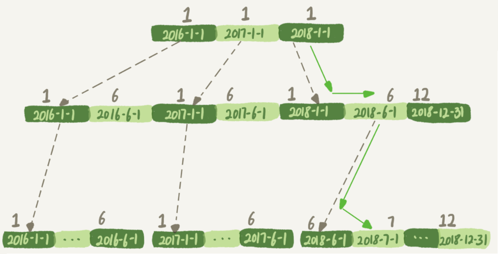
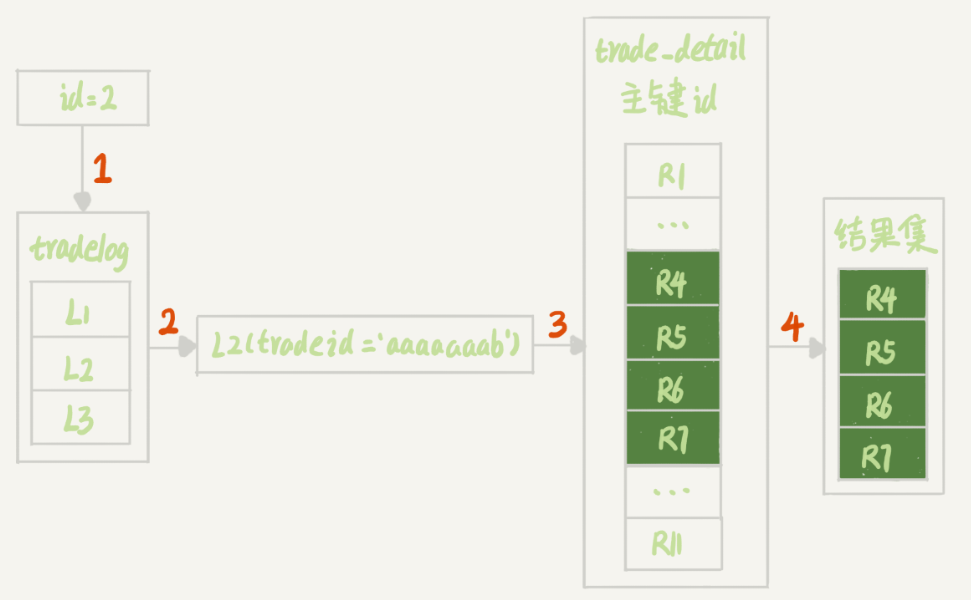

# 18讲为什么这些 SQL 语句逻辑相同，性能却差异巨大

在 MySQL 中，有很多看上去逻辑相同，但性能却差异巨大的 SQL 语句。对这些语句使用不当的话，就会不经意间导致整个数据库的压力变大，示例如下：

## 案例一：条件字段函数操作

假设你现在维护了一个交易系统，其中交易记录表 tradelog 包含交易流水号（tradeid）、交易员id（operator）、交易时间（t_modified）等字段。为了便于描述，我们先忽略其他字段。这个表的建表语句如下：

```sql
mysql> CREATE TABLE `tradelog` (
  `id` int(11) NOT NULL,
  `tradeid` varchar(32) DEFAULT NULL,
  `operator` int(11) DEFAULT NULL,
  `t_modified` datetime DEFAULT NULL,
  PRIMARY KEY (`id`),
  KEY `tradeid` (`tradeid`),
  KEY `t_modified` (`t_modified`)
) ENGINE=InnoDB DEFAULT CHARSET=utf8mb4;
```

假设，现在已经记录了从 2016 年初到 2018 年底的所有数据，运营部门有一个需求是，要统计发生在所有年份中 7 月份的交易记录总数。这个逻辑看上去并不复杂，你的 SQL 语句可能会这么写：

```sql
mysql> select count(*) from tradelog where month(t_modified)=7;
```

由于 `t_modified` 字段上有索引，于是你就很放心地在生产库中执行了这条语句，但却发现执行了特别久，才返回了结果。

**因为如果对字段做了函数计算，就用不上索引了，这是 MySQL 的规定**。

为什么条件是 `where t_modified='2018-7-1’` 的时候可以用上索引，而改成 `where month(t_modified)=7` 的时候就不行了？

下面是这个 `t_modified` 索引的示意图。方框上面的数字就是 `month()` 函数对应的值。



如果你的 SQL 语句条件用的是 `where t_modified='2018-7-1’` 的话，引擎就会按照上面绿色箭头的路线，快速定位到 `t_modified='2018-7-1’` 需要的结果。

**实际上，B+ 树提供的这个快速定位能力，来源于同一层兄弟节点的有序性。**

但是，如果计算 `month()` 函数的话，你会看到传入 7 的时候，在树的第一层就不知道该怎么办了。

即**对索引字段做函数操作，可能会破坏索引值的有序性，因此优化器就决定放弃走树搜索功能。**

**需要注意的是，优化器并不是要放弃使用这个索引**。

在这个例子里，放弃了树搜索功能，优化器可以选择遍历主键索引，也可以选择遍历索引 `t_modified`，优化器对比索引大小后发现，索引 `t_modified` 更小，遍历这个索引比遍历主键索引来得更快。因此最终还是会选择索引 `t_modified`。

接下来，我们使用 `explain` 命令，查看一下这条 SQL 语句的执行结果。

```mysql
mysql> explain select count(*) from tradelog where month(t_modified)=7;
+----+-------------+----------+------------+-------+---------------+------------+---------+------+------+----------+--------------------------+
| id | select_type | table    | partitions | type  | possible_keys | key        | key_len | ref  | rows | filtered | Extra                    |
+----+-------------+----------+------------+-------+---------------+------------+---------+------+------+----------+--------------------------+
|  1 | SIMPLE      | tradelog | NULL       | index | NULL          | t_modified | 6       | NULL |100335|   100.00 | Using where; Using index |
+----+-------------+----------+------------+-------+---------------+------------+---------+------+------+----------+--------------------------+
1 row in set, 1 warning (0.37 sec)
```

`key="t_modified"` 表示的是，使用了 `t_modified` 这个索引；我在测试表数据中插入了 10 万行数据，`rows=100335`，说明这条语句扫描了整个索引的所有值；`Extra` 字段的 `Using index`，表示的是使用了覆盖索引。

也就是说，由于在 `t_modified` 字段加了 `month()` 函数操作，**导致了全索引扫描**。为了能够用上索引的快速定位能力，我们就要把 SQL 语句改成基于字段本身的范围查询。按照下面这个写法，优化器就能按照我们预期的，用上 `t_modified` 索引的快速定位能力了。

```sql
mysql> select count(*) from tradelog where
    -> (t_modified >= '2016-7-1' and t_modified<'2016-8-1') or
    -> (t_modified >= '2017-7-1' and t_modified<'2017-8-1') or 
    -> (t_modified >= '2018-7-1' and t_modified<'2018-8-1');
```

当然，如果你的系统上线时间更早，或者后面又插入了之后年份的数据的话，你就需要再把其他年份补齐。

**由于加了 `month()` 函数操作，MySQL 无法再使用索引快速定位功能，而只能使用全索引扫描**。

不过优化器在个问题上确实有“偷懒”行为，即使是对于不改变有序性的函数，也不会考虑使用索引。比如，对于 `select * from tradelog where id + 1 = 10000` 这个 SQL 语句，这个加 1 操作并不会改变有序性，但是 MySQL 优化器还是不能用 id 索引快速定位到 9999 这一行。所以，需要你在写 SQL 语句的时候，手动改写成 `where id = 10000 -1` 才可以。

## 案例二：隐式类型转换

```sql
mysql> select * from tradelog where tradeid=110717;
```

交易编号 `tradeid` 这个字段上，本来就有索引，但是以上 SQL 语句的 explain 的结果却显示，这条语句需要走全表扫描。你可能也发现了，`tradeid` 的字段类型是 `varchar(32)`，而输入的参数却是整型，所以需要做类型转换。

那么，现在这里就有两个问题：

1. 数据类型转换的规则是什么？
2. 为什么有数据类型转换，就需要走全索引扫描？

先来看第一个问题，你可能会说，数据库里面类型这么多，这种数据类型转换规则更多，我记不住，应该怎么办呢？

这里有一个简单的方法，看 `select “10” > 9` 的结果：

1. 如果规则是「将字符串转成数字」，那么就是做数字比较，结果应该是 1；
2. 如果规则是「将数字转成字符串」，那么就是做字符串比较，结果应该是 0。

```mysql
mysql> select '10' > 9;
+----------+
| '10' > 9 |
+----------+
|        1 |
+----------+
1 row in set (0.00 sec)
```

**在 MySQL 中，字符串和数字做比较的话，是将字符串转换成数字。**

这时，你再看这个全表扫描的语句：

```sql
mysql> select * from tradelog where tradeid=110717;
```

就知道对于优化器来说，这个语句相当于：

```sql
mysql> select * from tradelog where  CAST(tradid AS signed int) = 110717;
```

这条语句触发了上面规则：对索引字段做函数操作，优化器会放弃走树搜索功能。

现在，我留给你一个小问题，id 的类型是 int，如果执行下面这个语句，是否会导致全表扫描呢？

```sql
select * from tradelog where id="83126";
```

你可以先自己分析一下，再到数据库里面去验证确认。

接下来，我们再来看一个稍微复杂点的例子。

## 案例三：隐式字符编码转换

假设系统里还有另外一个表 `trade_detail`，用于记录交易的操作细节。为了便于量化分析和复现，我往交易日志表 `tradelog` 和交易详情表 `trade_detail` 这两个表里插入一些数据。

```sql
mysql> CREATE TABLE `trade_detail` (
  `id` int(11) NOT NULL,
  `tradeid` varchar(32) DEFAULT NULL,
  `trade_step` int(11) DEFAULT NULL, /*操作步骤*/
  `step_info` varchar(32) DEFAULT NULL, /*步骤信息*/
  PRIMARY KEY (`id`),
  KEY `tradeid` (`tradeid`)
) ENGINE=InnoDB DEFAULT CHARSET=utf8;

insert into tradelog values(1, 'aaaaaaaa', 1000, now());
insert into tradelog values(2, 'aaaaaaab', 1000, now());
insert into tradelog values(3, 'aaaaaaac', 1000, now());

insert into trade_detail values(1, 'aaaaaaaa', 1, 'add');
insert into trade_detail values(2, 'aaaaaaaa', 2, 'update');
insert into trade_detail values(3, 'aaaaaaaa', 3, 'commit');
insert into trade_detail values(4, 'aaaaaaab', 1, 'add');
insert into trade_detail values(5, 'aaaaaaab', 2, 'update');
insert into trade_detail values(6, 'aaaaaaab', 3, 'update again');
insert into trade_detail values(7, 'aaaaaaab', 4, 'commit');
insert into trade_detail values(8, 'aaaaaaac', 1, 'add');
insert into trade_detail values(9, 'aaaaaaac', 2, 'update');
insert into trade_detail values(10, 'aaaaaaac', 3, 'update again');
insert into trade_detail values(11, 'aaaaaaac', 4, 'commit');
```

这时候，如果要查询 `id=2` 的交易的所有操作步骤信息，SQL 语句可以这么写：

```sql
mysql> select d.* from tradelog l, trade_detail d 
where d.tradeid=l.tradeid and l.id=2; /*语句Q1*/
```

```mysql
mysql> explain select d.* from tradelog l, trade_detail d
    -> where d.tradeid=l.tradeid and l.id=2; /*语句Q1*/
+----+-------------+-------+------------+-------+-----------------+---------+---------+-------+------+----------+-------------+
| id | select_type | table | partitions | type  | possible_keys   | key     | key_len | ref   | rows | filtered | Extra       |
+----+-------------+-------+------------+-------+-----------------+---------+---------+-------+------+----------+-------------+
|  1 | SIMPLE      | l     | NULL       | const | PRIMARY,tradeid | PRIMARY | 4       | const |    1 |   100.00 | NULL        |
|  1 | SIMPLE      | d     | NULL       | ALL   | NULL            | NULL    | NULL    | NULL  |   11 |   100.00 | Using where |
+----+-------------+-------+------------+-------+-----------------+---------+---------+-------+------+----------+-------------+
2 rows in set, 1 warning (0.00 sec)
```

我们一起来看下这个结果：

1. 第一行显示优化器会先在交易记录表 tradelog 上查到 `id=2` 的行，这个步骤用上了主键索引，`rows=1` 表示只扫描一行；
2. 第二行 `key=NULL`，表示没有用上交易详情表 `trade_detail` 上的 tradeid 索引，进行了全表扫描。

在这个执行计划里，是从 tradelog 表中取 tradeid 字段，再去 `trade_detail` 表里查询匹配字段。因此，我们把 tradelog 称为驱动表，把 `trade_detail` 称为被驱动表，把 tradeid 称为关联字段。

接下来，我们看下这个 explain 结果表示的执行流程：



图5 语句 Q1 的执行过程

图中：

- 第 1 步，是根据 id 在 tradelog 表里找到 L2 这一行；
- 第 2 步，是从 L2 中取出 `tradeid` 字段的值；
- 第 3 步，是根据 `tradeid` 值到 `trade_detail` 表中查找条件匹配的行。explain 的结果里面第二行的 `key=NULL` 表示的就是，这个过程是通过遍历主键索引的方式，一个一个地判断 `tradeid` 的值是否匹配。

进行到这里，你会发现第 3 步不符合我们的预期。因为表 `trade_detail` 里 `tradeid` 字段上是有索引的，我们本来是希望通过使用 `tradeid` 索引能够快速定位到等值的行。但并没有。

如果你去问 DBA 同学，他们可能会告诉你，因为这两个表的字符集不同，一个是 `utf8`，一个是 `utf8mb4`，所以做表连接查询的时候用不上关联字段的索引。这个回答，也是通常你搜索这个问题时会得到的答案。

为什么字符集不同就用不上索引呢？我们说问题是出在执行步骤的第 3 步，如果单独把这一步改成 SQL 语句的话，那就是：

```sql
mysql> select * from trade_detail where tradeid=$L2.tradeid.value; 
```

其中，`$L2.tradeid.value` 的字符集是 `utf8mb4`。

参照前面的两个例子，你肯定就想到了，字符集 `utf8mb4` 是 `utf8` 的超集，所以当这两个类型的字符串在做比较的时候， MySQL 内部的操作是，先把 `utf8` 字符串转成 `utf8mb4` 字符集，再做比较。

> 这个设定很好理解，utf8mb4 是 utf8 的超集。类似地，在程序设计语言里面，做自动类型转换的时候，为了避免数据在转换过程中由于截断导致数据错误，也都是“按数据长度增加的方向”进行转换的。

因此， 在执行上面这个语句的时候，需要将被驱动数据表里的字段一个个地转换成 `utf8mb4`，再跟 L2 做比较。

也就是说，实际上这个语句等同于下面这个写法：

```sql
select * from trade_detail  where CONVERT(traideid USING utf8mb4)=$L2.tradeid.value; 
```

`CONVERT()` 函数，在这里的意思是把输入的字符串转成 `utf8mb4`字符集。

这就再次触发了我们上面说到的原则：对索引字段做函数操作，优化器会放弃走树搜索功能。

到这里，你终于明确了，字符集不同只是条件之一，**连接过程中要求在被驱动表的索引字段上加函数操作**，是直接导致对被驱动表做全表扫描的原因。

作为对比验证，我给你提另外一个需求，“查找trade_detail表里id=4的操作，对应的操作者是谁”，再来看下这个语句和它的执行计划。

```mysql
mysql>select l.operator from tradelog l , trade_detail d 
where d.tradeid=l.tradeid and d.id=4;
```

```mysql
mysql> explain select l.operator from tradelog l , trade_detail d
    -> where d.tradeid=l.tradeid and d.id=4;
+----+-------------+-------+------------+-------+---------------+---------+---------+-------+------+----------+-------+
| id | select_type | table | partitions | type  | possible_keys | key     | key_len | ref   | rows | filtered | Extra |
+----+-------------+-------+------------+-------+---------------+---------+---------+-------+------+----------+-------+
|  1 | SIMPLE      | d     | NULL       | const | PRIMARY       | PRIMARY | 4       | const |    1 |   100.00 | NULL  |
|  1 | SIMPLE      | l     | NULL       | ref   | tradeid       | tradeid | 131     | const |    1 |   100.00 | NULL  |
+----+-------------+-------+------------+-------+---------------+---------+---------+-------+------+----------+-------+
2 rows in set, 1 warning (0.00 sec)
```

这个语句里 `trade_detail` 表成了驱动表，但是 explain 结果的第二行显示，这次的查询操作用上了被驱动表 tradelog 里的索引(tradeid)，扫描行数是1。

这也是两个 tradeid 字段的 join 操作，为什么这次能用上被驱动表的 tradeid 索引呢？

假设驱动表 trade_detail 里 id=4 的行记为 R4，那么在连接的时候（图 5 的第 3 步），被驱动表 tradelog 上执行的就是类似这样的 SQL 语句：

```mysql
select operator from tradelog  where traideid =$R4.tradeid.value; 
```

这时候 `$R4.tradeid.value` 的字符集是 utf8, 按照字符集转换规则，要转成 utf8mb4，所以这个过程就被改写成：

```mysql
select operator from tradelog  where traideid =CONVERT($R4.tradeid.value USING utf8mb4); 
```

这里的 CONVERT 函数是加在输入参数上的，这样就可以用上被驱动表的 traideid 索引。

理解了原理以后，就可以用来指导操作了。如果要优化语句

```mysql
select d.* from tradelog l, trade_detail d 
where d.tradeid=l.tradeid and l.id=2;
```

的执行过程，有两种做法：

- 比较常见的优化方法是，把 trade_detail 表上的 tradeid 字段的字符集也改成 utf8mb4，这样就没有字符集转换的问题了。

```mysql
alter table trade_detail modify tradeid varchar(32) CHARACTER SET utf8mb4 default null;
```

- 如果能够修改字段的字符集的话，是最好不过了。但如果数据量比较大， 或者业务上暂时不能做这个 DDL 的话，那就只能采用修改 SQL 语句的方法了。

```mysql
mysql> select d.* from tradelog l , trade_detail d where d.tradeid=CONVERT(l.tradeid USING utf8) and l.id=2; 
```

```mysql
mysql> explain select d.* from tradelog l , trade_detail d where d.tradeid=CONVERT(l.tradeid USING utf8) and l.id=2;
+----+-------------+-------+------------+-------+---------------+---------+---------+-------+------+----------+-------+
| id | select_type | table | partitions | type  | possible_keys | key     | key_len | ref   | rows | filtered | Extra |
+----+-------------+-------+------------+-------+---------------+---------+---------+-------+------+----------+-------+
|  1 | SIMPLE      | l     | NULL       | const | PRIMARY       | PRIMARY | 4       | const |    1 |   100.00 | NULL  |
|  1 | SIMPLE      | d     | NULL       | ref   | tradeid       | tradeid | 99      | const |    4 |   100.00 | NULL  |
+----+-------------+-------+------------+-------+---------------+---------+---------+-------+------+----------+-------+
2 rows in set, 1 warning (0.00 sec)
```

这里，我主动把 l.tradeid转成utf8，就避免了被驱动表上的字符编码转换，从explain结果可以看到，这次索引走对了。

## 小结

上述三个例子总结：**对索引字段做函数操作，可能会破坏索引值的有序性，因此优化器就决定放弃走树搜索功能。**

第二个例子是隐式类型转换，第三个例子是隐式字符编码转换，它们都跟第一个例子一样，因为要求在索引字段上做函数操作而导致了全索引扫描。

## 问题

今天我留给你的课后问题是，你遇到过别的、类似今天我们提到的性能问题吗？你认为原因是什么，又是怎么解决的呢？

你可以把你经历和分析写在留言区里，我会在下一篇文章的末尾选取有趣的评论跟大家一起分享和分析。感谢你的收听，也欢迎你把这篇文章分享给更多的朋友一起阅读。

## 上期问题时间

我在上篇文章的最后，留给你的问题是：我们文章中最后的一个方案是，通过三次limit Y,1 来得到需要的数据，你觉得有没有进一步的优化方法。

这里我给出一种方法，取Y1、Y2和Y3里面最大的一个数，记为M，最小的一个数记为N，然后执行下面这条SQL语句：

```
mysql> select * from t limit N, M-N+1;
```

再加上取整个表总行数的C行，这个方案的扫描行数总共只需要C+M+1行。

当然也可以先取回id值，在应用中确定了三个id值以后，再执行三次where id=X的语句也是可以的。@倪大人 同学在评论区就提到了这个方法。

这次评论区出现了很多很棒的留言：

> @老杨同志 提出了重新整理的方法、@雪中鼠[悠闲] 提到了用rowid的方法，是类似的思路，就是让表里面保存一个无空洞的自增值，这样就可以用我们的随机算法1来实现；
> @吴宇晨 提到了拿到第一个值以后，用id迭代往下找的方案，利用了主键索引的有序性。

## 精选留言

- 

    老杨同志

    感谢老师鼓励，我本人工作时间比较长，有一定的基础，听老师的课还是收获很大。每次公司内部有技术分享，我都去听课，但是多数情况，一两个小时的分享，就只有一两句话受益。老师的每篇文章都能命中我的知识盲点，感觉太别爽。

    对应今天的隐式类型转换问题也踩过坑。
    我们有个任务表记录待执行任务，表结构简化后如下：
    CREATE TABLE `task` (
    `task_id` int(11) NOT NULL AUTO_INCREMENT COMMENT '自增主键',
    `task_type` int(11) DEFAULT NULL COMMENT '任务类型id',
    `task_rfid` varchar(50) COLLATE utf8_unicode_ci DEFAULT NULL COMMENT '关联外键1',
    PRIMARY KEY (`task_id`)
    ) ENGINE=InnoDB AUTO_INCREMENT CHARSET=utf8 COLLATE=utf8_unicode_ci COMMENT='任务表';

    task_rfid 是业务主键，当然都是数字，查询时使用sql：
    select * from task where task_rfid =123;
    其实这个语句也有隐式转换问题，但是待执行任务只有几千条记录，并没有什么感觉。
    这个表还有个对应的历史表，数据有几千万
    忽然有一天，想查一下历史记录，执行语句
    select * from task_history where task_rfid =99;
    直接就等待很长时间后超时报错了。
    如果仔细看，其实我的表没有task_rfid 索引，写成task_rfid =‘99’也一样是全表扫描。
    运维时的套路是，猜测主键task_id的范围，怎么猜，我原表有creat_time字段，我会先查
    select max(task_id) from task_history 然后再看看 select * from task_history where task_id = maxId - 10000的时间，估计出大概的id范围。然后语句变成
    select * from task_history where task_rfid =99 and id between ？ and ？;

    

    2018-12-24 10:47

    作者回复

    你最后这个id预估，加上between ，
    有种神来之笔的感觉
    感觉隐约里面有二分法的思想

    2018-12-24 11:46

- 

    可凡不凡

    1.老师好
    2.如果在用一个 MySQL 关键字做字段,并且字段上索引,当我用这个索引作为唯一查询条件的时候 ,会 造 成隐式的转换吗?
    例如:SELECT * FROM b_side_order WHERE CODE = 332924 ; (code 上有索引)
    \3. mysql5.6 code 上有索引 intime 上没有索引
    语句一:
    SELECT * FROM b_side_order WHERE CODE = 332924 ;
    语句二;
    UPDATE b_side_order SET in_time = '2018-08-04 08:34:44' WHERE 1=2 or CODE = 332924;

    这两个语句 执行计划走 select 走了索引,update 没有走索引 是执行计划的bug 吗??

    

    

    

    2018-12-25 09:10

    作者回复

    \1. 你好
    \2. CODE不是关键字呀， 另外优化器选择跟关键字无关哈，关键字的话，要用 反‘ 括起来
    \3. 不是bug, update如果把 or 改成 and , 就能走索引

    2018-12-25 09:49

- 

    赖阿甘

    “mysql>select l.operator from tradelog l , trade_detail d where d.tradeid=l.tradeid and d.id=4;”
    图6上面那句sql是不是写错了。d.tradeid=l.tradeid是不是该写成l.tradeid = d.tradeid？不然函数会作用在索引字段上，就只能全表扫描了

    2018-12-24 13:48

    作者回复

    这个问题不是等号顺序决定的哈

    

    好问题

    2018-12-24 16:13

- 

    Leon

    索引字段不能进行函数操作，但是索引字段的参数可以玩函数，一言以蔽之

    2018-12-24 10:42

    作者回复

    精辟

    2018-12-24 11:43

- 

    可凡不凡

    1.老师对于多表联合查询中,MySQL 对索引的选择 以后会详细介绍吗?

    

    2018-12-24 13:49

    作者回复

    额，你是第三个提这个问题的了，我得好好考虑下安排

    2018-12-24 16:24

- 

    某、人

    SQL逻辑相同,性能差异较大的,通过老师所讲学习到的,和平时碰到的,大概有以下几类:
    一.字段发生了转换,导致本该使用索引而没有用到索引
    1.条件字段函数操作
    2.隐式类型转换
    3.隐式字符编码转换
    (如果驱动表的字符集比被驱动表得字符集小，关联列就能用到索引,如果更大,需要发生隐式编码转换,则不能用到索引,latin<gbk<utf8<utf8mb4)

    二.嵌套循环,驱动表与被驱动表选择错误
    1.连接列上没有索引,导致大表驱动小表,或者小表驱动大表(但是大表走的是全表扫描) --连接列上建立索引
    2.连接列上虽然有索引,但是驱动表任然选择错误。--通过straight_join强制选择关联表顺序
    3.子查询导致先执行外表在执行子查询,也是驱动表与被驱动表选择错误。
    --可以考虑把子查询改写为内连接,或者改写内联视图(子查询放在from后组成一个临时表,在于其他表进行关联)
    4.只需要内连接的语句,但是写成了左连接或者右连接。比如select * from t left join b on t.id=b.id where b.name='abc'驱动表被固定,大概率会扫描更多的行,导致效率降低.
    --根据业务情况或sql情况,把左连接或者右连接改写为内连接

    三.索引选择不同,造成性能差异较大
    1.select * from t where aid= and create_name>'' order by id limit 1;
    选择走id索引或者选择走(aid,create_time)索引,性能差异较大.结果集都有可能不一致
    --这个可以通过where条件过滤的值多少来大概判断,该走哪个索引

    四.其它一些因素
    1.比如之前学习到的是否有MDL X锁
    2.innodb_buffer_pool设置得太小,innodb_io_capacity设置得太小,刷脏速度跟不上
    3.是否是对表做了DML语句之后,马上做select,导致change buffer收益不高
    4.是否有数据空洞
    5.select选取的数据是否在buffer_pool中
    6.硬件原因,资源抢占
    原因多种多样,还需要慢慢补充。

    老师我问一个问题:
    连接列上一个是int一个是bigint或者一个是char一个varchar,为什么被驱动表上会出现(using index condition)?

    2018-12-24 16:21

- 

    探索无止境

    多表连接时，mysql是怎么选择驱动表和被驱动表的？这个很重要，希望老师可以讲讲

    2018-12-25 08:49

- 

    匿名的朋友

    丁奇老师，我有个疑问，就是sql语句执行时那些order by group by limit 以及where条件，有执行的先后顺序吗？

    2019-01-05 17:34

    作者回复

    有，先where ,再order by 最后limit

    2019-01-05 20:05

- 

    Destroy、

    老师，对于最后回答上一课的问题：mysql> select * from t limit N, M-N+1;
    这个语句也不是取3条记录。 没理解。

    2018-12-27 17:44

    作者回复

    取其中三条…

    2018-12-27 18:05

- 

    大坤

    之前遇到过按时间范围查询大表不走索引的情况，如果缩小时间范围，又会走索引，记得在一些文章中看到过结果数据超过全表的30%就会走全表扫描，但是前面说的时间范围查询大表，这个时间范围绝对是小于30%的情况，想请教下老师，这个优化器都是在什么情况下会放弃索引呢？

    2018-12-25 09:18

    作者回复

    总体来说就是判断哪种方式消耗更小，选哪种

    2018-12-25 09:41

- 

    Leon

    老师，经常面试被问到工作中做了什么优化，有没有好的业务表的设计，请问老师课程结束后能不能给我们一个提纲挈领的大纲套路，让我们有个脉络和思路来应付这种面试套路

    2018-12-25 09:15

    作者回复

    有没有好的业务表的设计，这类问题我第一次听到，能不能展开一下，这样说不要清楚面试官的考核点是啥…

    2018-12-25 09:45

- 

    果然如此

    我想问一个上期的问题，随机算法2虽然效率高，但是还是有个瑕疵，比如我们的随机出题算法无法直接应用，因为每次随机一个试题id，多次随机没有关联，会产生重复id，有没有更好的解决方法？

    2018-12-25 08:54

    作者回复

    内存里准备个set这样的数据结构，重读的不算，这样可以不

    2018-12-25 09:51

- 

    长杰

    这里我给出一种方法，取 Y1、Y2 和 Y3 里面最大的一个数，记为 M，最小的一个数记为 N，然后执行下面这条 SQL 语句：

    mysql> select * from t limit N, M-N+1;
    再加上取整个表总行数的 C 行，这个方案的扫描行数总共只需要 C+M 行。
    优化后的方案应该是C+M+1行吧？

    2018-12-24 22:22

    作者回复

    你说的对，我改下

    2018-12-25 10:01

- 

    asdf100

    在这个例子里，放弃了树搜索功能，优化器可以选择遍历主键索引，也可以选择遍历索引 t_modified，优化器对比索引大小后发现，索引 t_modified 更小，遍历这个索引比遍历主键索引来得更快。

    优化器如何对比的，根据参与字段字段类型占用空间大小吗？

    2018-12-24 13:02

    作者回复

    优化器信息是引擎给的，
    引擎是这么判断的

    2018-12-24 16:14

- 

    约书亚

    谁是驱动表谁是被驱动表，是否大多数情况看where条件就可以了？这是否本质上涉及到mysql底层决定用什么算法进行级联查询的问题？后面会有课程详细说明嘛？

    

    2018-12-24 08:44

    作者回复

    可以简单看where之后剩下的行数（预判不一定准哈）

    2018-12-24 16:17

- 

    zeusoul

    老师你好，我遇到了一个问题，麻烦帮忙解答下，谢谢。我在数据库中将某一个字段设置为 varchar 类型，但当我查询这个字段（long 类型的）时，本以为应该只查出来一条记录，但却查出来三条。具体细节如下：

    CREATE TABLE `user` (
    `id` int(11) unsigned NOT NULL AUTO_INCREMENT,
    `name` varchar(20) CHARACTER SET latin1 DEFAULT NULL,
    `simuid` varchar(50) CHARACTER SET latin1 NOT NULL DEFAULT '',
    PRIMARY KEY (`id`)
    ) ENGINE=InnoDB AUTO_INCREMENT=5 DEFAULT CHARSET=utf8;

    INSERT INTO `user` (`id`, `name`, `simuid`)
    VALUES
    (1, 'ccc', '6441760021201308940'),
    (3, 'bb', '6441760021201308941'),
    (4, 'bb', '6441760021201308942');

    select * from user where simuid = 6441760021201308940;
    查询结果：
    1 ccc 6441760021201308940
    3 bb 6441760021201308941
    4 bb 6441760021201308942

    如果查询：select * from user where simuid = '6441760021201308940';
    则查询结果为：
    1 ccc 6441760021201308940

    

    2019-01-09 21:51

- 

    运斤成风

    老师好，用explain工具能看到索引是否被用，而无法看到索引为什么没有被用，比如优化内部做了隐藏转换导致索引无法使用。我的问题是有没有工具能看到这一步的具体转换？谢谢

    2019-01-09 07:09

    作者回复

    没有。。

    2019-01-10 19:17

- 

    运斤成风

    说下我的理解：驱动表的索引字段不能添加函数运算或算术运算，若是则无法用到快速索引。而被驱动表则没有这个限制。

    2019-01-09 06:50

    作者回复

    只要是要“使用树搜索的索引字段”，都不应该有函数操作

    2019-01-10 19:17

- 

    雪候鸟

    找到问题了，我是用SQLyog工具改的，这种改法好像不会改历史数据，用alter改完字符集之后，索引就生效了

    2019-01-08 18:37

- 

    雪候鸟

    老师你好，EXPLAIN SELECT d.* FROM tradelog l, trade_detail d WHERE d.tradeid=l.tradeid AND l.id=2; 这个例子，我把字符集改成一样的，还是第二个表用不上索引，这个是怎么回事？

    2019-01-08 18:23