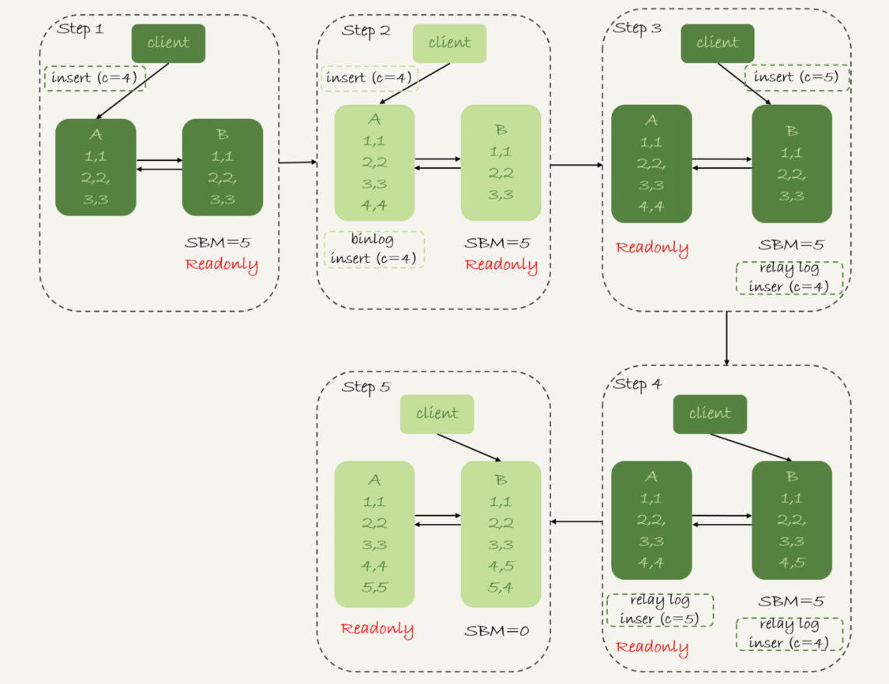
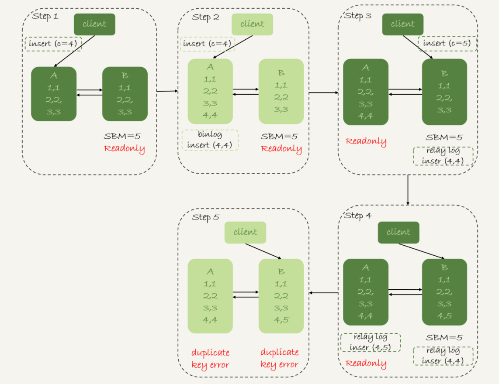
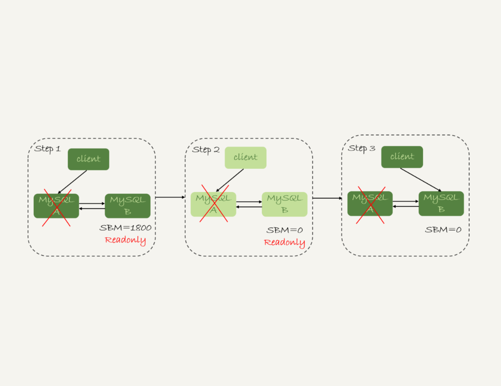
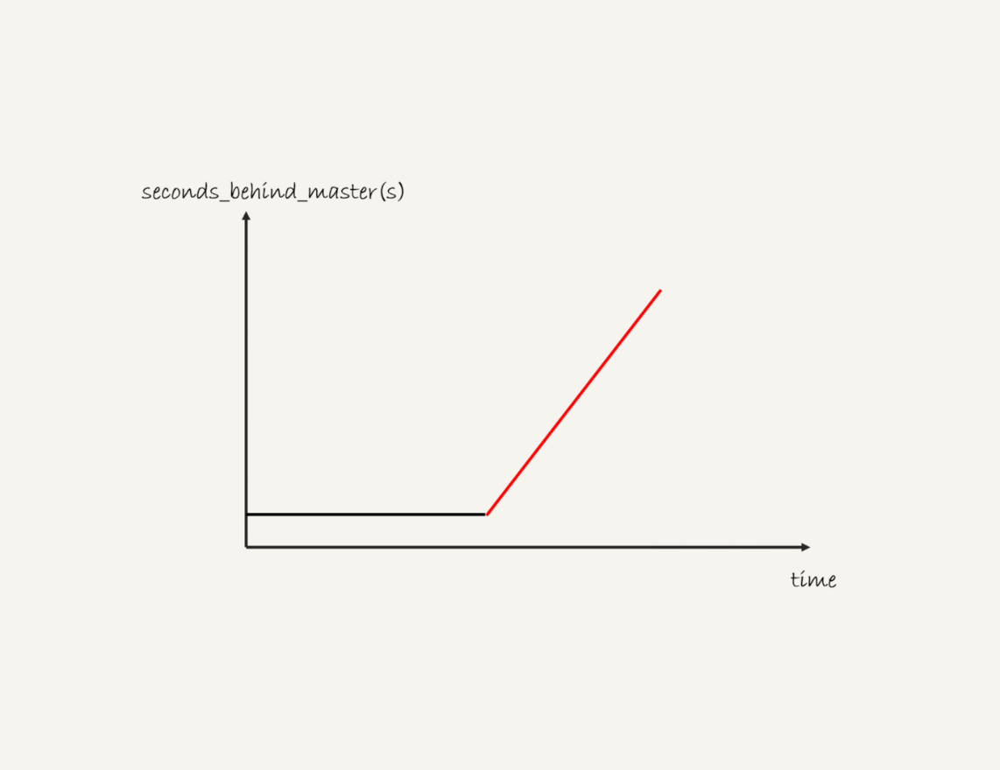
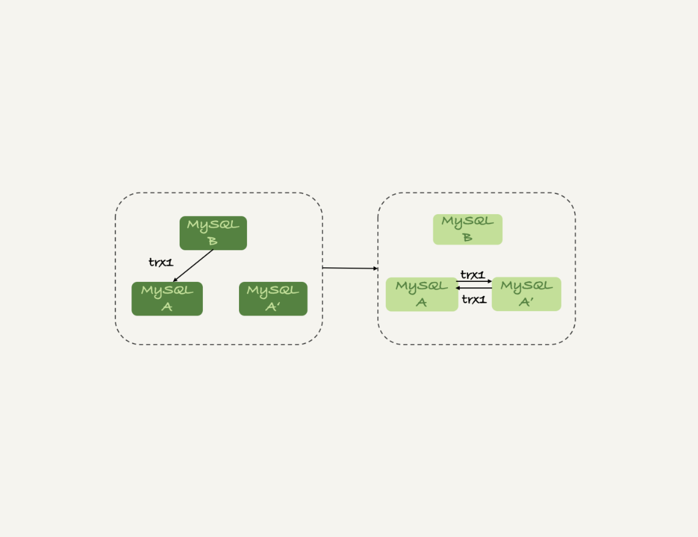

# 25讲MySQL是怎么保证高可用的

在上一篇文章中，我和你介绍了binlog的基本内容，在一个主备关系中，每个备库接收主库的binlog并执行。

正常情况下，只要主库执行更新生成的所有binlog，都可以传到备库并被正确地执行，备库就能达到跟主库一致的状态，这就是最终一致性。

但是，MySQL要提供高可用能力，只有最终一致性是不够的。为什么这么说呢？今天我就着重和你分析一下。

这里，我再放一次上一篇文章中讲到的双M结构的主备切换流程图。


图 1 MySQL主备切换流程--双M结构

# 主备延迟

主备切换可能是一个主动运维动作，比如软件升级、主库所在机器按计划下线等，也可能是被动操作，比如主库所在机器掉电。

接下来，我们先一起看看主动切换的场景。

在介绍主动切换流程的详细步骤之前，我要先跟你说明一个概念，即“同步延迟”。与数据同步有关的时间点主要包括以下三个：

1. 主库A执行完成一个事务，写入binlog，我们把这个时刻记为T1;
2. 之后传给备库B，我们把备库B接收完这个binlog的时刻记为T2;
3. 备库B执行完成这个事务，我们把这个时刻记为T3。

所谓主备延迟，就是同一个事务，在备库执行完成的时间和主库执行完成的时间之间的差值，也就是T3-T1。

你可以在备库上执行show slave status命令，它的返回结果里面会显示seconds_behind_master，用于表示当前备库延迟了多少秒。

seconds_behind_master的计算方法是这样的：

1. 每个事务的binlog 里面都有一个时间字段，用于记录主库上写入的时间；
2. 备库取出当前正在执行的事务的时间字段的值，计算它与当前系统时间的差值，得到seconds_behind_master。

可以看到，其实seconds_behind_master这个参数计算的就是T3-T1。所以，我们可以用seconds_behind_master来作为主备延迟的值，这个值的时间精度是秒。

你可能会问，如果主备库机器的系统时间设置不一致，会不会导致主备延迟的值不准？

其实不会的。因为，备库连接到主库的时候，会通过执行SELECT UNIX_TIMESTAMP()函数来获得当前主库的系统时间。如果这时候发现主库的系统时间与自己不一致，备库在执行seconds_behind_master计算的时候会自动扣掉这个差值。

需要说明的是，在网络正常的时候，日志从主库传给备库所需的时间是很短的，即T2-T1的值是非常小的。也就是说，网络正常情况下，主备延迟的主要来源是备库接收完binlog和执行完这个事务之间的时间差。

所以说，主备延迟最直接的表现是，备库消费中转日志（relay log）的速度，比主库生产binlog的速度要慢。接下来，我就和你一起分析下，这可能是由哪些原因导致的。

# 主备延迟的来源

**首先，有些部署条件下，备库所在机器的性能要比主库所在的机器性能差。**

一般情况下，有人这么部署时的想法是，反正备库没有请求，所以可以用差一点儿的机器。或者，他们会把20个主库放在4台机器上，而把备库集中在一台机器上。

其实我们都知道，更新请求对IOPS的压力，在主库和备库上是无差别的。所以，做这种部署时，一般都会将备库设置为“非双1”的模式。

但实际上，更新过程中也会触发大量的读操作。所以，当备库主机上的多个备库都在争抢资源的时候，就可能会导致主备延迟了。

当然，这种部署现在比较少了。因为主备可能发生切换，备库随时可能变成主库，所以主备库选用相同规格的机器，并且做对称部署，是现在比较常见的情况。

追问1：但是，做了对称部署以后，还可能会有延迟。这是为什么呢？

这就是**第二种常见的可能了，即备库的压力大**。一般的想法是，主库既然提供了写能力，那么备库可以提供一些读能力。或者一些运营后台需要的分析语句，不能影响正常业务，所以只能在备库上跑。

我真就见过不少这样的情况。由于主库直接影响业务，大家使用起来会比较克制，反而忽视了备库的压力控制。结果就是，备库上的查询耗费了大量的CPU资源，影响了同步速度，造成主备延迟。

这种情况，我们一般可以这么处理：

1. 一主多从。除了备库外，可以多接几个从库，让这些从库来分担读的压力。
2. 通过binlog输出到外部系统，比如Hadoop这类系统，让外部系统提供统计类查询的能力。

其中，一主多从的方式大都会被采用。因为作为数据库系统，还必须保证有定期全量备份的能力。而从库，就很适合用来做备份。

> 备注：这里需要说明一下，从库和备库在概念上其实差不多。在我们这个专栏里，为了方便描述，我把会在HA过程中被选成新主库的，称为备库，其他的称为从库。

追问2：采用了一主多从，保证备库的压力不会超过主库，还有什么情况可能导致主备延迟吗？

**这就是第三种可能了，即大事务。**

大事务这种情况很好理解。因为主库上必须等事务执行完成才会写入binlog，再传给备库。所以，如果一个主库上的语句执行10分钟，那这个事务很可能就会导致从库延迟10分钟。

不知道你所在公司的DBA有没有跟你这么说过：不要**一次性地用delete语句删除太多数据**。其实，这就是一个典型的大事务场景。

比如，一些归档类的数据，平时没有注意删除历史数据，等到空间快满了，业务开发人员要一次性地删掉大量历史数据。同时，又因为要避免在高峰期操作会影响业务（至少有这个意识还是很不错的），所以会在晚上执行这些大量数据的删除操作。

结果，负责的DBA同学半夜就会收到延迟报警。然后，DBA团队就要求你后续再删除数据的时候，要控制每个事务删除的数据量，分成多次删除。

**另一种典型的大事务场景，就是大表DDL。**这个场景，我在前面的文章中介绍过。处理方案就是，计划内的DDL，建议使用gh-ost方案（这里，你可以再回顾下第13篇文章[《为什么表数据删掉一半，表文件大小不变？》](https://time.geekbang.org/column/article/72388)中的相关内容）。

追问3：如果主库上也不做大事务了，还有什么原因会导致主备延迟吗？

造成主备延迟还有一个大方向的原因，就是**备库的并行复制能力**。这个话题，我会留在下一篇文章再和你详细介绍。

其实还是有不少其他情况会导致主备延迟，如果你还碰到过其他场景，欢迎你在评论区给我留言，我来和你一起分析、讨论。

由于主备延迟的存在，所以在主备切换的时候，就相应的有不同的策略。

# 可靠性优先策略

在图1的双M结构下，从状态1到状态2切换的详细过程是这样的：

1. 判断备库B现在的seconds_behind_master，如果小于某个值（比如5秒）继续下一步，否则持续重试这一步；
2. 把主库A改成只读状态，即把readonly设置为true；
3. 判断备库B的seconds_behind_master的值，直到这个值变成0为止；
4. 把备库B改成可读写状态，也就是把readonly 设置为false；
5. 把业务请求切到备库B。

这个切换流程，一般是由专门的HA系统来完成的，我们暂时称之为可靠性优先流程。


图2 MySQL可靠性优先主备切换流程

备注：图中的SBM，是seconds_behind_master参数的简写。

可以看到，这个切换流程中是有不可用时间的。因为在步骤2之后，主库A和备库B都处于readonly状态，也就是说这时系统处于不可写状态，直到步骤5完成后才能恢复。

在这个不可用状态中，比较耗费时间的是步骤3，可能需要耗费好几秒的时间。这也是为什么需要在步骤1先做判断，确保seconds_behind_master的值足够小。

试想如果一开始主备延迟就长达30分钟，而不先做判断直接切换的话，系统的不可用时间就会长达30分钟，这种情况一般业务都是不可接受的。

当然，系统的不可用时间，是由这个数据可靠性优先的策略决定的。你也可以选择可用性优先的策略，来把这个不可用时间几乎降为0。

# 可用性优先策略

如果我强行把步骤4、5调整到最开始执行，也就是说不等主备数据同步，直接把连接切到备库B，并且让备库B可以读写，那么系统几乎就没有不可用时间了。

我们把这个切换流程，暂时称作可用性优先流程。这个切换流程的代价，就是可能出现数据不一致的情况。

接下来，我就和你分享一个可用性优先流程产生数据不一致的例子。假设有一个表 t：

```
mysql> CREATE TABLE `t` (
  `id` int(11) unsigned NOT NULL AUTO_INCREMENT,
  `c` int(11) unsigned DEFAULT NULL,
  PRIMARY KEY (`id`)
) ENGINE=InnoDB;

insert into t(c) values(1),(2),(3);
```

这个表定义了一个自增主键id，初始化数据后，主库和备库上都是3行数据。接下来，业务人员要继续在表t上执行两条插入语句的命令，依次是：

```
insert into t(c) values(4);
insert into t(c) values(5);
```

假设，现在主库上其他的数据表有大量的更新，导致主备延迟达到5秒。在插入一条c=4的语句后，发起了主备切换。

图3是**可用性优先策略，且binlog_format=mixed**时的切换流程和数据结果。



图3 可用性优先策略，且binlog_format=mixed

现在，我们一起分析下这个切换流程：

1. 步骤2中，主库A执行完insert语句，插入了一行数据（4,4），之后开始进行主备切换。
2. 步骤3中，由于主备之间有5秒的延迟，所以备库B还没来得及应用“插入c=4”这个中转日志，就开始接收客户端“插入 c=5”的命令。
3. 步骤4中，备库B插入了一行数据（4,5），并且把这个binlog发给主库A。
4. 步骤5中，备库B执行“插入c=4”这个中转日志，插入了一行数据（5,4）。而直接在备库B执行的“插入c=5”这个语句，传到主库A，就插入了一行新数据（5,5）。

最后的结果就是，主库A和备库B上出现了两行不一致的数据。可以看到，这个数据不一致，是由可用性优先流程导致的。

那么，如果我还是用**可用性优先策略，但设置binlog_format=row**，情况又会怎样呢？

因为row格式在记录binlog的时候，会记录新插入的行的所有字段值，所以最后只会有一行不一致。而且，两边的主备同步的应用线程会报错duplicate key error并停止。也就是说，这种情况下，备库B的(5,4)和主库A的(5,5)这两行数据，都不会被对方执行。

图4中我画出了详细过程，你可以自己再分析一下。



图4 可用性优先策略，且binlog_format=row

从上面的分析中，你可以看到一些结论：

1. 使用row格式的binlog时，数据不一致的问题更容易被发现。而使用mixed或者statement格式的binlog时，数据很可能悄悄地就不一致了。如果你过了很久才发现数据不一致的问题，很可能这时的数据不一致已经不可查，或者连带造成了更多的数据逻辑不一致。
2. 主备切换的可用性优先策略会导致数据不一致。因此，大多数情况下，我都建议你使用可靠性优先策略。毕竟对数据服务来说的话，数据的可靠性一般还是要优于可用性的。

但事无绝对，**有没有哪种情况数据的可用性优先级更高呢？**

答案是，有的。

我曾经碰到过这样的一个场景：

- 有一个库的作用是记录操作日志。这时候，如果数据不一致可以通过binlog来修补，而这个短暂的不一致也不会引发业务问题。
- 同时，业务系统依赖于这个日志写入逻辑，如果这个库不可写，会导致线上的业务操作无法执行。

这时候，你可能就需要选择先强行切换，事后再补数据的策略。

当然，事后复盘的时候，我们想到了一个改进措施就是，让业务逻辑不要依赖于这类日志的写入。也就是说，日志写入这个逻辑模块应该可以降级，比如写到本地文件，或者写到另外一个临时库里面。

这样的话，这种场景就又可以使用可靠性优先策略了。

接下来我们再看看，**按照可靠性优先的思路，异常切换会是什么效果？**

假设，主库A和备库B间的主备延迟是30分钟，这时候主库A掉电了，HA系统要切换B作为主库。我们在主动切换的时候，可以等到主备延迟小于5秒的时候再启动切换，但这时候已经别无选择了。



图5 可靠性优先策略，主库不可用

采用可靠性优先策略的话，你就必须得等到备库B的seconds_behind_master=0之后，才能切换。但现在的情况比刚刚更严重，并不是系统只读、不可写的问题了，而是系统处于完全不可用的状态。因为，主库A掉电后，我们的连接还没有切到备库B。

你可能会问，那能不能直接切换到备库B，但是保持B只读呢？

这样也不行。

因为，这段时间内，中转日志还没有应用完成，如果直接发起主备切换，客户端查询看不到之前执行完成的事务，会认为有“数据丢失”。

虽然随着中转日志的继续应用，这些数据会恢复回来，但是对于一些业务来说，查询到“暂时丢失数据的状态”也是不能被接受的。

聊到这里你就知道了，在满足数据可靠性的前提下，MySQL高可用系统的可用性，是依赖于主备延迟的。延迟的时间越小，在主库故障的时候，服务恢复需要的时间就越短，可用性就越高。

# 小结

今天这篇文章，我先和你介绍了MySQL高可用系统的基础，就是主备切换逻辑。紧接着，我又和你讨论了几种会导致主备延迟的情况，以及相应的改进方向。

然后，由于主备延迟的存在，切换策略就有不同的选择。所以，我又和你一起分析了可靠性优先和可用性优先策略的区别。

在实际的应用中，我更建议使用可靠性优先的策略。毕竟保证数据准确，应该是数据库服务的底线。在这个基础上，通过减少主备延迟，提升系统的可用性。

最后，我给你留下一个思考题吧。

一般现在的数据库运维系统都有备库延迟监控，其实就是在备库上执行 show slave status，采集seconds_behind_master的值。

假设，现在你看到你维护的一个备库，它的延迟监控的图像类似图6，是一个45°斜向上的线段，你觉得可能是什么原因导致呢？你又会怎么去确认这个原因呢？



图6 备库延迟

你可以把你的分析写在评论区，我会在下一篇文章的末尾跟你讨论这个问题。感谢你的收听，也欢迎你把这篇文章分享给更多的朋友一起阅读。

# 上期问题时间

上期我留给你的问题是，什么情况下双M结构会出现循环复制。

一种场景是，在一个主库更新事务后，用命令set global server_id=x修改了server_id。等日志再传回来的时候，发现server_id跟自己的server_id不同，就只能执行了。

另一种场景是，有三个节点的时候，如图7所示，trx1是在节点 B执行的，因此binlog上的server_id就是B，binlog传给节点 A，然后A和A’搭建了双M结构，就会出现循环复制。



图7 三节点循环复制

这种三节点复制的场景，做数据库迁移的时候会出现。

如果出现了循环复制，可以在A或者A’上，执行如下命令：

```
stop slave；
CHANGE MASTER TO IGNORE_SERVER_IDS=(server_id_of_B);
start slave;
```

这样这个节点收到日志后就不会再执行。过一段时间后，再执行下面的命令把这个值改回来。

```
stop slave；
CHANGE MASTER TO IGNORE_SERVER_IDS=();
start slave;
```

评论区留言点赞板：

> @一大只、@HuaMax 同学提到了第一个复现方法；

> @Jonh同学提到了IGNORE_SERVER_IDS这个解决方法；

> @React 提到，如果主备设置不同的步长，备库是不是可以设置为可读写。我的建议是，只要这个节点设计内就不会有业务直接在上面执行更新，就建议设置为readonly。


## 精选留言

- 

    某、人

    遇到过下面几种造成主从延迟的情况:
    1.主库DML语句并发大,从库qps高
    2.从库服务器配置差或者一台服务器上几台从库(资源竞争激烈,特别是io)
    3.主库和从库的参数配置不一样
    4.大事务(DDL,我觉得DDL也相当于一个大事务)
    5.从库上在进行备份操作
    6.表上无主键的情况(主库利用索引更改数据,备库回放只能用全表扫描,这种情况可以调整slave_rows_search_algorithms参数适当优化下)
    7.设置的是延迟备库
    8.备库空间不足的情况下

    这期的问题：
    看这曲线,应该是从库正在应用一个大事务,或者一个大表上无主键的情况(有该表的更新)
    应该是T3随着时间的增长在增长,而T1这个时间点是没变的,造成的现象就是
    随着时间的增长,second_behind_master也是有规律的增长

    2019-01-10 21:46

    作者回复

    分析的点很准确

    2019-01-11 01:18

- 

    undifined

    问题答案：
    \1. 备库在执行复杂查询，导致资源被占用
    \2. 备库正在执行一个大事务
    \3. DML 语句执行

    老师我的理解对吗

    2019-01-09 20:52

    作者回复

    1不太准确，明天我会提到哈

    23对的

    2019-01-09 22:05

- 

    7号

    老师，生产环境有一张表需要清理，该表大小140G。要保留最近一个月的数据，又不能按时间直接用detele删（全表扫描），本来想通过清空分区表删，但是分区表又是哈希的。。有没好的办法呢？

    2019-01-09 19:42

    作者回复

    估计下一个月占多少比例，如果比较小就建新表，把数据导过去吧
    如果一个月占比高的话，只能一点点删了。

    时间字段有索引的话，每个分区按时间过滤出来删除

    2019-01-09 22:07

- 

    梁中华

    我有一个比较极端一点的HA问题，假设主库的binlog刚写成功还未来得及把binlog同步到从库，主库就掉电了，这时候从库的数据会不完整吗？
    第二个问题，原主库重启加入集群后，那条没有传出去的binlog会如何处理？

    2019-01-09 10:43

    作者回复

    1.可能会丢
    \2. 要看重启之后的拓扑结构了，如果还有节点是这个库的从库，还是会拿走的

    2019-01-09 12:49

- 

    JJ

    请问老师，主库断电了，怎么把binlog传给从库同步数据，怎么使的SBM为0主从切换呢？

    2019-01-09 09:10

    作者回复

    等应用完就认为是SBM=0

    如果不能接受主库有来不及传的，就使用semi-sync

    2019-01-09 10:39

- 

    via

    通过 binlog 输出到外部系统，比如 Hadoop 这类...

    文中这个具体是可采用什么工具呢？

    

    2019-01-09 08:53

    作者回复

    canal 可以了解下

    2019-01-10 19:19

- 

    Sinyo

    老师，在 binlog row模式下，insert 到表中一条记录，这条记录中某个字段不填，该字段在表中有设置默认值，利用canal解析binlog出来，这个不填的字段会不存在；难道 binlog 只记录有插入的字段数据，表字段的默认数据就不会记录么？mysql版本5.7.22 canal版本1.0.3

    2019-01-09 00:37

    作者回复

    不会啊
    insert记录的时候肯定都记录的
    你的默认值是什么？

    2019-01-10 19:16

- 

    qq悟空

    老师文章末尾思考题部分，有点困惑求解答。
    循环复制我之前理解是B->A->A'->B这样的拓扑结构。
    而双M结构理解是A->A'->A，此时A是A'的主库和从库，B只能是A的从库。那么trx1在从库B上的更新就不会传给A。
    文中是一种假设吗？还是我理解偏差了 ~

    --------正文--------
    trx1 是在节点 B 执行的，因此 binlog 上的 server_id 就是 B，binlog 传给节点 A，然后A 和 A’搭建了双 M 结构，就会出现循环复制。

    2019-01-12 16:32

    作者回复

    这个说的是迁移过程，
    也就是说，一开始A是B的从库，后来迁移过程中，停止了A和B的主备关系，让A和A'互为主备

    2019-01-12 19:37

- 

    崔伟协

    发生主从切换的时候，主有的最新数据没同步到从，会出现这种情况吗，出现了会怎么样

    2019-01-11 14:25

    作者回复

    异常切换有可能的

    要根据你的处理策略了，如果不能丢，有几个可选的
    1.不切换（等这个库自己恢复起来）
    \2. 使用semi-sync策略
    \3. 启动后业务做数据对账（这个一般用得少，成本高）

    2019-01-11 15:06

- 

    任鹏斌

    老师好发现我们系统中一条sql写法比较独特
    SELECT
    IF(ha.curricula_type = '02'
    AND ((cla.model_code IN ('CM05004' , 'CM05001')
    AND cla.is_vip_video = 1)
    OR cla.model_code = 'CM05008'),
    '1',
    '0') AS 'isUK'
    FROM
    h_curricula ha,
    h_class cla
    WHERE
    ha.`code` = '2'
    AND cla.`code` ='2'
    使用查询分析器后所有列都无信息显示，只在Extra列显示，
    Impossible WHERE noticed after reading const tables，不知道如何分析其执行计划。
    如果code列均为两个表的主键类型是varchar，想知道这种情况下是否会产生笛卡尔积？

    2019-01-11 09:24

    作者回复

    Impossible WHERE noticed after reading const tables

    这个语句是不是执行结果是空？

    2019-01-11 11:47

- 

    康磊

    老师你好，现在一般采用读写分离，读的是从库，那么主从如果出现延迟的话，读库就读的不是最新数据，对这种问题有什么好建议吗？

    2019-01-11 09:00

    作者回复

    第28篇专门讲这个问题，敬请期待

    2019-01-11 11:11

- 

    cyberty

    请问老师，如果备库连接主库之后，主库的系统时间修改了，备库同步的时候是否会自动修正？

    2019-01-10 13:19

    作者回复

    好问题，不会

    2019-01-10 23:33

- 

    风萧雨瑟

    老师问一下集群在开启并行复制的情况下：
    主库参数：binlog_group_commit_sync_delay=1000；binlog_group_commit_sync_no_delay_count=10
    从库：slave_parallel_type=LOGICAL_CLOCK；slave_parallel_workers=8
    MySQL：社区版5.7.20
    在从库上查看slave status的时Seconds_Behind_Master总是显示落后10-15，在有大量更新的情况下数据会一直增大，通过binlog来看的话Read_Master_Log_Pos 和Exec_Master_Log_Pos相差总是在1000+，甚至变大的更大。但将slave_parallel_type更改回默认值DATABASE时，Read_Master_Log_Pos 和Exec_Master_Log_Pos相差很小，甚至可以相同。
    在不同的集群上开启并行复制都会出现相同的情况，但将slave_parallel_type更改回默认值DATABASE时都要比LOGICAL_CLOCK延迟情况要好。
    更换5.7.24版本的情况下有同样的问题。
    如果有两台从库，机器配置相同其它参数一样。一台设置成slave_parallel_type=DATABASE。而另一台设置成LOGICAL_CLOCK，不管是线上的表现还是通过sysbench压测来看，设置成LOGICAL_CLOCK的从库延迟确实要比DATABASE大一些。
    这个情况从哪里排查一下？谢谢。

    

    2019-01-10 11:09

    作者回复

    先看看26篇，然后再下面留下你的理解和新的疑问哈

    2019-01-10 23:32

- 

    xm

    一般主从延时多少算是合理的？是秒级别吗？

    2019-01-10 11:09

    作者回复

    一般大于1就不好 ^_^

    2019-01-10 23:30

- 

    Chris

    老师，咨询个问题，现在遇到一个问题，mysql数据库总是crash，重新启动服务又正常，然后运行一段时间又会crash，报错如下InnoDB: Assertion failure in thread 6792 in file fil0fil.cc line 5805
    InnoDB: Failing assertion: err == DB_SUCCESS
    InnoDB: We intentionally generate a memory trap.
    InnoDB: Submit a detailed bug report to http://bugs.mysql.com.
    InnoDB: If you get repeated assertion failures or crashes, even
    InnoDB: immediately after the mysqld startup, there may be
    InnoDB: corruption in the InnoDB tablespace. Please refer to
    InnoDB: http://dev.mysql.com/doc/refman/5.7/en/forcing-innodb-recovery.html
    InnoDB: about forcing recovery.
    08:52:33 UTC - mysqld got exception 0x80000003 ;
    This could be because you hit a bug. It is also possible that this binary
    or one of the libraries it was linked against is corrupt, improperly built,
    or misconfigured. This error can also be caused by malfunctioning hardware.
    Attempting to collect some information that could help diagnose the problem.
    As this is a crash and something is definitely wrong, the information
    collection process might fail.

    key_buffer_size=8388608
    read_buffer_size=131072
    max_used_connections=60
    max_threads=151
    thread_count=45
    connection_count=45
    It is possible that mysqld could use up to
    key_buffer_size + (read_buffer_size + sort_buffer_size)*max_threads = 68010 K bytes of memory
    Hope that's ok; if not, decrease some variables in the equation.

    Thread pointer: 0x0
    Attempting backtrace. You can use the following information to find out
    where mysqld died. If you see no messages after this, something went
    terribly wrong...
    13f9b9812 mysqld.exe!my_sigabrt_handler()[my_thr_init.c:449]
    13fd5e349 mysqld.exe!raise()[winsig.c:587]
    13fd5d240 mysqld.exe!abort()[abort.c:82]
    13fab9b08 mysqld.exe!ut_dbg_assertion_failed()[ut0dbg.cc:67]
    13fae06da mysqld.exe!fil_aio_wait()[fil0fil.cc:5807]
    13fa7eb84 mysqld.exe!io_handler_thread()
    The manual page at http://dev.mysql.com/doc/mysql/en/crashing.

    2019-01-10 11:08

    作者回复

    看着好像是磁盘问题了，你这个是5.7的哪个小版本？
    还有，尽量不要用windows系统哦

    2019-01-11 01:18

- 

    xm

    老师好，如果是主库的qps上来了，主库写请求太多这种造成的延迟的话是不是从主库上下手好点？这种是做热数据隔离主库拆分？

    2019-01-10 11:06

    作者回复

    就是要看还有没有救，如果各种方法都没救了，就只能主库分库了

    

    2019-01-11 01:15

- 

    考拉出山

    你好，想问几个不明了的与平时遇到的问题：
    CREATE TABLE `t_my_user` (
    `id` bigint(20) NOT NULL,
    `type` int(11) NOT NULL,
    `groupType` int(11) NOT NULL,
    PRIMARY KEY (`id`),
    UNIQUE KEY `unique-type` (`type`) USING BTREE
    ) ENGINE=InnoDB DEFAULT CHARSET=utf8;
    INSERT INTO t_my_user(`id`, `type`, `groupType`) VALUES (1, 1, 1),(2, 2, 2),(3, 3, 3);

    RC事务隔离级别
    (session-A)begin;
    (session-B)begin;
    (session-A)update t_my_user set type = 4 where type =2;
    (session-B) delete from t_my_user where groupType = 6;
    结果是session-B 处于fetching rows LOCK WAIT 等待session-A;
    问题1：mysql delete是会扫描记录加锁然后过滤适配记录再释放X锁吗？是一次性全表先加X锁，还是一边逐行扫描加锁，然后过滤，释放？为什么扫描过滤不先加S锁，发现满足条件再变为X锁呢。
    问题2：session-B换成(delete from t_my_user where groupType = 6;) 则不会阻塞，除非命中记录，update不需要加锁过滤？

    (session-A)begin;
    select * from t_my_user where type = 2 lock in SHARE mode;
    update t_my_user set type = 4 where type =2;
    结果是顺利执行；
    问题3：第一步获取了S锁，第二部获取了X锁，这个过程是怎么样的呢？ S锁升级为X锁？还是先释放S锁，再获取X锁，难道不用提交事务也可以释放锁吗？

    (session-A)begin;
    (session-B)begin;
    (session-C)begin;
    (session-A)INSERT INTO t_my_user(`id`, `type`, `groupType`) VALUES (4, 4, 4);
    (session-B)INSERT INTO t_my_user(`id`, `type`, `groupType`) VALUES (5, 4, 4);
    (session-C)INSERT INTO t_my_user(`id`, `type`, `groupType`) VALUES (6, 4, 4);
    结果是：session-A 执行 session-B/session-C Lock Mode S Lock Wait X ,等待session-A；
    官方文档有如下解释“If a duplicate-key error occurs, a shared lock on the duplicate index record is set.”；
    为什么要添加S锁呢？没有找到相关解释。网上有解释说是插入语句会先在唯一索引上添加S锁进行唯一性检查，再变为X锁？ 还是只有在“duplicate-key error occurs”才会尝试添加S锁

    

    2019-01-10 10:44

    作者回复

    \1. 因为groupType没有索引，所以全表扫描，并在primary key上加上所有next-key lock，所以会在锁id=2这一行，被锁住；
    \2. 是不是打错了？delete from t_my_user where type = 6; 能通过，是因为这个语句锁的是 type这个索引上(2, suprenum)，这个没有锁冲突
    \3. 这样的情况下两个锁都还在，都在事务提交的时候释放。是在“duplicate-key error occurs”才会尝试添加S锁。

    2019-01-10 23:30

- 

    光

    老师请教个问题我们公司现在用得阿里云mysql ，昨天下午开始了延迟，排查发现有大事务更新操作。
    现在怎么解决这个大事务呢。
    1、如果我主库上删除这个表或者从库上删除这个表会有什么结果。
    2、比如我主库上三个表1、2、3，只同步了1，没同步完时候删除了2、3表，这时候会有什么错误。
    3、Waiting for Slave Workers to free pending events 这个是代表什么意思
    4、mysql tables in use 1, locked 1
    6045 lock struct(s), heap size 549072, 159972 row lock(s), undo log entries 159972
    MySQL thread id 3, OS thread handle 47532738873088, query id 165269 Executing event
    这个是锁表了把。能简单解释下呢。我查资料不是很明白。
    5、这个事务是不是只能等。或者是重建主从。

    

    2019-01-10 10:28

    作者回复

    \1. 主库上删除，对延迟没有任何影响的，还是得等从库同步完成之后，再执行“删表”这个动作；
    备库的话，如果这个语句已经在执行了，你执行的drop table是会被堵住的，所以对延迟也无益；
    \2. 说的是主库删除还是备库删除？
    \3. 表示从库上的工作线程的等待队列太多了
    \4. 不是锁表，就是锁了太多行了；
    \5. 如果你真的可以重建表的话，操作上可以这样。
    a) 备库上stop slave
    b) 备库上 set sql_log_bin=off; truncate table t;
    c）备库上跳过这个事务（方法后面文章会说）

    2019-01-10 19:58

- 

    nero

    老师请教下：备库连接到主库的时候，会通过执行 SELECT UNIX_TIMESTAMP() 函数来获得当前主库的系统时间。这个时间也不是很准确吧，没有网络延时吗

    

    2019-01-10 10:22

    作者回复

    单位是秒，应该还好啦^_^

    2019-01-10 19:51

- 

    春困秋乏夏打盹

    (Master_Log_file, Read_Master_Log_Pos): Coordinates in the master binary log indicating how far the slave I/O thread has read events from that log.
    (Relay_Master_Log_File, Exec_Master_Log_Pos): Coordinates in the master binary log indicating how far the slave SQL thread has executed events received from that log.
    (Relay_Log_File, Relay_Log_Pos): Coordinates in the slave relay log indicating how far the slave SQL thread has executed the relay log. These correspond to the preceding coordinates, but are
    expressed in slave relay log coordinates rather than master binary log coordinates.
    清楚了

    2019-01-10 09:49