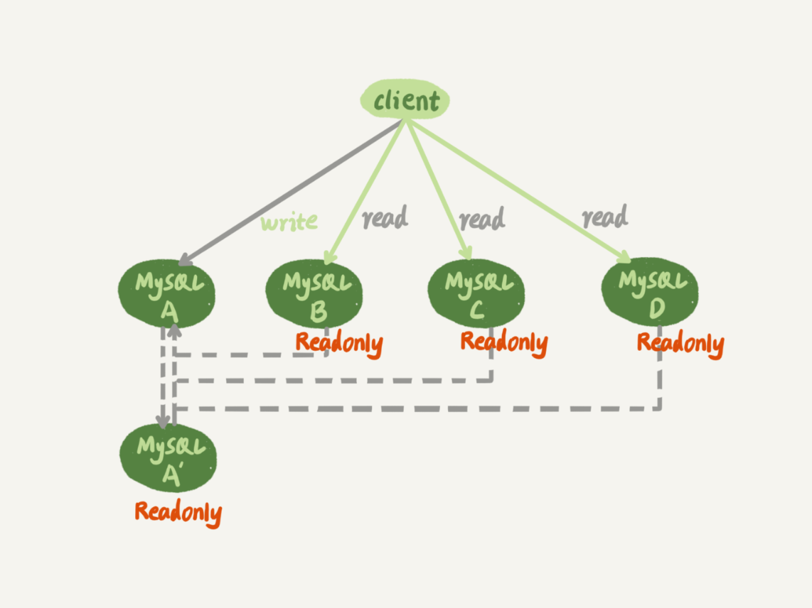

# 27讲主库出问题了，从库怎么办

在前面的第[24](https://time.geekbang.org/column/article/76446)、[25](https://time.geekbang.org/column/article/76795)和[26](https://time.geekbang.org/column/article/77083)篇文章中，我和你介绍了MySQL主备复制的基础结构，但这些都是一主一备的结构。

大多数的互联网应用场景都是读多写少，因此你负责的业务，在发展过程中很可能先会遇到读性能的问题。而在数据库层解决读性能问题，就要涉及到接下来两篇文章要讨论的架构：一主多从。

今天这篇文章，我们就先聊聊一主多从的切换正确性。然后，我们在下一篇文章中再聊聊解决一主多从的查询逻辑正确性的方法。

如图1所示，就是一个基本的一主多从结构。



图1 一主多从基本结构

图中，虚线箭头表示的是主备关系，也就是A和A’互为主备， 从库B、C、D指向的是主库A。一主多从的设置，一般用于读写分离，主库负责所有的写入和一部分读，其他的读请求则由从库分担。

今天我们要讨论的就是，在一主多从架构下，主库故障后的主备切换问题。

如图2所示，就是主库发生故障，主备切换后的结果。


图2 一主多从基本结构--主备切换

相比于一主一备的切换流程，一主多从结构在切换完成后，A’会成为新的主库，从库B、C、D也要改接到A’。正是由于多了从库B、C、D重新指向的这个过程，所以主备切换的复杂性也相应增加了。

接下来，我们再一起看看一个切换系统会怎么完成一主多从的主备切换过程。

# 基于位点的主备切换

这里，我们需要先来回顾一个知识点。

当我们把节点B设置成节点A’的从库的时候，需要执行一条change master命令：

```
CHANGE MASTER TO 
MASTER_HOST=$host_name 
MASTER_PORT=$port 
MASTER_USER=$user_name 
MASTER_PASSWORD=$password 
MASTER_LOG_FILE=$master_log_name 
MASTER_LOG_POS=$master_log_pos  
```

这条命令有这么6个参数：

- MASTER_HOST、MASTER_PORT、MASTER_USER和MASTER_PASSWORD四个参数，分别代表了主库A’的IP、端口、用户名和密码。
- 最后两个参数MASTER_LOG_FILE和MASTER_LOG_POS表示，要从主库的master_log_name文件的master_log_pos这个位置的日志继续同步。而这个位置就是我们所说的同步位点，也就是主库对应的文件名和日志偏移量。

那么，这里就有一个问题了，节点B要设置成A’的从库，就要执行change master命令，就不可避免地要设置位点的这两个参数，但是这两个参数到底应该怎么设置呢？

原来节点B是A的从库，本地记录的也是A的位点。但是相同的日志，A的位点和A’的位点是不同的。因此，从库B要切换的时候，就需要先经过“找同步位点”这个逻辑。

这个位点很难精确取到，只能取一个大概位置。为什么这么说呢？

我来和你分析一下看看这个位点一般是怎么获取到的，你就清楚其中不精确的原因了。

考虑到切换过程中不能丢数据，所以我们找位点的时候，总是要找一个“稍微往前”的，然后再通过判断跳过那些在从库B上已经执行过的事务。

一种取同步位点的方法是这样的：

1. 等待新主库A’把中转日志（relay log）全部同步完成；
2. 在A’上执行show master status命令，得到当前A’上最新的File 和 Position；
3. 取原主库A故障的时刻T；
4. 用mysqlbinlog工具解析A’的File，得到T时刻的位点。

```
mysqlbinlog File --stop-datetime=T --start-datetime=T
```


图3 mysqlbinlog 部分输出结果

图中，end_log_pos后面的值“123”，表示的就是A’这个实例，在T时刻写入新的binlog的位置。然后，我们就可以把123这个值作为$master_log_pos ，用在节点B的change master命令里。

当然这个值并不精确。为什么呢？

你可以设想有这么一种情况，假设在T这个时刻，主库A已经执行完成了一个insert 语句插入了一行数据R，并且已经将binlog传给了A’和B，然后在传完的瞬间主库A的主机就掉电了。

那么，这时候系统的状态是这样的：

1. 在从库B上，由于同步了binlog， R这一行已经存在；
2. 在新主库A’上， R这一行也已经存在，日志是写在123这个位置之后的；
3. 我们在从库B上执行change master命令，指向A’的File文件的123位置，就会把插入R这一行数据的binlog又同步到从库B去执行。

这时候，从库B的同步线程就会报告 Duplicate entry ‘id_of_R’ for key ‘PRIMARY’ 错误，提示出现了主键冲突，然后停止同步。

所以，**通常情况下，我们在切换任务的时候，要先主动跳过这些错误，有两种常用的方法。**

**一种做法是**，主动跳过一个事务。跳过命令的写法是：

```
set global sql_slave_skip_counter=1;
start slave;
```

因为切换过程中，可能会不止重复执行一个事务，所以我们需要在从库B刚开始接到新主库A’时，持续观察，每次碰到这些错误就停下来，执行一次跳过命令，直到不再出现停下来的情况，以此来跳过可能涉及的所有事务。

**另外一种方式是，**通过设置slave_skip_errors参数，直接设置跳过指定的错误。

在执行主备切换时，有这么两类错误，是经常会遇到的：

- 1062错误是插入数据时唯一键冲突；
- 1032错误是删除数据时找不到行。

因此，我们可以把slave_skip_errors 设置为 “1032,1062”，这样中间碰到这两个错误时就直接跳过。

这里需要注意的是，这种直接跳过指定错误的方法，针对的是主备切换时，由于找不到精确的同步位点，所以只能采用这种方法来创建从库和新主库的主备关系。

这个背景是，我们很清楚在主备切换过程中，直接跳过1032和1062这两类错误是无损的，所以才可以这么设置slave_skip_errors参数。等到主备间的同步关系建立完成，并稳定执行一段时间之后，我们还需要把这个参数设置为空，以免之后真的出现了主从数据不一致，也跳过了。

# GTID

通过sql_slave_skip_counter跳过事务和通过slave_skip_errors忽略错误的方法，虽然都最终可以建立从库B和新主库A’的主备关系，但这两种操作都很复杂，而且容易出错。所以，MySQL 5.6版本引入了GTID，彻底解决了这个困难。

那么，GTID到底是什么意思，又是如何解决找同步位点这个问题呢？现在，我就和你简单介绍一下。

GTID的全称是Global Transaction Identifier，也就是全局事务ID，是一个事务在提交的时候生成的，是这个事务的唯一标识。它由两部分组成，格式是：

```
GTID=server_uuid:gno
```

其中：

- server_uuid是一个实例第一次启动时自动生成的，是一个全局唯一的值；
- gno是一个整数，初始值是1，每次提交事务的时候分配给这个事务，并加1。

这里我需要和你说明一下，在MySQL的官方文档里，GTID格式是这么定义的：

```
GTID=source_id:transaction_id
```

这里的source_id就是server_uuid；而后面的这个transaction_id，我觉得容易造成误导，所以我改成了gno。为什么说使用transaction_id容易造成误解呢？

因为，在MySQL里面我们说transaction_id就是指事务id，事务id是在事务执行过程中分配的，如果这个事务回滚了，事务id也会递增，而gno是在事务提交的时候才会分配。

从效果上看，GTID往往是连续的，因此我们用gno来表示更容易理解。

GTID模式的启动也很简单，我们只需要在启动一个MySQL实例的时候，加上参数gtid_mode=on和enforce_gtid_consistency=on就可以了。

在GTID模式下，每个事务都会跟一个GTID一一对应。这个GTID有两种生成方式，而使用哪种方式取决于session变量gtid_next的值。

1. 如果gtid_next=automatic，代表使用默认值。这时，MySQL就会把server_uuid:gno分配给这个事务。
    a. 记录binlog的时候，先记录一行 SET @@SESSION.GTID_NEXT=‘server_uuid:gno’;
    b. 把这个GTID加入本实例的GTID集合。
2. 如果gtid_next是一个指定的GTID的值，比如通过set gtid_next='current_gtid’指定为current_gtid，那么就有两种可能：
    a. 如果current_gtid已经存在于实例的GTID集合中，接下来执行的这个事务会直接被系统忽略；
    b. 如果current_gtid没有存在于实例的GTID集合中，就将这个current_gtid分配给接下来要执行的事务，也就是说系统不需要给这个事务生成新的GTID，因此gno也不用加1。

注意，一个current_gtid只能给一个事务使用。这个事务提交后，如果要执行下一个事务，就要执行set 命令，把gtid_next设置成另外一个gtid或者automatic。

这样，每个MySQL实例都维护了一个GTID集合，用来对应“这个实例执行过的所有事务”。

这样看上去不太容易理解，接下来我就用一个简单的例子，来和你说明GTID的基本用法。

我们在实例X中创建一个表t。

```
CREATE TABLE `t` (
  `id` int(11) NOT NULL,
  `c` int(11) DEFAULT NULL,
  PRIMARY KEY (`id`)
) ENGINE=InnoDB;

insert into t values(1,1);
```


图4 初始化数据的binlog

可以看到，事务的BEGIN之前有一条SET @@SESSION.GTID_NEXT命令。这时，如果实例X有从库，那么将CREATE TABLE和insert语句的binlog同步过去执行的话，执行事务之前就会先执行这两个SET命令， 这样被加入从库的GTID集合的，就是图中的这两个GTID。

假设，现在这个实例X是另外一个实例Y的从库，并且此时在实例Y上执行了下面这条插入语句：

```
insert into t values(1,1);
```

并且，这条语句在实例Y上的GTID是 “aaaaaaaa-cccc-dddd-eeee-ffffffffffff:10”。

那么，实例X作为Y的从库，就要同步这个事务过来执行，显然会出现主键冲突，导致实例X的同步线程停止。这时，我们应该怎么处理呢？

处理方法就是，你可以执行下面的这个语句序列：

```
set gtid_next='aaaaaaaa-cccc-dddd-eeee-ffffffffffff:10';
begin;
commit;
set gtid_next=automatic;
start slave;
```

其中，前三条语句的作用，是通过提交一个空事务，把这个GTID加到实例X的GTID集合中。如图5所示，就是执行完这个空事务之后的show master status的结果。


图5 show master status结果

可以看到实例X的Executed_Gtid_set里面，已经加入了这个GTID。

这样，我再执行start slave命令让同步线程执行起来的时候，虽然实例X上还是会继续执行实例Y传过来的事务，但是由于“aaaaaaaa-cccc-dddd-eeee-ffffffffffff:10”已经存在于实例X的GTID集合中了，所以实例X就会直接跳过这个事务，也就不会再出现主键冲突的错误。

在上面的这个语句序列中，start slave命令之前还有一句set gtid_next=automatic。这句话的作用是“恢复GTID的默认分配行为”，也就是说如果之后有新的事务再执行，就还是按照原来的分配方式，继续分配gno=3。

# 基于GTID的主备切换

现在，我们已经理解GTID的概念，再一起来看看基于GTID的主备复制的用法。

在GTID模式下，备库B要设置为新主库A’的从库的语法如下：

```
CHANGE MASTER TO 
MASTER_HOST=$host_name 
MASTER_PORT=$port 
MASTER_USER=$user_name 
MASTER_PASSWORD=$password 
master_auto_position=1 
```

其中，master_auto_position=1就表示这个主备关系使用的是GTID协议。可以看到，前面让我们头疼不已的MASTER_LOG_FILE和MASTER_LOG_POS参数，已经不需要指定了。

我们把现在这个时刻，实例A’的GTID集合记为set_a，实例B的GTID集合记为set_b。接下来，我们就看看现在的主备切换逻辑。

我们在实例B上执行start slave命令，取binlog的逻辑是这样的：

1. 实例B指定主库A’，基于主备协议建立连接。
2. 实例B把set_b发给主库A’。
3. 实例A’算出set_a与set_b的差集，也就是所有存在于set_a，但是不存在于set_b的GITD的集合，判断A’本地是否包含了这个差集需要的所有binlog事务。
    a. 如果不包含，表示A’已经把实例B需要的binlog给删掉了，直接返回错误；
    b. 如果确认全部包含，A’从自己的binlog文件里面，找出第一个不在set_b的事务，发给B；
4. 之后就从这个事务开始，往后读文件，按顺序取binlog发给B去执行。

其实，这个逻辑里面包含了一个设计思想：在基于GTID的主备关系里，系统认为只要建立主备关系，就必须保证主库发给备库的日志是完整的。因此，如果实例B需要的日志已经不存在，A’就拒绝把日志发给B。

这跟基于位点的主备协议不同。基于位点的协议，是由备库决定的，备库指定哪个位点，主库就发哪个位点，不做日志的完整性判断。

基于上面的介绍，我们再来看看引入GTID后，一主多从的切换场景下，主备切换是如何实现的。

由于不需要找位点了，所以从库B、C、D只需要分别执行change master命令指向实例A’即可。

其实，严谨地说，主备切换不是不需要找位点了，而是找位点这个工作，在实例A’内部就已经自动完成了。但由于这个工作是自动的，所以对HA系统的开发人员来说，非常友好。

之后这个系统就由新主库A’写入，主库A’的自己生成的binlog中的GTID集合格式是：server_uuid_of_A’:1-M。

如果之前从库B的GTID集合格式是 server_uuid_of_A:1-N， 那么切换之后GTID集合的格式就变成了server_uuid_of_A:1-N, server_uuid_of_A’:1-M。

当然，主库A’之前也是A的备库，因此主库A’和从库B的GTID集合是一样的。这就达到了我们预期。

# GTID和在线DDL

接下来，我再举个例子帮你理解GTID。

之前在第22篇文章[《MySQL有哪些“饮鸩止渴”提高性能的方法？》](https://time.geekbang.org/column/article/75746)中，我和你提到业务高峰期的慢查询性能问题时，分析到如果是由于索引缺失引起的性能问题，我们可以通过在线加索引来解决。但是，考虑到要避免新增索引对主库性能造成的影响，我们可以先在备库加索引，然后再切换。

当时我说，在双M结构下，备库执行的DDL语句也会传给主库，为了避免传回后对主库造成影响，要通过set sql_log_bin=off关掉binlog。

评论区有位同学提出了一个问题：这样操作的话，数据库里面是加了索引，但是binlog并没有记录下这一个更新，是不是会导致数据和日志不一致？

这个问题提得非常好。当时，我在留言的回复中就引用了GTID来说明。今天，我再和你展开说明一下。

假设，这两个互为主备关系的库还是实例X和实例Y，且当前主库是X，并且都打开了GTID模式。这时的主备切换流程可以变成下面这样：

- 在实例X上执行stop slave。
- 在实例Y上执行DDL语句。注意，这里并不需要关闭binlog。
- 执行完成后，查出这个DDL语句对应的GTID，并记为 server_uuid_of_Y:gno。
- 到实例X上执行以下语句序列：

```
set GTID_NEXT="server_uuid_of_Y:gno";
begin;
commit;
set gtid_next=automatic;
start slave;
```

这样做的目的在于，既可以让实例Y的更新有binlog记录，同时也可以确保不会在实例X上执行这条更新。

- 接下来，执行完主备切换，然后照着上述流程再执行一遍即可。

# 小结

在今天这篇文章中，我先和你介绍了一主多从的主备切换流程。在这个过程中，从库找新主库的位点是一个痛点。由此，我们引出了MySQL 5.6版本引入的GTID模式，介绍了GTID的基本概念和用法。

可以看到，在GTID模式下，一主多从切换就非常方便了。

因此，如果你使用的MySQL版本支持GTID的话，我都建议你尽量使用GTID模式来做一主多从的切换。

在下一篇文章中，我们还能看到GTID模式在读写分离场景的应用。

最后，又到了我们的思考题时间。

你在GTID模式下设置主从关系的时候，从库执行start slave命令后，主库发现需要的binlog已经被删除掉了，导致主备创建不成功。这种情况下，你觉得可以怎么处理呢？

你可以把你的方法写在留言区，我会在下一篇文章的末尾和你讨论这个问题。感谢你的收听，也欢迎你把这篇文章分享给更多的朋友一起阅读。

# 上期问题时间

上一篇文章最后，我给你留的问题是，如果主库都是单线程压力模式，在从库追主库的过程中，binlog-transaction-dependency-tracking 应该选用什么参数？

这个问题的答案是，应该将这个参数设置为WRITESET。

由于主库是单线程压力模式，所以每个事务的commit_id都不同，那么设置为COMMIT_ORDER模式的话，从库也只能单线程执行。

同样地，由于WRITESET_SESSION模式要求在备库应用日志的时候，同一个线程的日志必须与主库上执行的先后顺序相同，也会导致主库单线程压力模式下退化成单线程复制。

所以，应该将binlog-transaction-dependency-tracking 设置为WRITESET。

**评论区留言点赞板：**

> @慧鑫coming 问了一个好问题，对同一行作更新的几个事务，如果commit_id相同，是不是在备库并行执行的时候会导致数据不一致？这个问题的答案是更新同一行的事务是不可能同时进入commit状态的。
> @老杨同志 对这个问题给出了更详细的回答，大家可以去看一下。

## 精选留言

- 

    某、人

    1.如果业务允许主从不一致的情况那么可以在主上先show global variables like 'gtid_purged';然后在从上执行set global gtid_purged =' '.指定从库从哪个gtid开始同步,binlog缺失那一部分,数据在从库上会丢失,就会造成主从不一致
    2.需要主从数据一致的话,最好还是通过重新搭建从库来做。
    3.如果有其它的从库保留有全量的binlog的话，可以把从库指定为保留了全量binlog的从库为主库(级联复制)
    4.如果binlog有备份的情况,可以先在从库上应用缺失的binlog,然后在start slave

    

    2019-01-15 17:21

    作者回复

    非常好

    2019-01-15 19:34

- 

    Mr.Strive.Z.H.L

    老师您好：
    在实际工作中，主从备份似乎是mysql用的最多的高可用方案。
    但是个人认为主从备份这个方案的问题实在太多了：
    \1. binlog数据传输前，主库宕机，导致提交了的事务数据丢失。
    \2. 一主多从，即使采用半同步，也只能保证binlog至少在两台机器上，没有一个机制能够选出拥有最完整binlog的从库作为新的主库。
    \3. 主从切换涉及到 人为操作，而不是全自动化的。即使在使用GTID的情况下，也会有binlog被删除，需要重新做从库的情况。
    \4. 互为主备，如果互为主备的两个实例全部宕机，mysql直接不可用。

    mysql应该有更强大更完备的高可用方案（类似于zab协议或者raft协议这种），而在实际环境下，为什么主从备份用得最多呢？

    

    2019-01-18 10:43

    作者回复

    3 这个应该是可以做到自动化的。
    4 这个概率比较小，其实即使是别的三节点的方案，也架不住挂两个实例，所以这个不是MySQL主备的锅。

    前面两点提得很对哈。
    其实MySQL到现在，还是提供了很多方案可选的。很多是业务权衡的结果。

    比如说，异步复制，在主库异常掉电的时候可能会丢数据。
    这个大家知道以后，有一些就改成semi-sync了，但是还是有一些就留着异步复制的模式，因为semi-sync有性能影响（一开始35%，现在好点15%左右，看具体环境），而可能这些业务认为丢一两行，可以从应用层日志去补。 就保留了异步复制模式。

    最后，为什么主从备份用得最多，我觉得有历史原因。多年前MySQL刚要开始火的时候，大家发现这个主备模式好方便，就都用了。
    而基于其他协议的方案，都是后来出现的，并且还是陆陆续续出点bug。
    涉及到线上服务，大家使用新方案的热情总是局限在测试环境的多。

    semi-sync也是近几年才开始稳定并被一些公司开始作为默认配置。

    新技术的推广，在数据库上，确实比其他领域更需要谨慎些，也算是业务决定的吧^_^
    好问题
    以上仅一家之言哈

    

    2019-01-18 11:54

- 

    悟空

    看过上篇后想到一个问题:
    级联复制A->B->C结构下, 从库C的Seconds_Behind_Master的时间计算问题.
    假定当前主库A仅有一个DDL要进行变更,耗时1分钟.那么从库C的SBM值最大应该是多少时间?
    是1分钟, 2分钟, 还是3分钟呢 ?
    带着疑问看了一下测试从库C的binlog文件中的时间戳,得出结论应该是3分钟.

    打破之前认知 ♀ . 请老师解惑 , 谢谢 !

    2019-01-14 16:06

    作者回复

    是的，因为算的是：当前执行时间，跟*日志时间*的差距

    而这个日志时间，是在A上执行出来的。

    好问题，很好的验证过程。

    2019-01-14 17:15

- 

    张永志

    今天问题回答：
    GTID主从同步设置时，主库A发现需同步的GTID日志有删掉的，那么A就会报错。
    解决办法：
    从库B在启动同步前需要设置 gtid_purged，指定GTID同步的起点，使用备份搭建从库时需要这样设置。

    如果在从库上执行了单独的操作，导致主库上缺少GTID，那么可以在主库上模拟一个与从库B上GTID一样的空事务，这样主从同步就不会报错了。

    

    2019-01-14 16:49

    作者回复

    你已经理解GTID的机制啦

    2019-01-15 03:47

- 

    Mr.Strive.Z.H.L

    老师您好：
    之前讲过 互为主备 的场景下，会出现循环复制的问题，今天这节讲了GTID。
    如果使用GTID，那么 循环复制 的问题自然而然就解决了呀？？！！

    2019-01-18 10:33

    作者回复

    哈哈，you got it

    2019-01-18 11:42

- 

    春困秋乏夏打盹

    回答undifined的第二个问题
    A-A'-B这样的级联结构
    A (binlog：A:1-M)
    A'(binlog: A:1-M,B:1-N) ,A'上面的操作记为B:1-N
    B (binlog: A:1-M,B:1-N,C:1-X) B上面的操作记为C:1-X
    ---A,B,C分别为A-A'-B的uuid

    2019-01-16 16:46

    作者回复

    对的
    总之就是，一个主备关系里，备库的GTID集合应该包含主库的GTID集合。

    2019-01-16 17:51

- 

    tchz

    1.purge gtid，2.重做备库数据

    2019-01-15 13:14

    作者回复

    2 是ok的

    purge gtid是啥

    2019-01-15 19:27

- 

    fuyu

    seta 和 setb 里的集合大小不会很大？

    2019-01-15 12:55

    作者回复

    大没关系呀，是分段的，比如 server_uuid_of_a:1-1000000，就一个段

    2019-01-15 19:26

- 

    Leo

    老师你好，PingCAP的大牛说分布式数据库的一个难点是时间同步。此话怎讲？mysql主从架构下时间不同步会有哪些问题？

    2019-01-15 09:14

    作者回复

    今晚发布的第28篇会提到哈

    2019-01-15 10:11

- 

    _CountingStars

    老师我有一个问题 如果数据库已经有完成了很多事务 实例 A’的 GTID集合和 实例 B的 GTID集合 是不是很大，这个GTID是从binglog里一点一点的解析出来所有的事务的吗？这样是不是会很慢 ？在所有binlog里定位某个GTID是不是效率也很低

    2019-01-15 08:25

    作者回复

    好问题，
    在binlog文件开头，有一个Previous_gtids, 用于记录 “生成这个binlog的时候，实例的Executed_gtid_set”, 所以启动的时候只需要解析最后一个文件；

    同样的，由于有这个Previous_gtids，可以快速地定位GTID在哪个文件里。

    2019-01-15 10:09

- 

    小超

    老师，问个上一篇的问题，从库不是只根据binlog来做相应的操作么，这个并行复制策略根据事务相同commit_id判断好理解，但是根据同时进入redo log prepare 和 commit 来判断这个怎么理解？事务提交的时候，其他事务的redo log处于prepare的状态事务的某个标识也会记录到每一个事务的binlog中么？

    2019-01-14 22:28

- 

    PengfeiWang

    老师，您好： 文中对于sql_slave_skip_counter=1的理解似乎有偏差，官方文档中的解释是：
    When you use SET GLOBAL sql_slave_skip_counter to skip events and the result is in the middle of a group, the slave continues to skip events until it reaches the end of the group. Execution then starts with the next event group.
    按照官方文档的解释，命令sql_slave_skip_counter=1 应该是跳过一个事务中的1个event，除非这个事务是有单个event组成的，才会跳过一个事务。

    

    2019-01-14 16:06

    作者回复

    你这个是好问题，

    确实只是跳过一个event，不过文档中说了呀
    “the slave continues to skip events until it reaches the end of the group. ”，
    所以效果上等效于跳过一个事务哦

    2019-01-14 18:31

- 

    PengfeiWang

    老师，你好：在生产环境（基于位点的主备切换）中，经常会遇到这样的场景：备库由于硬件或其他原因异常宕机，恢复后重启备库，执行start slave命令，总会遇到1062主键重复的报错，一直解释不清楚为什么？

    2019-01-14 15:50

    作者回复

    看一下这个语句的结果, 会受这几个参数的影响哈
    select * from information_schema.GLOBAL_VARIABLES where VARIABLE_NAME in ('master_info_repository','relay_log_info_repository','sync_master_info','sync_relay_log_info', 'sync_binlog', 'innodb_flush_log_at_trx_commit');

    2019-01-14 17:09

- 

    路过

    老师，请教：
    show slave status\G的输出中，包含如下：
    Executed_Gtid_Set: 572ece6c-e3ed-11e8-92c4-005056a509d8:1-1136659,
    ecb34895-e3eb-11e8-80e9-005056a55d62:1-1015
    是不是表示当前slave曾经和两个master同步过？

    2019-01-14 15:42

    作者回复

    一个是它自己吧？
    select @@server_uuid 看看

    2019-01-14 16:59

- 

    undifined

    老师 有几个问题：
    \1. 会不会出现主库切换后，B 中已经执行过的事务，而 A'由于网络延迟还没有收到，此时已经对 B 执行切换主库，这时候，B 中有该 GTID，但是 A'中没有，这种情况会怎么处理
    \2. 如果 A 是主库，A' 备库，B 是 A'的从库，此时 B 的 GTID 集合应该是 server_uuid_of_A':1-N，此时 A'宕机，B 改为监听 A，这时候A 和 B 的 GTID 集合没有交集，会不会发生 A 将所有的binlog 重新发给B
    \3. 思考题我的理解是从主库中 dump 出相关的数据，在备库中执行后再次执行 start slave；评论中说到从其他从库获取，但是如果只有一主一从，有 binlog 丢失，是不是只要 dump 文件恢复这一个办法

    2019-01-14 12:45

    作者回复

    \1. 这个也是异步复制导致的，只有semi-sync能解了。。
    \2. 不是哦，如果“ A 是主库，A' 备库，B 是 A'的从库”，那所有A的更新也都会通过A'传给B，所以B的GTID集合正常就是包含了A和A'的
    \3. “如果只有一主一从，有 binlog 丢失”，是的，就只有备库重做了

    2019-01-16 10:29

- 

    亮

    老师您好，假如a宕机了，需要把从切换到a'，这时候业务已经有感知了吧？怎么能让业务尽量没有感知呢？谢谢老师

    2019-01-14 10:13

    作者回复

    这种情况下，不可能业务完全无感知，

    但是如果业务代码有“重连并重试”的逻辑，并且切换足够快，就可以对业务无影响，前提是要解决主备延迟问题，就是25、26两篇提到的

    2019-01-14 11:25

- 

    大坤

    今天问题回答，由于GTID具有全局唯一性，那么其它正常的gtid已经被复制到了其他从库上了，只需要切换gtid到其他从库，等待同步完毕后在切换回主库即可

    2019-01-14 08:16

    作者回复

    这个想法很不错

    2019-01-14 10:23

- 

    往事随风，顺其自然

    执行事务之前生成GTID，系统怎么知道下次要生成事物，是预生成留在那？

    2019-01-14 08:09

    作者回复

    提交事务的时候才生成GTID

    2019-01-14 10:22