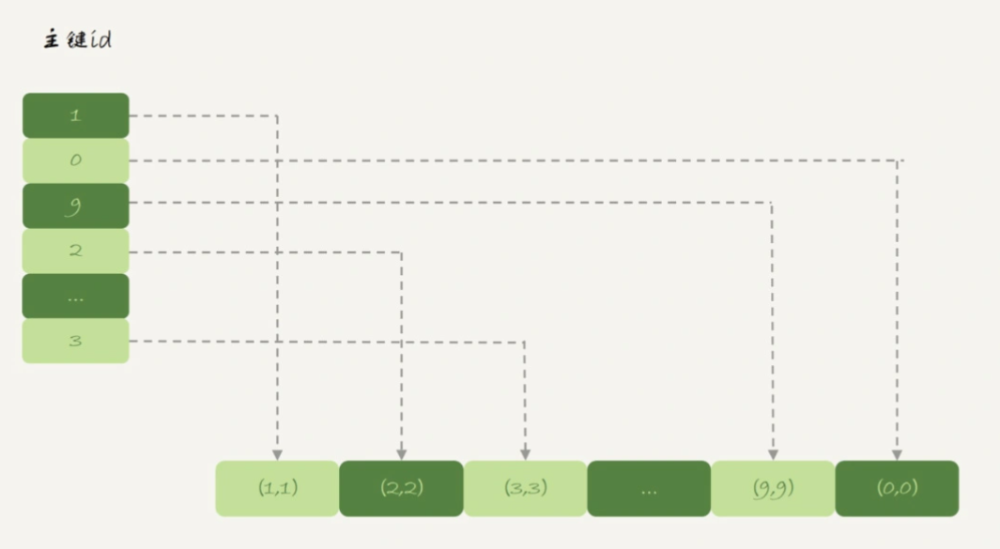
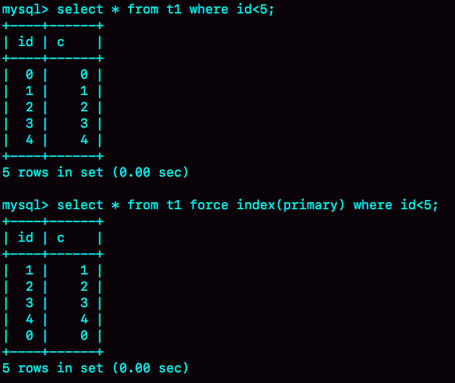
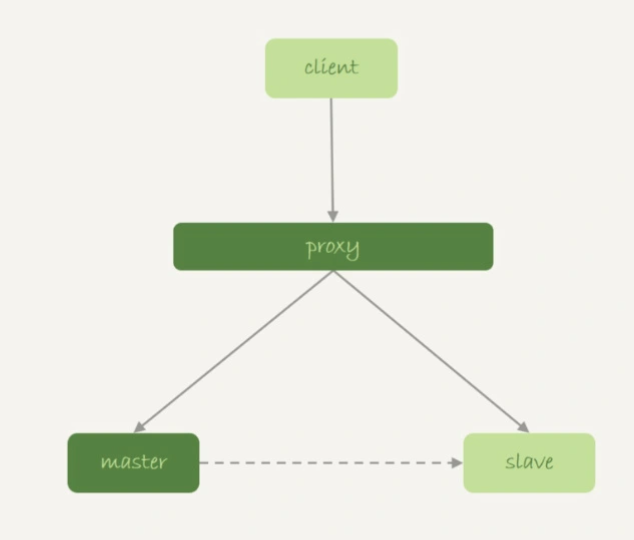
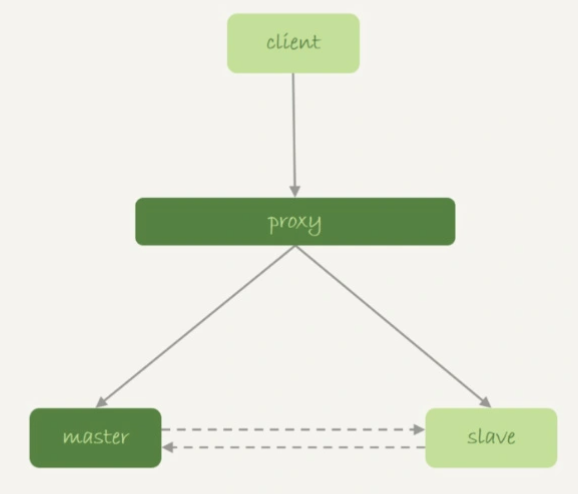
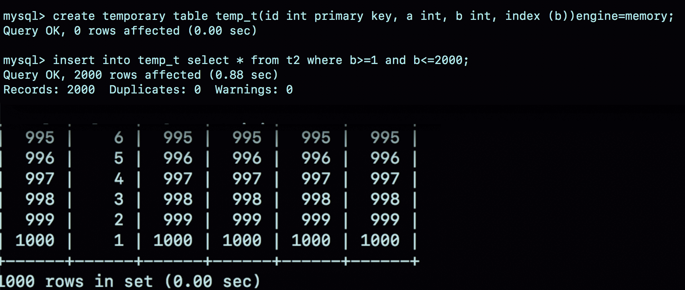

# 38讲都说InnoDB好，那还要不要使用Memory引擎

我在上一篇文章末尾留给你的问题是：两个group by 语句都用了order by null，为什么使用内存临时表得到的语句结果里，0这个值在最后一行；而使用磁盘临时表得到的结果里，0这个值在第一行？

今天我们就来看看，出现这个问题的原因吧。

# 内存表的数据组织结构

为了便于分析，我来把这个问题简化一下，假设有以下的两张表t1 和 t2，其中表t1使用Memory 引擎， 表t2使用InnoDB引擎。

```
create table t1(id int primary key, c int) engine=Memory;
create table t2(id int primary key, c int) engine=innodb;
insert into t1 values(1,1),(2,2),(3,3),(4,4),(5,5),(6,6),(7,7),(8,8),(9,9),(0,0);
insert into t2 values(1,1),(2,2),(3,3),(4,4),(5,5),(6,6),(7,7),(8,8),(9,9),(0,0);
```

然后，我分别执行select * from t1和select * from t2。


图1 两个查询结果-0的位置

可以看到，内存表t1的返回结果里面0在最后一行，而InnoDB表t2的返回结果里0在第一行。

出现这个区别的原因，要从这两个引擎的主键索引的组织方式说起。

表t2用的是InnoDB引擎，它的主键索引id的组织方式，你已经很熟悉了：InnoDB表的数据就放在主键索引树上，主键索引是B+树。所以表t2的数据组织方式如下图所示：


图2 表t2的数据组织

主键索引上的值是有序存储的。在执行select *的时候，就会按照叶子节点从左到右扫描，所以得到的结果里，0就出现在第一行。

与InnoDB引擎不同，Memory引擎的数据和索引是分开的。我们来看一下表t1中的数据内容。



图3 表t1 的数据组织

可以看到，内存表的数据部分以数组的方式单独存放，而主键id索引里，存的是每个数据的位置。主键id是hash索引，可以看到索引上的key并不是有序的。

在内存表t1中，当我执行select *的时候，走的是全表扫描，也就是顺序扫描这个数组。因此，0就是最后一个被读到，并放入结果集的数据。

可见，InnoDB和Memory引擎的数据组织方式是不同的：

- InnoDB引擎把数据放在主键索引上，其他索引上保存的是主键id。这种方式，我们称之为**索引组织表**（Index Organizied Table）。
- 而Memory引擎采用的是把数据单独存放，索引上保存数据位置的数据组织形式，我们称之为**堆组织表**（Heap Organizied Table）。

从中我们可以看出，这两个引擎的一些典型不同：

1. InnoDB表的数据总是有序存放的，而内存表的数据就是按照写入顺序存放的；
2. 当数据文件有空洞的时候，InnoDB表在插入新数据的时候，为了保证数据有序性，只能在固定的位置写入新值，而内存表找到空位就可以插入新值；
3. 数据位置发生变化的时候，InnoDB表只需要修改主键索引，而内存表需要修改所有索引；
4. InnoDB表用主键索引查询时需要走一次索引查找，用普通索引查询的时候，需要走两次索引查找。而内存表没有这个区别，所有索引的“地位”都是相同的。
5. InnoDB支持变长数据类型，不同记录的长度可能不同；内存表不支持Blob 和 Text字段，并且即使定义了varchar(N)，实际也当作char(N)，也就是固定长度字符串来存储，因此内存表的每行数据长度相同。

由于内存表的这些特性，每个数据行被删除以后，空出的这个位置都可以被接下来要插入的数据复用。比如，如果要在表t1中执行：

```
delete from t1 where id=5;
insert into t1 values(10,10);
select * from t1;
```

就会看到返回结果里，id=10这一行出现在id=4之后，也就是原来id=5这行数据的位置。

需要指出的是，表t1的这个主键索引是哈希索引，因此如果执行范围查询，比如

```
select * from t1 where id<5;
```

是用不上主键索引的，需要走全表扫描。你可以借此再回顾下[第4篇文章](https://time.geekbang.org/column/article/69236)的内容。那如果要让内存表支持范围扫描，应该怎么办呢 ？

# hash索引和B-Tree索引

实际上，内存表也是支B-Tree索引的。在id列上创建一个B-Tree索引，SQL语句可以这么写：

```
alter table t1 add index a_btree_index using btree (id);
```

这时，表t1的数据组织形式就变成了这样：


图4 表t1的数据组织--增加B-Tree索引

新增的这个B-Tree索引你看着就眼熟了，这跟InnoDB的b+树索引组织形式类似。

作为对比，你可以看一下这下面这两个语句的输出：



图5 使用B-Tree和hash索引查询返回结果对比

可以看到，执行select * from t1 where id<5的时候，优化器会选择B-Tree索引，所以返回结果是0到4。 使用force index强行使用主键id这个索引，id=0这一行就在结果集的最末尾了。

其实，一般在我们的印象中，内存表的优势是速度快，其中的一个原因就是Memory引擎支持hash索引。当然，更重要的原因是，内存表的所有数据都保存在内存，而内存的读写速度总是比磁盘快。

但是，接下来我要跟你说明，为什么我不建议你在生产环境上使用内存表。这里的原因主要包括两个方面：

1. 锁粒度问题；
2. 数据持久化问题。

# 内存表的锁

我们先来说说内存表的锁粒度问题。

内存表不支持行锁，只支持表锁。因此，一张表只要有更新，就会堵住其他所有在这个表上的读写操作。

需要注意的是，这里的表锁跟之前我们介绍过的MDL锁不同，但都是表级的锁。接下来，我通过下面这个场景，跟你模拟一下内存表的表级锁。


图6 内存表的表锁--复现步骤

在这个执行序列里，session A的update语句要执行50秒，在这个语句执行期间session B的查询会进入锁等待状态。session C的show processlist 结果输出如下：


图7 内存表的表锁--结果

跟行锁比起来，表锁对并发访问的支持不够好。所以，内存表的锁粒度问题，决定了它在处理并发事务的时候，性能也不会太好。

# 数据持久性问题

接下来，我们再看看数据持久性的问题。

数据放在内存中，是内存表的优势，但也是一个劣势。因为，数据库重启的时候，所有的内存表都会被清空。

你可能会说，如果数据库异常重启，内存表被清空也就清空了，不会有什么问题啊。但是，在高可用架构下，内存表的这个特点简直可以当做bug来看待了。为什么这么说呢？

**我们先看看M-S架构下，使用内存表存在的问题。**



图8 M-S基本架构

我们来看一下下面这个时序：

1. 业务正常访问主库；
2. 备库硬件升级，备库重启，内存表t1内容被清空；
3. 备库重启后，客户端发送一条update语句，修改表t1的数据行，这时备库应用线程就会报错“找不到要更新的行”。

这样就会导致主备同步停止。当然，如果这时候发生主备切换的话，客户端会看到，表t1的数据“丢失”了。

在图8中这种有proxy的架构里，大家默认主备切换的逻辑是由数据库系统自己维护的。这样对客户端来说，就是“网络断开，重连之后，发现内存表数据丢失了”。

你可能说这还好啊，毕竟主备发生切换，连接会断开，业务端能够感知到异常。

但是，接下来内存表的这个特性就会让使用现象显得更“诡异”了。由于MySQL知道重启之后，内存表的数据会丢失。所以，担心主库重启之后，出现主备不一致，MySQL在实现上做了这样一件事儿：在数据库重启之后，往binlog里面写入一行DELETE FROM t1。

**如果你使用是如图9所示的双M结构的话：**



图9 双M结构

在备库重启的时候，备库binlog里的delete语句就会传到主库，然后把主库内存表的内容删除。这样你在使用的时候就会发现，主库的内存表数据突然被清空了。

基于上面的分析，你可以看到，内存表并不适合在生产环境上作为普通数据表使用。

有同学会说，但是内存表执行速度快呀。这个问题，其实你可以这么分析：

1. 如果你的表更新量大，那么并发度是一个很重要的参考指标，InnoDB支持行锁，并发度比内存表好；
2. 能放到内存表的数据量都不大。如果你考虑的是读的性能，一个读QPS很高并且数据量不大的表，即使是使用InnoDB，数据也是都会缓存在InnoDB Buffer Pool里的。因此，使用InnoDB表的读性能也不会差。

所以，**我建议你把普通内存表都用InnoDB表来代替。**但是，有一个场景却是例外的。

这个场景就是，我们在第35和36篇说到的用户临时表。在数据量可控，不会耗费过多内存的情况下，你可以考虑使用内存表。

内存临时表刚好可以无视内存表的两个不足，主要是下面的三个原因：

1. 临时表不会被其他线程访问，没有并发性的问题；
2. 临时表重启后也是需要删除的，清空数据这个问题不存在；
3. 备库的临时表也不会影响主库的用户线程。

现在，我们回过头再看一下第35篇join语句优化的例子，当时我建议的是创建一个InnoDB临时表，使用的语句序列是：

```
create temporary table temp_t(id int primary key, a int, b int, index(b))engine=innodb;
insert into temp_t select * from t2 where b>=1 and b<=2000;
select * from t1 join temp_t on (t1.b=temp_t.b);
```

了解了内存表的特性，你就知道了， 其实这里使用内存临时表的效果更好，原因有三个：

1. 相比于InnoDB表，使用内存表不需要写磁盘，往表temp_t的写数据的速度更快；
2. 索引b使用hash索引，查找的速度比B-Tree索引快；
3. 临时表数据只有2000行，占用的内存有限。

因此，你可以对[第35篇文章](https://time.geekbang.org/column/article/80147)的语句序列做一个改写，将临时表t1改成内存临时表，并且在字段b上创建一个hash索引。

```
create temporary table temp_t(id int primary key, a int, b int, index (b))engine=memory;
insert into temp_t select * from t2 where b>=1 and b<=2000;
select * from t1 join temp_t on (t1.b=temp_t.b);
```



图10 使用内存临时表的执行效果

可以看到，不论是导入数据的时间，还是执行join的时间，使用内存临时表的速度都比使用InnoDB临时表要更快一些。

# 小结

今天这篇文章，我从“要不要使用内存表”这个问题展开，和你介绍了Memory引擎的几个特性。

可以看到，由于重启会丢数据，如果一个备库重启，会导致主备同步线程停止；如果主库跟这个备库是双M架构，还可能导致主库的内存表数据被删掉。

因此，在生产上，我不建议你使用普通内存表。

如果你是DBA，可以在建表的审核系统中增加这类规则，要求业务改用InnoDB表。我们在文中也分析了，其实InnoDB表性能还不错，而且数据安全也有保障。而内存表由于不支持行锁，更新语句会阻塞查询，性能也未必就如想象中那么好。

基于内存表的特性，我们还分析了它的一个适用场景，就是内存临时表。内存表支持hash索引，这个特性利用起来，对复杂查询的加速效果还是很不错的。

最后，我给你留一个问题吧。

假设你刚刚接手的一个数据库上，真的发现了一个内存表。备库重启之后肯定是会导致备库的内存表数据被清空，进而导致主备同步停止。这时，最好的做法是将它修改成InnoDB引擎表。

假设当时的业务场景暂时不允许你修改引擎，你可以加上什么自动化逻辑，来避免主备同步停止呢？

你可以把你的思考和分析写在评论区，我会在下一篇文章的末尾跟你讨论这个问题。感谢你的收听，也欢迎你把这篇文章分享给更多的朋友一起阅读。

# 上期问题时间

今天文章的正文内容，已经回答了我们上期的问题，这里就不再赘述了。

评论区留言点赞板：

> @老杨同志、@poppy、@长杰 这三位同学给出了正确答案，春节期间还持续保持跟进学习，给你们点赞。

## 精选留言

- 

    放

    老师新年快乐！过年都不忘给我们传授知识！

    2019-02-08 22:13

    作者回复

    新年快乐

    2019-02-08 22:52

- 

    Long

    老师新年好 :-)
    刚好遇到一个问题。

    本来准备更新到，一个查询是怎么运行的里面的，看到这篇更新文章，就写在这吧，希望老师帮忙解答。

    关于这个系统memory引擎表：information_schema.tables
    相关信息如下
    （1）Verison: MySQL 5.6.26
    （2）数据量table_schema = abc的有接近4W的表，整个实例有接近10W的表。（默认innodb引擎）
    （3）mysql.user和mysql.db的数据量都是100-200的行数，MyISAM引擎。
    （4）默认事务隔离级别RC

    
    在运行查询语句1的时候：select * from information_schema.tables where table_schema = 'abc';
    状态一直是check permission，opening tables，其他线程需要打开的表在opend tables里面被刷掉的，会显示在opening tables，可能需要小几秒后基本恢复正常。

    但是如果在运行查询语句2：select count(1) from information_schema.tables where table_schema = 'abc'; 这个时候语句2本身在profiling看长期处于check permission状态，其他线程就会出现阻塞现象，大部分卡在了opening tables，小部分closing tables。我测试下了，当个表查询的时候check permission大概也就是0.0005s左右的时间，4W个表理论良好状态应该是几十秒的事情。
    但是语句1可能需要5-10分钟，语句2需要5分钟。

    3个问题，请老师抽空看下：
    （1）information_schema.tables的组成方式，是我每次查询的时候从数据字典以及data目录下的文件中实时去读的吗？
    （2）语句1和语句2在运行的时候的过程分别是怎样的，特别是语句2。
    （3）语句2为什么会出现大量阻塞其他事务，其他事务都卡在opening tables的状态。

    
    PS: 最后根据audit log分析来看，语句实际上是MySQL的一个客户端Toad发起的，当使用Toad的object explorer的界面来查询表，或者设置connection的时候指定的的default schema是大域的时候就会run这个语句：（table_schema改成了abc，其他都是原样）
    SELECT COUNT(1) FROM information_schema.tables WHERE table_schema = 'abc' AND table_type != 'VIEW';

    
    再次感谢！

    2019-02-08 17:07

- 

    于家鹏

    新年好！
    课后作业：在备库配置跳过该内存表的主从同步。

    有一个问题一直困扰着我：SSD以及云主机的广泛运用，像Innodb这种使用WAL技术似乎并不能发挥最大性能（我的理解：基于SSD的WAL更多的只是起到队列一样削峰填谷的作用）。对于一些数据量不是特别大，但读写频繁的应用（比如点赞、积分），有没有更好的引擎推荐。

    2019-02-08 12:05

    作者回复

    即使是SSD，顺序写也比随机写快些的。 不过确实没有机械盘那么明显。

    2019-02-08 13:36

- 

    夜空中最亮的星（华仔）

    老师，结合课程 和 MySQL8 的新技术 老师有出书的计划吗？

    2019-02-13 16:45

- 

    Long

    老师可能没看到，再发下。

    老师新年好 :-)
    刚好遇到一个问题。

    本来准备更新到，一个查询是怎么运行的里面的，看到这篇更新文章，就写在这吧，希望老师帮忙解答。

    关于这个系统memory引擎表：information_schema.tables
    相关信息如下
    （1）Verison: MySQL 5.6.26
    （2）数据量table_schema = abc的有接近4W的表，整个实例有接近10W的表。（默认innodb引擎）
    （3）mysql.user和mysql.db的数据量都是100-200的行数，MyISAM引擎。
    （4）默认事务隔离级别RC

    
    在运行查询语句1的时候：select * from information_schema.tables where table_schema = 'abc';
    状态一直是check permission，opening tables，其他线程需要打开的表在opend tables里面被刷掉的，会显示在opening tables，可能需要小几秒后其他线程基本恢复正常。

    但是如果在运行查询语句2：select count(1) from information_schema.tables where table_schema = 'abc'; 这个时候语句2本身在profiling看长期处于check permission状态，其他线程就会出现被阻塞现象，大部分卡在了opening tables，小部分closing tables。我测试下了，单个表查询的时候check permission大概也就是0.0005s左右的时间，4W个表理论良好状态应该是几十秒的事情。
    但是语句1可能需要5-10分钟，语句2需要5分钟。

    3个问题，请老师抽空看下：
    （1）information_schema.tables的组成方式，是我每次查询的时候从数据字典以及data目录下的文件中实时去读的吗？
    （2）语句1和语句2在运行的时候的过程分别是怎样的，特别是语句2。
    （3）语句2为什么会出现大量阻塞其他事务，其他事务都卡在opening tables的状态。

    
    PS: 最后根据audit log分析来看，语句实际上是MySQL的一个客户端Toad发起的，当使用Toad的object explorer的界面来查询表，或者设置connection的时候指定的的default schema是大域的时候就会run这个语句：（table_schema改成了abc，其他都是原样）
    SELECT COUNT(1) FROM information_schema.tables WHERE table_schema = 'abc' AND table_type != 'VIEW';

    
    再次感谢！

    2019-02-13 14:30

- 

    朱高建

    备库要重启，那么备库的访问业务流量应该会被摘除，那么在备库摘除访问流量之后，重启之前，将备库的内存表引擎改为innodb，再重启备库。如果业务必须使用memory引擎，可以在重启之后改回memory引擎。

    2019-02-12 15:47

- 

    lionetes

    重启前 my.cnf 添加 skip-slave-errors 忽略 内存表引起的主从异常导致复制失败

    

    2019-02-11 17:28

    作者回复

    嗯，这个也是可以的。不过也会放过其他引擎表的主备不一致的报错哈

    2019-02-11 18:15

- 

    夹心面包

    我们线上就有一个因为内存表导致的主从同步异常的例子,我的做法是先跳过这个表的同步,然后开发进行改造,取消这张表的作用

    2019-02-11 13:47

    作者回复

    嗯嗯，联系开发改造是对的

    2019-02-11 16:22

- 

    llx

    1、如果临时表读数据的次数很少（比如只读一次），是不是建临时表时不创建索引效果很更好？
    2、engine=memory 如果遇到范围查找，在使用哈希索引时应该不会使用索引吧

    2019-02-11 11:05

    作者回复

    \1. 取决于对临时表的访问模式哦，如果是需要用到索引查找，还是要创建的。如果创建的临时表只是用于全表扫描，就可以不创建索引；
    \2. 是的，如果明确要用范围查找，就得创建b-tree索引

    2019-02-11 16:27

- 

    AI杜嘉嘉

    我的认识里，有一点不是很清楚。memory这个存储引擎，最大的特性应该是把数据存到内存。但是innodb也可以把数据存到内存，不但可以存到内存(innodb buffer size)，还可以进行持久化。这样一对比，我感觉memory的优势更没有了。不知道我讲的对不对

    2019-02-10 16:48

    作者回复

    是，如我们文中说的，不建议使用普通内存表了哈

    2019-02-10 20:49

- 

    长杰

    内存表一般数据量不大，并且更新不频繁，可以写一个定时任务，定期检测内存表的数据，如果数据不空，就将它持久化到一个innodb同结构的表中，如果为空，就反向将数据写到内存表中，这些操作可设置为不写入binlog。

    2019-02-09 14:10

    作者回复

    因为重启的时候已经执行了delete语句，所以再写入数据的动作也可以保留binlog哈

    2019-02-10 17:05

- 

    往事随风，顺其自然

    为什么memory 引擎中数据按照数组单独存储，0索引对应的数据怎么放到数组的最后

    2019-02-09 11:46

    作者回复

    这就是堆组织表的数据存放方式

    2019-02-09 15:49

- 

    HuaMax

    课后题。是不是可以加上创建表的操作，并且是innodb 类型的？

    2019-02-09 08:40

    作者回复

    嗯，如果可以改引擎，也是极好的

    2019-02-10 17:05

- 

    老杨同志

    安装之前学的知识，把主库delete语句的gtid，设置到从库中，就可以跳过这条语句了吧。
    但是主备不一致是不是要也处理一下，将主库的内存表数据备份一下。然后delete数据，重新插入。
    等备件执行者两个语句后，主备应该都有数据了

    2019-02-08 22:58

    作者回复

    题目里说的是 “备库重启”哈

    2019-02-09 07:33