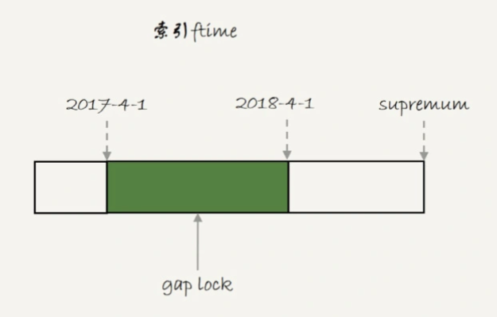
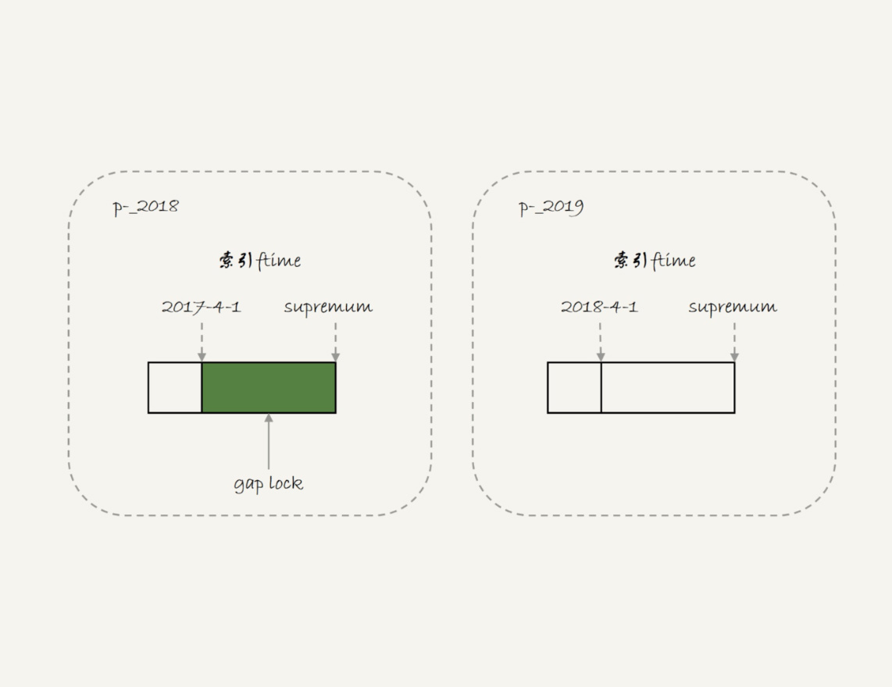

# 43讲要不要使用分区表

## 一、分区表是什么？

为了说明分区表的组织形式，我先创建一个表t：

```sql
CREATE TABLE `t` (
  `ftime` datetime NOT NULL,
  `c` int(11) DEFAULT NULL,
  KEY (`ftime`)
) ENGINE=InnoDB DEFAULT CHARSET=latin1
PARTITION BY RANGE (YEAR(ftime))
(PARTITION p_2017 VALUES LESS THAN (2017) ENGINE = InnoDB,
 PARTITION p_2018 VALUES LESS THAN (2018) ENGINE = InnoDB,
 PARTITION p_2019 VALUES LESS THAN (2019) ENGINE = InnoDB,
PARTITION p_others VALUES LESS THAN MAXVALUE ENGINE = InnoDB);

insert into t values('2017-4-1',1),('2018-4-1',1);
```


图1 表 t 的磁盘文件

我在表 t 中初始化插入了两行记录，按照定义的分区规则，这两行记录分别落在 `p_2018` 和 `p_2019` 这两个分区上。

可以看到，这个表包含了一个 `.frm` 文件和 4 个 `.ibd` 文件，每个分区对应一个 `.ibd` 文件。也就是说：

- 对于引擎层来说，这是 4 个表；
- 对于 Server 层来说，这是 1 个表。

你可能会觉得这两句都是废话。其实不然，这两句话非常重要，可以帮我们理解分区表的执行逻辑。

# 分区表的引擎层行为

我先给你举个在分区表加间隙锁的例子，目的是说明对于 InnoDB 来说，这是 4 个表。


图2 分区表间隙锁示例

这里顺便复习一下，我在[第21篇文章](https://time.geekbang.org/column/article/75659)和你介绍的间隙锁加锁规则。

我们初始化表t的时候，只插入了两行数据， ftime的值分别是，‘2017-4-1’ 和’2018-4-1’ 。session A的select语句对索引ftime上这两个记录之间的间隙加了锁。如果是一个普通表的话，那么T1时刻，在表t的ftime索引上，间隙和加锁状态应该是图3这样的。



图3 普通表的加锁范围

也就是说，‘2017-4-1’ 和’2018-4-1’ 这两个记录之间的间隙是会被锁住的。那么，sesion B的两条插入语句应该都要进入锁等待状态。

但是，从上面的实验效果可以看出，session B的第一个insert语句是可以执行成功的。这是因为，对于引擎来说，p_2018和p_2019是两个不同的表，也就是说2017-4-1的下一个记录并不是2018-4-1，而是p_2018分区的supremum。所以T1时刻，在表t的ftime索引上，间隙和加锁的状态其实是图4这样的：



图4 分区表t的加锁范围

由于分区表的规则，session A的select语句其实只操作了分区p_2018，因此加锁范围就是图4中深绿色的部分。

所以，session B要写入一行ftime是2018-2-1的时候是可以成功的，而要写入2017-12-1这个记录，就要等session A的间隙锁。

图5就是这时候的show engine innodb status的部分结果。


图5 session B被锁住信息

看完InnoDB引擎的例子，我们再来一个MyISAM分区表的例子。

我首先用alter table t engine=myisam，把表t改成MyISAM表；然后，我再用下面这个例子说明，对于MyISAM引擎来说，这是4个表。


图6 用MyISAM表锁验证

在session A里面，我用sleep(100)将这条语句的执行时间设置为100秒。由于MyISAM引擎只支持表锁，所以这条update语句会锁住整个表t上的读。

但我们看到的结果是，session B的第一条查询语句是可以正常执行的，第二条语句才进入锁等待状态。

这正是因为MyISAM的表锁是在引擎层实现的，session A加的表锁，其实是锁在分区p_2018上。因此，只会堵住在这个分区上执行的查询，落到其他分区的查询是不受影响的。

看到这里，你可能会说，分区表看来还不错嘛，为什么不让用呢？我们使用分区表的一个重要原因就是单表过大。那么，如果不使用分区表的话，我们就是要使用手动分表的方式。

接下来，我们一起看看手动分表和分区表有什么区别。

比如，按照年份来划分，我们就分别创建普通表t_2017、t_2018、t_2019等等。手工分表的逻辑，也是找到需要更新的所有分表，然后依次执行更新。在性能上，这和分区表并没有实质的差别。

分区表和手工分表，一个是由server层来决定使用哪个分区，一个是由应用层代码来决定使用哪个分表。因此，从引擎层看，这两种方式也是没有差别的。

其实这两个方案的区别，主要是在server层上。从server层看，我们就不得不提到分区表一个被广为诟病的问题：打开表的行为。

# 分区策略

每当第一次访问一个分区表的时候，MySQL需要把所有的分区都访问一遍。**一个典型的报错情况**是这样的：如果一个分区表的分区很多，比如超过了1000个，而MySQL启动的时候，`open_files_limit` 参数使用的是默认值1024，那么就会在访问这个表的时候，由于需要打开所有的文件，导致打开表文件的个数超过了上限而报错。

下图就是我创建的一个包含了很多分区的表 t_myisam，执行一条插入语句后报错的情况。


图 7 insert 语句报错

可以看到，这条 insert 语句，明显只需要访问一个分区，但语句却无法执行。

这时，你一定从表名猜到了，这个表我用的是 MyISAM 引擎。是的，因为使用 InnoDB 引擎的话，并不会出现这个问题。

MyISAM 分区表使用的分区策略，我们称为**通用分区策略**（generic partitioning），每次访问分区都由 server 层控制。通用分区策略，是 MySQL 一开始支持分区表的时候就存在的代码，在文件管理、表管理的实现上很粗糙，因此有比较严重的性能问题。

从MySQL 5.7.9开始，InnoDB引擎引入了**本地分区策略**（native partitioning）。这个策略是在InnoDB内部自己管理打开分区的行为。

MySQL从5.7.17开始，将MyISAM分区表标记为即将弃用(deprecated)，意思是“从这个版本开始不建议这么使用，请使用替代方案。在将来的版本中会废弃这个功能”。

从MySQL 8.0版本开始，就不允许创建MyISAM分区表了，只允许创建已经实现了本地分区策略的引擎。目前来看，只有InnoDB和NDB这两个引擎支持了本地分区策略。

接下来，我们再看一下分区表在server层的行为。

# 分区表的server层行为

如果从server层看的话，一个分区表就只是一个表。

这句话是什么意思呢？接下来，我就用下面这个例子来和你说明。如图8和图9所示，分别是这个例子的操作序列和执行结果图。


图8 分区表的MDL锁


图9 show processlist结果

可以看到，虽然session B只需要操作p_2107这个分区，但是由于session A持有整个表t的MDL锁，就导致了session B的alter语句被堵住。

这也是DBA同学经常说的，分区表，在做DDL的时候，影响会更大。如果你使用的是普通分表，那么当你在truncate一个分表的时候，肯定不会跟另外一个分表上的查询语句，出现MDL锁冲突。

到这里我们小结一下：

1. MySQL在第一次打开分区表的时候，需要访问所有的分区；
2. 在server层，认为这是同一张表，因此所有分区共用同一个MDL锁；
3. 在引擎层，认为这是不同的表，因此MDL锁之后的执行过程，会根据分区表规则，只访问必要的分区。

而关于“必要的分区”的判断，就是根据SQL语句中的where条件，结合分区规则来实现的。比如我们上面的例子中，where ftime=‘2018-4-1’，根据分区规则year函数算出来的值是2018，那么就会落在p_2019这个分区。

但是，如果这个where 条件改成 where ftime>=‘2018-4-1’，虽然查询结果相同，但是这时候根据where条件，就要访问p_2019和p_others这两个分区。

如果查询语句的where条件中没有分区key，那就只能访问所有分区了。当然，这并不是分区表的问题。即使是使用业务分表的方式，where条件中没有使用分表的key，也必须访问所有的分表。

我们已经理解了分区表的概念，那么什么场景下适合使用分区表呢？

# 分区表的应用场景

分区表的一个显而易见的优势是对业务透明，相对于用户分表来说，使用分区表的业务代码更简洁。还有，分区表可以很方便的清理历史数据。

如果一项业务跑的时间足够长，往往就会有根据时间删除历史数据的需求。这时候，按照时间分区的分区表，就可以直接通过alter table t drop partition …这个语法删掉分区，从而删掉过期的历史数据。

这个alter table t drop partition …操作是直接删除分区文件，效果跟drop普通表类似。与使用delete语句删除数据相比，优势是速度快、对系统影响小。

# 小结

这篇文章，我主要和你介绍的是server层和引擎层对分区表的处理方式。我希望通过这些介绍，你能够对是否选择使用分区表，有更清晰的想法。

需要注意的是，我是以范围分区（range）为例和你介绍的。实际上，MySQL还支持hash分区、list分区等分区方法。你可以在需要用到的时候，再翻翻[手册](https://dev.mysql.com/doc/refman/8.0/en/partitioning-types.html)。

实际使用时，分区表跟用户分表比起来，有两个绕不开的问题：一个是第一次访问的时候需要访问所有分区，另一个是共用MDL锁。

因此，如果要使用分区表，就不要创建太多的分区。我见过一个用户做了按天分区策略，然后预先创建了10年的分区。这种情况下，访问分区表的性能自然是不好的。这里有两个问题需要注意：

1. 分区并不是越细越好。实际上，单表或者单分区的数据一千万行，只要没有特别大的索引，对于现在的硬件能力来说都已经是小表了。
2. 分区也不要提前预留太多，在使用之前预先创建即可。比如，如果是按月分区，每年年底时再把下一年度的12个新分区创建上即可。对于没有数据的历史分区，要及时的drop掉。

至于分区表的其他问题，比如查询需要跨多个分区取数据，查询性能就会比较慢，基本上就不是分区表本身的问题，而是数据量的问题或者说是使用方式的问题了。

当然，如果你的团队已经维护了成熟的分库分表中间件，用业务分表，对业务开发同学没有额外的复杂性，对DBA也更直观，自然是更好的。

最后，我给你留下一个思考题吧。

我们举例的表中没有用到自增主键，假设现在要创建一个自增字段id。MySQL要求分区表中的主键必须包含分区字段。如果要在表t的基础上做修改，你会怎么定义这个表的主键呢？为什么这么定义呢？

你可以把你的结论和分析写在留言区，我会在下一篇文章的末尾和你讨论这个问题。感谢你的收听，也欢迎你把这篇文章分享给更多的朋友一起阅读。

# 上期问题时间

上篇文章后面还不够多，可能很多同学还没来记得看吧，我们就等后续有更多留言的时候，再补充本期的“上期问题时间”吧。

@夹心面包 提到了在grant的时候是支持通配符的："_"表示一个任意字符，“%”表示任意字符串。这个技巧在一个分库分表方案里面，同一个分库上有多个db的时候，是挺方便的。不过我个人认为，权限赋值的时候，控制的精确性还是要优先考虑的。

## 精选留言

- 

    夹心面包

    我说下我的感想
    1 经典的利用分区表的场景
    1 zabbix历史数据表的改造,利用存储过程创建和改造
    2 后台数据的分析汇总,比如日志数据,便于清理
    这两种场景我们都在执行,我们对于分区表在业务采用的是hash 用户ID方式,不过大规模应用分区表的公司我还没遇到过
    2 分区表需要注意的几点
    总结下
    1 由于分区表都很大,DDL耗时是非常严重的,必须考虑这个问题
    2 分区表不能建立太多的分区,我曾被分享一个因为分区表分区过多导致的主从延迟问题
    3 分区表的规则和分区需要预先设置好,否则后来进行修改也很麻烦

    

    2019-02-20 14:42

    作者回复

    非常好

    2019-02-20 16:31

- 

    One day

    这次竟然只需要再读两次就能读懂，之前接触过mycat和sharding-jdbc实现分区,老师能否谈谈这方面的呢

    2019-02-20 15:51

    作者回复

    赞两次

    这个就是我们文章说的“分库分表中间件”
    不过看到不少公司都会要在这基础上做点定制化

    2019-02-20 16:25

- 

    锋芒

    老师，请问什么情况会出现间隙锁？能否专题讲一下锁呢？

    2019-02-23 12:03

- 

    daka

    本期提到了ndb，了解了下，这个存储引擎高可用及读写可扩展性功能都是自带，感觉是不错，为什么很少见人使用呢？生产不可靠？

    2019-02-21 22:55

- 

    helloworld.xs

    请教个问题，一般mysql会有查询缓存，但是update操作也有缓存机制吗？使用mysql console第一次执行一个update SQL耗时明显比后面执行相同update SQL要慢，这是为什么？

    2019-02-21 18:37

    作者回复

    update的话，主要应该第一次执行的时候，数据都读入到了

    2019-02-21 21:15

- 

    万勇

    老师，请问add column after column_name跟add column不指定位置，这两种性能上有区别吗？我们在add column 指定after column_name的情况很多。

    2019-02-21 17:41

    作者回复

    仅仅看性能，是没什么差别的

    但是建议尽量不要加after column_name，
    也就是说尽量加到最后一列。

    因为其实没差别，但是加在最后有以下两个好处：
    \1. 开始有一些分支支持快速加列，就是说如果你加在最后一列，是瞬间就能完成，而加了after column_name，就用不上这些优化（以后潜在的好处）

    \2. 我们在前面的文章有提到过，如果怕对线上业务造成影响，有时候是通过“先做备库、切换、再做备库”这种方式来执行ddl的，那么使用after column_name的时候用不上这种方式。

    实际上列的数据是不应该有影响的，还是要形成好习惯

    2019-02-21 21:19

- 

    aliang

    老师，mysql还有一个参数是innodb_open_files，资料上说作用是限制Innodb能打开的表的数量。它和open_files_limit之间有什么关系吗？

    2019-02-21 14:47

    作者回复

    好问题。

    在InnoDB引擎打开文件超过 innodb_open_files这个值的时候，就会关掉一些之前打开的文件。

    其实我们文章中 ，InnoDB分区表使用了本地分区策略以后，即使分区个数大于open_files_limit ，打开InnoDB分区表也不会报“打开文件过多”这个错误，就是innodb_open_files这个参数发挥的作用。

    2019-02-21 21:21

- 

    Q

    老师 请问下 网站开发数据库表是myisam和innodb混合引擎 考虑管理比较麻烦 想统一成innodb 请问是否影响数据库或带来什么隐患吗？ 网站是网上商城购物类型的

    2019-02-20 21:25

    作者回复

    应该统一成innodb
    网上商城购物类型更要用InnoDB，因为MyISAM并不是crash-safe的。

    测试环境改完回归下

    2019-02-21 00:20

- 

    权恒星

    这个只适合单机吧？集群没法即使用innodb引擎，又支持分区表吧，只能使用中间件了。之前调研了一下，官方只有ndb cluster才支持分区表？

    2019-02-20 20:34

    作者回复

    对这篇文章讲的是单机上的单表多分区

    2019-02-20 21:28

- 

    夹心面包

    
    我觉得老师的问题可以提炼为 Mysql复合主键中自增长字段设置问题
    复合索引可以包含一个auto_increment,但是auto_increment列必须是第一列。这样插入的话,只需要指定非自增长的列
    语法 alter table test1 change column id id int auto_increment;

    2019-02-20 14:36

    作者回复

    “但是auto_increment列必须是第一列” 可以不是哦

    2019-02-20 16:50

- 

    undifined

    老师，有两个问题
    \1. 图三的间隙锁，根据“索引上的等值查询，向右遍历时且最后一个值不满足等值条件的时候，next-key lock 退化为间隙锁”，不应该是 (-∞,2017-4-1],(2017-4-1,2018-4-1)吗，图4左边的也应该是 (-∞,2017-4-1],(2017-4-1, supernum)，是不是图画错了
    \2. 现有的一个表，一千万行的数据， InnoDB 引擎，如果以月份分区，即使有 MDL 锁和初次访问时会查询所有分区，但是综合来看，分区表的查询性能还是要比不分区好，这样理解对吗

    思考题的答案
    ALTER TABLE t
    ADD COLUMN (id INT AUTO_INCREMENT ),
    ADD PRIMARY KEY (id, ftime);

    麻烦老师解答一下，谢谢老师

    2019-02-20 10:53

    作者回复

    \1. 我们语句里面是 where ftime='2017-5-1' 哈，不是“4-1”
    \2. “分区表的查询性能还是要比不分区好，这样理解对吗”，其实还是要看表的索引情况。
    当然一定存在一个数量级N，把这N行分到10个分区表，比把这N行放到一个大表里面，效率高

    2019-02-20 13:26

- 

    千木

    老师您好，你在文章里面有说通用分区规则会打开所有引擎文件导致不可用，而本地分区规则应该是只打开单个引擎文件，那你不建议创建太多分区的原因是什么呢？如果是本地分区规则，照例说是不会影响的吧，叨扰了

    2019-02-20 09:46

    作者回复

    “本地分区规则应该是只打开单个引擎文件”，并不是哈，我在文章末尾说了，也会打开所有文件的，只是说本地分区规则有优化，比如如果文件数过多，就会淘汰之前打开的文件句柄（暂时关掉）。

    所以分区太多，还是会有影响的

    2019-02-20 13:28

- 

    郭江伟

    此时主键包含自增列+分区键，原因为对innodb来说分区等于单独的表，自增字段每个分区可以插入相同的值，如果主键只有自增列无法完全保证唯一性。
    测试表如下：
    mysql> show create table t\G
    Table: t
    Create Table: CREATE TABLE `t` (
    `id` int(11) NOT NULL AUTO_INCREMENT,
    `ftime` datetime NOT NULL,
    `c` int(11) DEFAULT NULL,
    PRIMARY KEY (`id`,`ftime`),
    KEY `ftime` (`ftime`)
    ) ENGINE=InnoDB DEFAULT CHARSET=utf8mb4
    /*!50100 PARTITION BY RANGE (YEAR(ftime))
    (PARTITION p_2017 VALUES LESS THAN (2017) ENGINE = InnoDB,
    PARTITION p_2018 VALUES LESS THAN (2018) ENGINE = InnoDB,
    PARTITION p_2019 VALUES LESS THAN (2019) ENGINE = InnoDB,
    PARTITION p_others VALUES LESS THAN MAXVALUE ENGINE = InnoDB) */
    1 row in set (0.00 sec)
    mysql> insert into t values(1,'2017-4-1',1),(1,'2018-4-1',1);
    Query OK, 2 rows affected (0.02 sec)
    mysql> select * from t;
    +----+---------------------+------+
    | id | ftime | c |
    +----+---------------------+------+
    | 1 | 2017-04-01 00:00:00 | 1 |
    | 1 | 2018-04-01 00:00:00 | 1 |
    +----+---------------------+------+
    2 rows in set (0.00 sec)

    mysql> insert into t values(null,'2017-5-1',1),(null,'2018-5-1',1);
    Query OK, 2 rows affected (0.02 sec)

    mysql> select * from t;
    +----+---------------------+------+
    | id | ftime | c |
    +----+---------------------+------+
    | 1 | 2017-04-01 00:00:00 | 1 |
    | 2 | 2017-05-01 00:00:00 | 1 |
    | 1 | 2018-04-01 00:00:00 | 1 |
    | 3 | 2018-05-01 00:00:00 | 1 |
    +----+---------------------+------+
    4 rows in set (0.00 sec)

    2019-02-20 09:36

- 

    wljs

    
    老师我想问个问题 我们公司一个订单表有110个字段 想拆分成两个表 第一个表放经常查的字段 第二个表放不常查的 现在程序端不想改sql，数据库端来实现 当查询字段中 第一个表不存在 就去关联第二个表查出数据 db能实现不

    2019-02-20 08:48

    作者回复

    用view可能可以实现部分你的需求，但是强烈不建议这么做。
    业务不想修改，就好好跟他们说，毕竟这样分（常查和不常查的垂直拆分）是合理的，对读写性能都有明显的提升的。

    2019-02-20 09:16