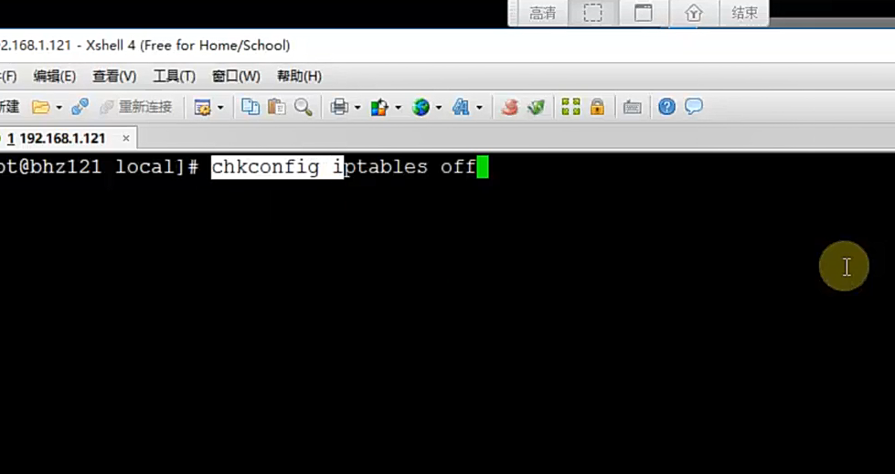
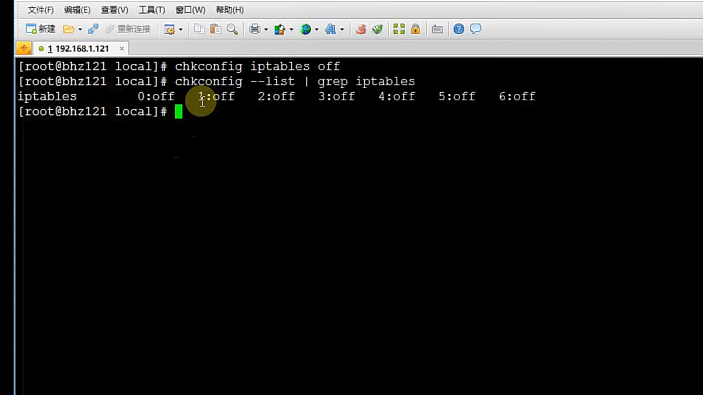
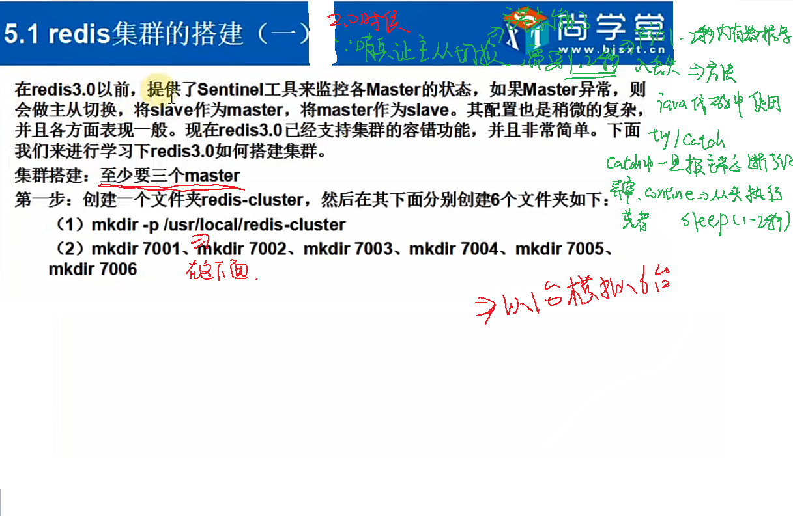
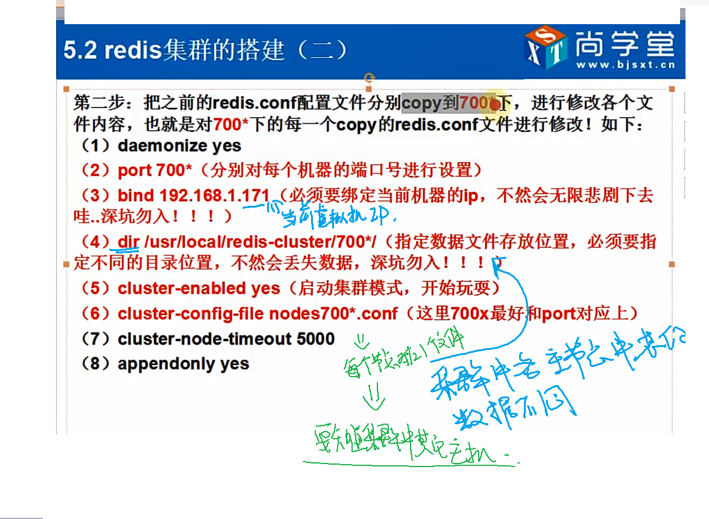
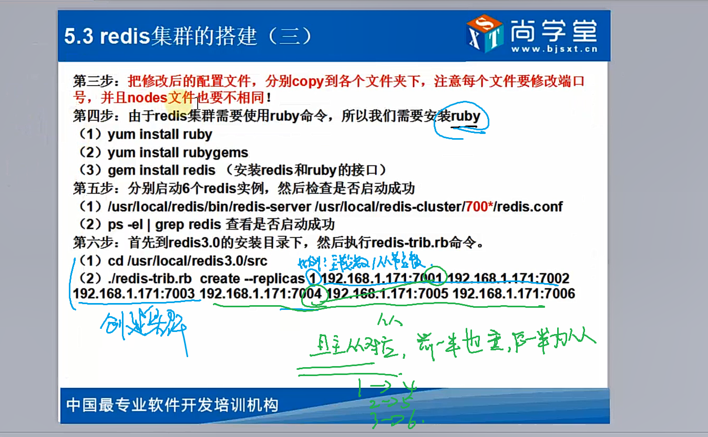
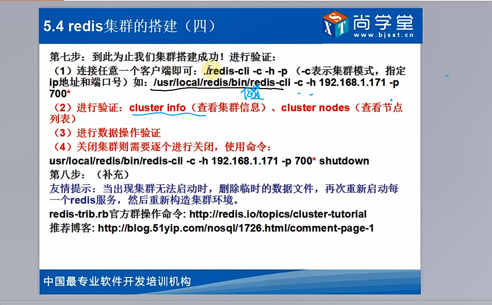
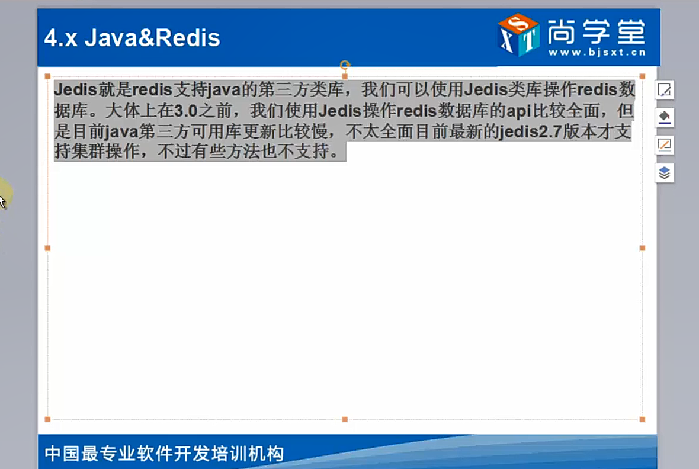

# Redis 使用

## 一、非关系型数据库

关系型数据库：MySQL 、Oracle、SQLServer

非关系型数据库（NoSQL）主要包括以下四类：

- **键值（Key-value）存储数据库**：这一类数据库主要会使用到一个哈希表，这个表中有一个特定的键和一个指针指向特定的数据。如 Redis、oldemort、Oracle BDB；

- 列存储数据库：这部分数据库通常是用来应对分布式存储的海量数据。键仍然存在，但是它们的特点是指向了多个列。如 HBase、Rak；

- 文档型数据库：该类型的数据模型是版本化的文档，半结构化的文档以特定的格式存储，比如 JSON。文档型数据库可以看作是键值数据库的升级版，允许之间嵌套键值。而且文档型数据库比键值数据库的查询效率更高。如：CouchDB, MongoDb；

- 图形（Graph）数据库：图形结构的数据库同其他行列以及刚性结构的 SQL 数据库不同，它是使用灵活的图形模型，并且能够扩展到多个服务器上。NoSQL 数据库没有标准的查询语言（SQL）因此进行数据库查询需要制定数据模型；

## 二、Redis 简介

Redis 是以 key-value 存储数据结构服务器。键可以包含:( string)字符串,哈希,（List）链表,（Set）集合，（zset）有序集合。这些数据集合都支持 push/pop、 add/ remove及取交集和并集以及更丰富的操作，redis 支持各种不同的方式排序。

- 优点:
    - 对数据高并发读写
    - 对海量数据的高效率存储和访问
        因为是基于内存级别的读取操作
    - 对数据的可扩展性和高可用性

- 缺点: 
    - Redis（ACID 处理非常简单）无法做到太复杂的关系数据库模型


### （一）Redis 安装

> 详见 Linux -> LinuxBlogs -> CentOS 安装 Redis；

**基本命令：**

- 启动服务：`src/redis-server redis.conf`
- 退出服务：`pkill redis-server`/ `kill 进程号` / `src/redis-cli shutdown`
- 启动客户端：`src/redis-cli`
- 退出客户端：`quit`
- 查看是否有 Redis 服务或者查看端口：`ps -ef | grep redis` 或者 `netstat -tunpl | grep 6379`


## 三、Redis 数据类型

Redis 一共分为五种基本数据类型： String、Hash、List（类型 Java 的 Queue）、Set（Java 中 List 增强版）、ZSet；

### （一）String 类型

String 类型是包含很多种类型的特殊类型，并且**是二进制安全的**。比如序列化的对象进行存储，比如一张图片进行二进制存储，比如一个简单的字符串、数值等。


- Set 方法：
    - 设置值：`set key值 value值`，重复为同一个 key 值设置 value，新的会覆盖旧的值；
    - 设置值：`setnx key值 value值`，如果该 key 存在则不再设置，返回 0，否则进行设置；
    - 设置值有效期：`setex key值 过期时间 value值`，设置 key 值有效期（秒）。过期则返回 nil（相当于 null）；示例：`setex key 10 value`设置该值的有效期为 10 秒；
    - 取值：`get key值`
    - 删除值：`del key值`
    - 使用 setrange 替换字符串：比如之前的值：`set key1 value123`；然后通过 `setrange key1 4 ww`表示将 key1 对应的 value 值，从第 4 位开始（从 0 开始）逐个替换为 ww，上面示例的结果值为：`valuww23`；

- 批量设置多个值或者批量取出多个值：
    - 批量设置值：`mset key1 value1 key2 value2 key3 value3`；
    - 批量获取值：`mget key1 key2 key3`
    - 同样也有 msetnx 和 mget 方法；
    - 一次性设置和取值：getset 方法，示例，已经设置值：`set key1 value1`，然后：`getset key1 value2`，首先会返回原来的值 value1，同时将 key1 值设置为：value2；
- 其他方法
    - incr 和 decr ：对 key 对应的 value 值 +/- 1（因为默认步长为 1）；`incr key1`，key1 对应的值的大小 + 1；
    - incrby 和 decr 方法：对某个值进行制定长度的递增和递减，可以使用：`incrby key1 2`，将 key1 对应的值 + 2，这里 2 表示步长。步长可正可负。
    - append 方法：在 key 对应值的后面追加；`append key1 lalala`，在 key1 对应的 value 值后面追加 lalala。
    - strlen 方法：获取 key 对应的值的长度；


### （二）Hash 类型

Hash 类型是 String 类型的 field 和 value 的映射表，或者说一个 String 集合，**特别适合存储对象**，相比，将一个对象类型存储在 Hash 类型中要比存储在 String 类型中占用内存空间更小同时更方便存取整个对象。

一般之前数据表中数据在 redis 中有两种方式存储

| id   | name  | age  |
| ---- | ----- | ---- |
| 1    | zhang | 21   |
| 2    | lisi  | 22   |

- 方式一：使用默认的 Map 形式（一般适用于经常存取部分字段时候使用）
    user1 中 ：id:1，name:zhang，age:21；使用键值对存放
    然后将 user1 和 user2 整合为 user 表；

- 方式二：使用 JSON 格式（一般适用于经常取出整条数据）
    这里一般假设 id 即是 UUID
    所以：key=uuid，value:{id=1，name=lisi，age=22}

**语法示例：**

- 存储内容：`hset hash集合名字 key值（字段名） value值`
- 批量存取内容：`hset hash集合名字 key1 value1 key2 value2`
- 获取内容：`hget hash集合名字 key值`
- 批量获取内容：`hmget hash集合名字 key1 key2`
- hsetnx 和 setnx 相似
- hincrby 和 hdecrby 集合的递增和递减
- hexists 是否存在 key，如果存在就返回，不存在返回 0
- hlen：返回 hash 集合中所有的键的数量
- hdel ：删除指定 hash 中的 key
- hkeys：返回 hash 中多有字段（key）
- hvals：返回 hash 中所有的 value
- hgetall：返回 hash 中所有的 key 和 value；


### （三）List 类型

List 类型是链表结构的集合，主要功能有：push、pop、获取元素等等。**List 类型是一个双端链表的结构，可以通过相关操作进行集合的头部或者尾部添加删除元素**，List 可以作为栈也可以作为队列。**因此 Redis 可以充当消息队列（MQ）使用**

- lpush 方法：从头部加入元素，先进后出（相当于栈）

    ```c
    127.0.0.1:6379> lpush list1 "hello"
    (integer) 1
    127.0.0.1:6379> lpush list1 "world"
    (integer) 2
    127.0.0.1:6379> lrange list1 0 -1 // 表示从头取到末尾，就是查询栈中所有元素 
    1) "world"
    2) "hello"
    ```

- rpush 方法：从尾部添加元素，先进先出（相当于队列）

    ```c
    127.0.0.1:6379> rpush list2 "hello"
    (integer) 1
    127.0.0.1:6379> rpush list2 "world"
    (integer) 2
    127.0.0.1:6379> lrange list2 0 -1
    1) "hello"
    2) "world"
    ```

- linsert 方法：插入元素
    `linsert hash集合名 before 集合已有的元素 插入的元素`

    ```c
    127.0.0.1:6379> linsert list2 before "world" "your"
    (integer) 3
    127.0.0.1:6379> lrange list2 0 -1
    1) "hello"
    2) "your"
    3) "world"
    ```

- lset 方法：将指定下标的元素替换掉
    `lset 集合名 要替换元素在集合中的位置 新的值`

    ```c
    127.0.0.1:6379> lset list2 1 "my"
    OK
    127.0.0.1:6379> lrange list2 0 -1
    1) "hello"
    2) "my"
    3) "world"
    ```

- lrem 方法：删除元素，返回删除元素的个数
    `lrem 集合名 删除几个该名称元素  要删除的元素名称`

```redis
127.0.0.1:6379> lrange list2 0 -1
1) "hello"
2) "my"
3) "my"
4) "my"
5) "world"
127.0.0.1:6379> lrem list2 2 "my"
(integer) 2
127.0.0.1:6379> lrange list2 0 -1
1) "hello"
2) "my"
3) "world"
// 如果再想删除两个 "my"，最后实际上仅仅删除了唯一的一个
127.0.0.1:6379> lrem list2 2 "my"
(integer) 1
127.0.0.1:6379> lrange list2 0 -1
1) "hello"
2) "world"

```

- ltrim 方法：保留指定 key 的值范围内的数据
    `ltrim 集合名 开始位置  结尾位置`：保留集合中 [开始位置，结尾位置] 元素，其他元素删除；

```redis
127.0.0.1:6379> lrange list2 0 -1
1) "hello"
2) "my"
3) "your"
4) "his"
5) "her"
6) "world"
127.0.0.1:6379> ltrim list2 2 4
OK
127.0.0.1:6379> lrange list2 0 -1
1) "your"
2) "his"
3) "her"
```

- lpop 方法：从 list 的头部删除元素，并返回删除元素
- rpop 方法：从 list 的尾部删除元素，并返回删除元素

```redis
127.0.0.1:6379> lrange list2 0 -1
1) "your"
2) "his"
3) "her"
127.0.0.1:6379> lpop list2
"your"
127.0.0.1:6379> rpop list2
"her"
127.0.0.1:6379> lrange list2 0 -1
1) "his"
```

- rpoplpush 方法：第一步从尾部删除元素，然后从头部加入元素
- lindex 方法：返回指定 list 中 Index 位置的元素：`lindex list2 3`
- llen 方法：返回元素的个数：`lindex list2`

```c
127.0.0.1:6379> lrange list2 0 -1
1) "her"
2) "my"
3) "your"
4) "its"
5) "his"
// 将 list2 中尾部的元素删除，并将该元素加入 list1 的头部
127.0.0.1:6379> rpoplpush list2 list1
"his"
127.0.0.1:6379> lrange list2 0 -1
1) "her"
2) "my"
3) "your"
4) "its"
127.0.0.1:6379> lrange list1 0 -1
1) "his"
2) "world"
3) "hello"
```


### （四）Set 类型和 ZSet 类型

Set 集合是 String 类型的无序集合，set 是通过 hashTable 实现的，对集合我们可以取交集、并集、差集。

- sadd 方法：向 set 集合中添加元素（set 集合中不允许存在重复元素）
- smembers 方法：查看 set 集合的元素
- srem 方法：删除 set 集合元素
- spop 方法：随机返回删除的 key `spop set集合名 数量` 随机删除 set 集合中的一部分元素；
- sdiff 方法：返回后一个集合中不在前一个集合中的元素（哪个集合在前就以那个集合为标准）
- sdiffstore 方法：将上面方法返回的元素存储到一个新的集合中

```redis
127.0.0.1:6379> sadd set2 "f"
(integer) 1
127.0.0.1:6379> smembers set1
1) "d"
2) "c"
3) "b"
4) "a"
127.0.0.1:6379> smembers set2
1) "f"
2) "c"
3) "e"
4) "a"
127.0.0.1:6379> sdiffstore set3 set1 set2
(integer) 2
127.0.0.1:6379> smembers set1
1) "d"
2) "c"
3) "b"
4) "a"
127.0.0.1:6379> smembers set2
1) "f"
2) "c"
3) "e"
4) "a"
127.0.0.1:6379> smembers set3
1) "d"
2) "b"

```

- sinter 方法：返回集合的交集 `sinter set1 set2`
- sinterstore 方法：返回集合的交集结果数量，并将交集存入新的集合；`sinterstore set3 set1 set2`。
- sunion 方法：取两个集合的并集；`sunion set1 set2`
- sunionstore 方法：将两个集合的并集存到第三个集合中；`sunionstore set3 set1 set2`

- smove 方法：将某个集合中的元素移动到另一个集合中 `smove 从这个集合名  移动到这个集合名  要移动的元素`
- scard 方法：查看集合中元素的个数 `scard 集合名`
- sismember 方法：判断某元素是否为集合中的元素（返回 1 代表是的，返回 0 代表不是）`sismember 集合名 元素名`
- srandmember 方法：随机返回集合中一个元素 `srandmember 集合名`


**ZSet 方法**

- zadd 方法：向有序集合中添加一个元素，该**元素如果存在则更新顺序**

```redis
127.0.0.1:6379> zrange zset1 0 -1
1) "a"
2) "b"
3) "c"
// 插入同样的元素，会更新其位置
127.0.0.1:6379> zadd zset1 4 "b"
(integer) 0
127.0.0.1:6379> zrange zset1 0 -1
1) "a"
2) "c"
3) "b"
127.0.0.1:6379> zrange zset1 0 -1 withscores
1) "a"
2) "1"
3) "c"
4) "3"
5) "b"
6) "4"
```

- zrem：删除集合中的指定元素：`zrem zset1 "c"`
- zincrby：以指定的值去自动递增或者减少，用法和之前的 incrby 类似
- zrangebyscore：找到指定区间范围的数据进行返回；
- zremrangebyrank：删除 1 到 1 （只删除索引 1）；
- zremrangebyscore：删除指定序号；
- zrank ：返回排序索引，从小到大排序（升序之后再找索引）
    顺序号和索引号不一样；
- zrevrank：返回排序索引，从大到小排序（降序排序之后再找索引）；
- zrangebyscore：找到指定区间范围的数据进行返回；`zrangebyscore zset1 2 3 withscores`
- zcard：返回集合中所有元素的个数；
- zcount：返回集合中 score 在给定区间中的数量；
- zremrangebyrank：删除索引 ；`zremrangerank 集合名 从这里  到这里`
- zremrangebyscore：删除指定序号；`zremrangerank 集合名 从这里 到这里`

### （五）Redis 高级命令及特性

- 返回满足所有的键：`keys *`
- 是否存在指定 key：`exists key1`
- 设置某个 key 的过期时间：`expire key名 时间`，可以使用 `ttl key名` 查看剩余的时间；
- 取消某个 key 的过期时间：`persist key名`
- 选择数据库（0-15 个库，默认是 0 库）`select 2`
- 将当前数据中的 key 转移到其他数据库中：`move key值 数据库编号`
- 随机返回数据库中的一个 key ：`randomkey`
- 重命名 key 值 ：`rename 原key值 新key值`
- 查看数据中的 key 数量：`dbsize`
- 获取数据库信息：`info`
- 清空当前数据库：`flushdb`
- 清空所有数据库：`flushall`
- 返回所有配置：`config get *`


## 四、Redis 实现主从复制

配置主从的时候：默认就绑定了 IP，一定要去掉：bind 127.0.0.1

### （一）主从复制

**主从复制过程**

- save与 master建立连接,发送sync同步命令
- maste会开启一个后台进程,将数据库快照保存到文件中,同时 mastel主进程会开始收集新的写命令并缓存
- 后台完成保存后,就将文件发送给slave
- slave将此文件保存到硬盘上


**主从复制配置过程**
这里以主服务器：192.168.238.143 ；从服务器：192.168.238.144 为例；
配置从服务器的 redis.conf ，添加：`slaveof 192.168.238.143 6379`


### （二）哨兵

主要是在 Redis 2.0 中的，用于对主服务器进行监控

- 功能一：监控主数据库和从数据库是否正常运行；
- 功能二：主数据库出现故障时候，可以自动将从数据库转换为主数据库，实现自动切换；

**实现步骤：**

- 修改从服务器的 sentinel.conf 
    - `sentinel monitor GJXAIOU 192.168.238.143 6379 1` # 主数据库名称、IP、端口、投票选举次数
    - `sentinel down-after-milliseconds GJXAIOU 5000`#默认 1 秒检查一次，这里配置超时 5000 毫秒为宕机；
    - `sentinel failover-timeout GJXAIOU 900000`
    - `sentinel parallel-syncs GJXAIOU 2`
    - `sentinel can-failover GJXAIOU yes`
- 启动 sentinel 哨兵
    `src/redis-server src/sentinel.conf --sentinel &`

### （三）事务

**事务一般不使用**
使用 `multi`开启事务，使用 `exec` 执行，使用 `discard`取消事务；


## 七、Redis 集群

**文件目录说明**
Redis
  redis-5.0.0（默认操作：输入命令的文件夹）
    redis-cluster
        1
        2
        3
        4
        5
        6
        7

虚拟机：CentOS7MinClone2 ，IP 地址：192.168.238.147

- 创建上述目录结构（从第三层往下需要手动创建）；
- 将原来的配置文件：redis.conf 分别拷贝到 7 个文件下面
- 修改配置文件

```c
daemonize yes
port 700* #针对每台机器设置端口号：本实验设置顺序为：6371-6376 代替 7001 - 7006
bind 192.168.238.147 #绑定当前机器的 IP
dir /home/GJXAIOU/Redis/redis-5.0.5/redis-cluster/*（这里是 1- 6）/ # 设置数据文件保存位置
cluster -enabled yes  # 启动集群模式
cluster-config-file nodes700*.conf #这里和端口名字相同，本实验顺序为：6371-6376代替 7001-7006
cluster-node-timeout 5000
appendonly yes
```

- 安装 ruby

```redis
yum install ruby
yum install rubygems

gem sources --remove https://rubygems.org/
gem sources -a https://gems.ruby-china.com/
gem install redis
```

如果报错：`redis requires Ruby version >= 2.3.0.`

```redis
yum install curl
curl -sSL https://rvm.io/mpapis.asc | gpg2 --import -
curl -sSL https://rvm.io/pkuczynski.asc | gpg2 --import -
gpg2 --keyserver hkp://keys.gnupg.net --recv-keys D39DC0E3
curl -L get.rvm.io | bash -s stable
source /usr/local/rvm/scripts/rvm
rvm install 2.6.3
rvm use 2.6.3 --default
rvm remove 2.0.0

gem install redis
```

- 然后分别启动这 6 个实例，并判断是否启动成功；
    `src/redis-server redis-cluster/1/redis.conf`，然后将 1 依次换成 2- 6 挨个启动；
    `ps -el | grep redis` 查看是否启动成功

- 然后执行 redis-trib.rb 命令
    `src/redis-trib.rb create --replicas 1 192.168.238.147:6371 192.168.238.147:6372 192.168.238.147:6373 192.168.238.147:6374 192.168.238.147:6375 192.168.238.147:6376`











